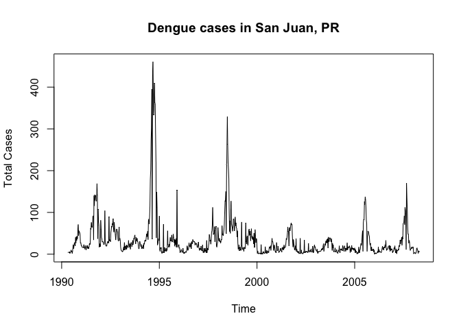
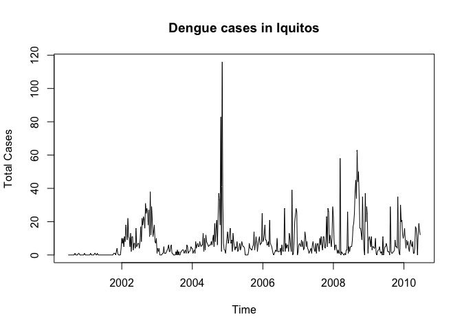
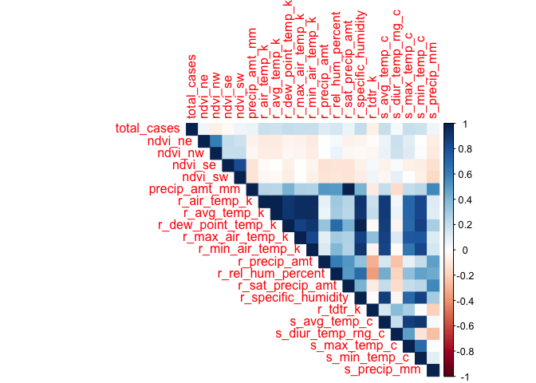

Health Analytics
================
Dalya Adams
6/2/2018

``` r
knitr::opts_chunk$set(echo = TRUE)
library("vars", lib.loc="/Library/Frameworks/R.framework/Versions/3.3/Resources/library")
```

    ## Loading required package: MASS

    ## Loading required package: strucchange

    ## Loading required package: zoo

    ## 
    ## Attaching package: 'zoo'

    ## The following objects are masked from 'package:base':
    ## 
    ##     as.Date, as.Date.numeric

    ## Loading required package: sandwich

    ## Loading required package: urca

    ## Loading required package: lmtest

``` r
library("forecast", lib.loc="/Library/Frameworks/R.framework/Versions/3.3/Resources/library")
```

    ## Warning in as.POSIXlt.POSIXct(Sys.time()): unknown timezone 'zone/tz/2018e.
    ## 1.0/zoneinfo/America/New_York'

``` r
library("corrplot", lib.loc="/Library/Frameworks/R.framework/Versions/3.3/Resources/library")
```

    ## corrplot 0.84 loaded

``` r
library("Hmisc", lib.loc="/Library/Frameworks/R.framework/Versions/3.3/Resources/library")
```

    ## Loading required package: lattice

    ## Loading required package: survival

    ## Loading required package: Formula

    ## Loading required package: ggplot2

    ## 
    ## Attaching package: 'ggplot2'

    ## The following object is masked from 'package:forecast':
    ## 
    ##     autolayer

    ## 
    ## Attaching package: 'Hmisc'

    ## The following objects are masked from 'package:base':
    ## 
    ##     format.pval, units

``` r
#Import training and test set
train<- read.csv("~/Desktop/MSPA/DS 413/Final Project/Training_Data_Labels.csv")
features <- read.csv("~/Desktop/MSPA/DS 413/Final Project/Training_Data_Features.csv", header=TRUE)
test <- read.csv("~/Desktop/MSPA/DS 413/Final Project/Test_Data_Features.csv", header=TRUE)
```

``` r
#merge features with the main dataset
#train$key<-paste(train$city,train$year, train$weekofyear)

train<-merge(train, features, by=c("city", "year", "weekofyear"))
```

Problem
-------

### The problem under consideration is to predict the total future dengue fever cases in both San Juan, Puerto Rico and Iquitos, Peru, each week. We are provided with NOAA daily climate and precipitation data, PERSIANN precipitation information, a normalized difference in vegetation index, and 3 years of dengue fever cases for San Juan and 5 years of dengue fever cases for Iquitos.

Significance
------------

### This problem is significant because the impact of dengue fever in Latin America is significant, with nearly half a billion cases per year. By predicting the number of cases of dengue fever per week in San Juan, Puerto Rico and Iquitos, Peru, and gaining a better understanding of the relationship between climate and dengue fever, research and resource allocation can be better targeted to eliminate or alleviate the impact of this pandemic.

### As stated by the Center of Disease Control, “accurate dengue predictions would help public health workers and people around the world take steps to reduce the impact of these epidemics. But predicting dengue is a hefty task that calls for the consolidation of different data sets on disease incidence, weather, and the environment.”

Data
----

### Prior to engineering any features, it is important to look at the raw data. We notice that the majority of the data points are for San Juan, 936 versus 520 for Iquitos. We also notice that the ndvi variables all have negative values, and there are a number of null values in the dataset that will need to be addressed prior to modeling.

### In reference to the ndvi variables, these represent an index of the difference in vegetation. This change in vegetation index leads me to beleive that negative values are not errors, and thus they are not adjusted. In reference to the null values present in the dataset, a flag variable is created for each null value. If there is a null value, a new column is created with the prefix "m\_" and an indicator of "1" is placed at that observation number, otherwise a value of "0" is in the column. This flag variable allows us to determine if the null value has implications on the total number of dengue cases in that week.

``` r
#Summary of all variables

summary(train)
```

    ##  city          year        weekofyear     total_cases    
    ##  iq:520   Min.   :1990   Min.   : 1.00   Min.   :  0.00  
    ##  sj:936   1st Qu.:1997   1st Qu.:13.75   1st Qu.:  5.00  
    ##           Median :2002   Median :26.50   Median : 12.00  
    ##           Mean   :2001   Mean   :26.50   Mean   : 24.68  
    ##           3rd Qu.:2005   3rd Qu.:39.25   3rd Qu.: 28.00  
    ##           Max.   :2010   Max.   :53.00   Max.   :461.00  
    ##                                                          
    ##    week_start_date    ndvi_ne            ndvi_nw        
    ##  2000-07-01:   2   Min.   :-0.40625   Min.   :-0.45610  
    ##  2000-07-08:   2   1st Qu.: 0.04495   1st Qu.: 0.04922  
    ##  2000-07-15:   2   Median : 0.12882   Median : 0.12143  
    ##  2000-07-22:   2   Mean   : 0.14229   Mean   : 0.13055  
    ##  2000-07-29:   2   3rd Qu.: 0.24848   3rd Qu.: 0.21660  
    ##  2000-08-05:   2   Max.   : 0.50836   Max.   : 0.45443  
    ##  (Other)   :1444   NA's   :194        NA's   :52        
    ##     ndvi_se            ndvi_sw         precipitation_amt_mm
    ##  Min.   :-0.01553   Min.   :-0.06346   Min.   :  0.00      
    ##  1st Qu.: 0.15509   1st Qu.: 0.14421   1st Qu.:  9.80      
    ##  Median : 0.19605   Median : 0.18945   Median : 38.34      
    ##  Mean   : 0.20378   Mean   : 0.20231   Mean   : 45.76      
    ##  3rd Qu.: 0.24885   3rd Qu.: 0.24698   3rd Qu.: 70.23      
    ##  Max.   : 0.53831   Max.   : 0.54602   Max.   :390.60      
    ##  NA's   :22         NA's   :22         NA's   :13          
    ##  reanalysis_air_temp_k reanalysis_avg_temp_k reanalysis_dew_point_temp_k
    ##  Min.   :294.6         Min.   :294.9         Min.   :289.6              
    ##  1st Qu.:297.7         1st Qu.:298.3         1st Qu.:294.1              
    ##  Median :298.6         Median :299.3         Median :295.6              
    ##  Mean   :298.7         Mean   :299.2         Mean   :295.2              
    ##  3rd Qu.:299.8         3rd Qu.:300.2         3rd Qu.:296.5              
    ##  Max.   :302.2         Max.   :302.9         Max.   :298.4              
    ##  NA's   :10            NA's   :10            NA's   :10                 
    ##  reanalysis_max_air_temp_k reanalysis_min_air_temp_k
    ##  Min.   :297.8             Min.   :286.9            
    ##  1st Qu.:301.0             1st Qu.:293.9            
    ##  Median :302.4             Median :296.2            
    ##  Mean   :303.4             Mean   :295.7            
    ##  3rd Qu.:305.5             3rd Qu.:297.9            
    ##  Max.   :314.0             Max.   :299.9            
    ##  NA's   :10                NA's   :10               
    ##  reanalysis_precip_amt_kg_per_m2 reanalysis_relative_humidity_percent
    ##  Min.   :  0.00                  Min.   :57.79                       
    ##  1st Qu.: 13.05                  1st Qu.:77.18                       
    ##  Median : 27.25                  Median :80.30                       
    ##  Mean   : 40.15                  Mean   :82.16                       
    ##  3rd Qu.: 52.20                  3rd Qu.:86.36                       
    ##  Max.   :570.50                  Max.   :98.61                       
    ##  NA's   :10                      NA's   :10                          
    ##  reanalysis_sat_precip_amt_mm reanalysis_specific_humidity_g_per_kg
    ##  Min.   :  0.00               Min.   :11.72                        
    ##  1st Qu.:  9.80               1st Qu.:15.56                        
    ##  Median : 38.34               Median :17.09                        
    ##  Mean   : 45.76               Mean   :16.75                        
    ##  3rd Qu.: 70.23               3rd Qu.:17.98                        
    ##  Max.   :390.60               Max.   :20.46                        
    ##  NA's   :13                   NA's   :10                           
    ##  reanalysis_tdtr_k station_avg_temp_c station_diur_temp_rng_c
    ##  Min.   : 1.357    Min.   :21.40      Min.   : 4.529         
    ##  1st Qu.: 2.329    1st Qu.:26.30      1st Qu.: 6.514         
    ##  Median : 2.857    Median :27.41      Median : 7.300         
    ##  Mean   : 4.904    Mean   :27.19      Mean   : 8.059         
    ##  3rd Qu.: 7.625    3rd Qu.:28.16      3rd Qu.: 9.567         
    ##  Max.   :16.029    Max.   :30.80      Max.   :15.800         
    ##  NA's   :10        NA's   :43         NA's   :43             
    ##  station_max_temp_c station_min_temp_c station_precip_mm
    ##  Min.   :26.70      Min.   :14.7       Min.   :  0.00   
    ##  1st Qu.:31.10      1st Qu.:21.1       1st Qu.:  8.70   
    ##  Median :32.80      Median :22.2       Median : 23.85   
    ##  Mean   :32.45      Mean   :22.1       Mean   : 39.33   
    ##  3rd Qu.:33.90      3rd Qu.:23.3       3rd Qu.: 53.90   
    ##  Max.   :42.20      Max.   :25.6       Max.   :543.30   
    ##  NA's   :20         NA's   :14         NA's   :22

``` r
#subset data based on city
sjtrain<-train[which(train$city=='sj'),]
iqtrain<-train[which(train$city=='iq'),]

#subset data based on city
sjtest<-test[which(test$city=='sj'),]
iqtest<-test[which(test$city=='iq'),]
```

``` r
#make time series
ts.sjtrain<-ts(sjtrain$total_cases, start = c(1990,18), end = c(2008,17), frequency = 52)
ts.iqtrain<-ts(iqtrain$total_cases, start = c(2000,26), end = c(2010,25), frequency = 52)
```

### Next, the dataset is split up into two datasets, based on the city. A dataset for San Juan is plotted below. It appears the daatset is both seasonal and cyclical, with an extreme peak near 1995.

``` r
plot(ts.sjtrain, main='Dengue cases in San Juan, PR', ylab='Total Cases')
```



### Below is a plot of total number of dengue fever cases in Iquitos, Peru. The first thing noticed is that Iquitos' dengue outbreaks do not follow the same pattern as the ones presented for San Juan. This difference is possibly related to the two cities being in different hemispheres. In viewing the dengue cases in Iquitos from 2000 until 2011, we notice the same seasonal and cyclical effect. Also, there is an extreme spike in thsi daatset as well, although around 2005, 10 year after the spike present in the San Juan dataset.

``` r
plot(ts.iqtrain, main='Dengue cases in Iquitos', ylab='Total Cases')
```



### Next we look at the missing values present in the datset. In the San Juan dataset, we notice that there a missing values present in the feature columns.

``` r
##Check to see number of null values in each column:
colSums(is.na(sjtrain))
```

    ##                                  city 
    ##                                     0 
    ##                                  year 
    ##                                     0 
    ##                            weekofyear 
    ##                                     0 
    ##                           total_cases 
    ##                                     0 
    ##                       week_start_date 
    ##                                     0 
    ##                               ndvi_ne 
    ##                                   191 
    ##                               ndvi_nw 
    ##                                    49 
    ##                               ndvi_se 
    ##                                    19 
    ##                               ndvi_sw 
    ##                                    19 
    ##                  precipitation_amt_mm 
    ##                                     9 
    ##                 reanalysis_air_temp_k 
    ##                                     6 
    ##                 reanalysis_avg_temp_k 
    ##                                     6 
    ##           reanalysis_dew_point_temp_k 
    ##                                     6 
    ##             reanalysis_max_air_temp_k 
    ##                                     6 
    ##             reanalysis_min_air_temp_k 
    ##                                     6 
    ##       reanalysis_precip_amt_kg_per_m2 
    ##                                     6 
    ##  reanalysis_relative_humidity_percent 
    ##                                     6 
    ##          reanalysis_sat_precip_amt_mm 
    ##                                     9 
    ## reanalysis_specific_humidity_g_per_kg 
    ##                                     6 
    ##                     reanalysis_tdtr_k 
    ##                                     6 
    ##                    station_avg_temp_c 
    ##                                     6 
    ##               station_diur_temp_rng_c 
    ##                                     6 
    ##                    station_max_temp_c 
    ##                                     6 
    ##                    station_min_temp_c 
    ##                                     6 
    ##                     station_precip_mm 
    ##                                     6

### These missing values are also present in the Iquitos dataset.

``` r
colSums(is.na(iqtrain))
```

    ##                                  city 
    ##                                     0 
    ##                                  year 
    ##                                     0 
    ##                            weekofyear 
    ##                                     0 
    ##                           total_cases 
    ##                                     0 
    ##                       week_start_date 
    ##                                     0 
    ##                               ndvi_ne 
    ##                                     3 
    ##                               ndvi_nw 
    ##                                     3 
    ##                               ndvi_se 
    ##                                     3 
    ##                               ndvi_sw 
    ##                                     3 
    ##                  precipitation_amt_mm 
    ##                                     4 
    ##                 reanalysis_air_temp_k 
    ##                                     4 
    ##                 reanalysis_avg_temp_k 
    ##                                     4 
    ##           reanalysis_dew_point_temp_k 
    ##                                     4 
    ##             reanalysis_max_air_temp_k 
    ##                                     4 
    ##             reanalysis_min_air_temp_k 
    ##                                     4 
    ##       reanalysis_precip_amt_kg_per_m2 
    ##                                     4 
    ##  reanalysis_relative_humidity_percent 
    ##                                     4 
    ##          reanalysis_sat_precip_amt_mm 
    ##                                     4 
    ## reanalysis_specific_humidity_g_per_kg 
    ##                                     4 
    ##                     reanalysis_tdtr_k 
    ##                                     4 
    ##                    station_avg_temp_c 
    ##                                    37 
    ##               station_diur_temp_rng_c 
    ##                                    37 
    ##                    station_max_temp_c 
    ##                                    14 
    ##                    station_min_temp_c 
    ##                                     8 
    ##                     station_precip_mm 
    ##                                    16

### Prior to imputing the dataset, we will create flag variables for missing values. The flag variables are created in a new column and for every null value, a '1' is placed in the new column, which has a prefix of 'm\_'. If the value is present, a value of '0' is placed in the new column. The purpose of the flag variable is to allow the model to determine if the missing values were predictive in nature.

``` r
## create flags for null variables

sjtrain[ , paste0( "M_",names(sjtrain)[-1])] <- 
       lapply(sjtrain[-1], function(x) as.numeric(is.na(x)) )

iqtrain[ , paste0( "M_",names(iqtrain)[-1])] <- 
       lapply(iqtrain[-1], function(x) as.numeric(is.na(x)) )

## create flags for null variables

sjtest[ , paste0( "M_",names(sjtest)[-1])] <- 
       lapply(sjtest[-1], function(x) as.numeric(is.na(x)) )

iqtest[ , paste0( "M_",names(iqtest)[-1])] <- 
       lapply(iqtest[-1], function(x) as.numeric(is.na(x)) )
```

### Now that we have a better idea what the dataset looks like and we've created flag variables for the missing values, we will address missing values as well as feature engineering prior to modeling. The missing values present in the San Juan and Iquitos dataset are imputed, not using a median or mean, but using the last value present in the dataset. Since the dengue dataset is a time series, by imputing with the last present value, we attempt to maintain the trend that was present in the dataset, at the time of the null value.

``` r
#replace null values with the previous value in each column
sjtrain<-na.locf(sjtrain)
iqtrain<-na.locf(iqtrain)

#test
#replace null values with the previous value in each column
sjtest<-na.locf(sjtest)
iqtest<-na.locf(iqtest)
```

``` r
##convert chr to num
colum<-c(2:4,6:49)
sjtrain[,colum] <- lapply(sjtrain[,colum], function(x) as.numeric(as.character(x)))
iqtrain[,colum] <- lapply(iqtrain[,colum], function(x) as.numeric(as.character(x)))

##convert chr to num
sjtest[,colum] <- lapply(sjtest[,colum], function(x) as.numeric(as.character(x)))
```

    ## Warning in FUN(X[[i]], ...): NAs introduced by coercion

``` r
iqtest[,colum] <- lapply(iqtest[,colum], function(x) as.numeric(as.character(x)))
```

    ## Warning in FUN(X[[i]], ...): NAs introduced by coercion

``` r
colnames(sjtrain)
```

    ##  [1] "city"                                   
    ##  [2] "year"                                   
    ##  [3] "weekofyear"                             
    ##  [4] "total_cases"                            
    ##  [5] "week_start_date"                        
    ##  [6] "ndvi_ne"                                
    ##  [7] "ndvi_nw"                                
    ##  [8] "ndvi_se"                                
    ##  [9] "ndvi_sw"                                
    ## [10] "precipitation_amt_mm"                   
    ## [11] "reanalysis_air_temp_k"                  
    ## [12] "reanalysis_avg_temp_k"                  
    ## [13] "reanalysis_dew_point_temp_k"            
    ## [14] "reanalysis_max_air_temp_k"              
    ## [15] "reanalysis_min_air_temp_k"              
    ## [16] "reanalysis_precip_amt_kg_per_m2"        
    ## [17] "reanalysis_relative_humidity_percent"   
    ## [18] "reanalysis_sat_precip_amt_mm"           
    ## [19] "reanalysis_specific_humidity_g_per_kg"  
    ## [20] "reanalysis_tdtr_k"                      
    ## [21] "station_avg_temp_c"                     
    ## [22] "station_diur_temp_rng_c"                
    ## [23] "station_max_temp_c"                     
    ## [24] "station_min_temp_c"                     
    ## [25] "station_precip_mm"                      
    ## [26] "M_year"                                 
    ## [27] "M_weekofyear"                           
    ## [28] "M_total_cases"                          
    ## [29] "M_week_start_date"                      
    ## [30] "M_ndvi_ne"                              
    ## [31] "M_ndvi_nw"                              
    ## [32] "M_ndvi_se"                              
    ## [33] "M_ndvi_sw"                              
    ## [34] "M_precipitation_amt_mm"                 
    ## [35] "M_reanalysis_air_temp_k"                
    ## [36] "M_reanalysis_avg_temp_k"                
    ## [37] "M_reanalysis_dew_point_temp_k"          
    ## [38] "M_reanalysis_max_air_temp_k"            
    ## [39] "M_reanalysis_min_air_temp_k"            
    ## [40] "M_reanalysis_precip_amt_kg_per_m2"      
    ## [41] "M_reanalysis_relative_humidity_percent" 
    ## [42] "M_reanalysis_sat_precip_amt_mm"         
    ## [43] "M_reanalysis_specific_humidity_g_per_kg"
    ## [44] "M_reanalysis_tdtr_k"                    
    ## [45] "M_station_avg_temp_c"                   
    ## [46] "M_station_diur_temp_rng_c"              
    ## [47] "M_station_max_temp_c"                   
    ## [48] "M_station_min_temp_c"                   
    ## [49] "M_station_precip_mm"

``` r
##rename columns
names(sjtrain)<-c("city", "year", "weekofyear", "total_cases", "week_start_date", "ndvi_ne", "ndvi_nw", "ndvi_se", "ndvi_sw", "precip_amt_mm", "r_air_temp_k", "r_avg_temp_k", "r_dew_point_temp_k", "r_max_air_temp_k", "r_min_air_temp_k","r_precip_amt", "r_rel_hum_percent", "r_sat_precip_amt", "r_specific_humidity", "r_tdtr_k", "s_avg_temp_c", "s_diur_temp_rng_c", "s_max_temp_c", "s_min_temp_c", "s_precip_mm","m_year", "m_weekofyear", "m_total_cases", "m_week_start_date", "m_ndvi_ne", "m_ndvi_nw", "m_ndvi_se", "m_ndvi_sw", "m_precip_amt_mm", "m_r_air_temp_k", "m_r_avg_temp_k", "m_r_dew_point_temp_k", "m_r_max_air_temp_k", "m_r_min_air_temp_k","m_r_precip_amt", "m_r_rel_hum_percent", "m_r_sat_precip_amt", "m_r_specific_humidity", "m_r_tdtr_k", "m_s_avg_temp_c", "m_s_diur_temp_rng_c", "m_s_max_temp_c", "m_s_min_temp_c", "m_s_precip_mm")

names(iqtrain)<-c("city", "year", "weekofyear", "total_cases", "week_start_date", "ndvi_ne", "ndvi_nw", "ndvi_se", "ndvi_sw", "precip_amt_mm", "r_air_temp_k", "r_avg_temp_k", "r_dew_point_temp_k", "r_max_air_temp_k", "r_min_air_temp_k","r_precip_amt", "r_rel_hum_percent", "r_sat_precip_amt", "r_specific_humidity", "r_tdtr_k", "s_avg_temp_c", "s_diur_temp_rng_c", "s_max_temp_c", "s_min_temp_c", "s_precip_mm","m_year", "m_weekofyear", "m_total_cases", "m_week_start_date", "m_ndvi_ne", "m_ndvi_nw", "m_ndvi_se", "m_ndvi_sw", "m_precip_amt_mm", "m_r_air_temp_k", "m_r_avg_temp_k", "m_r_dew_point_temp_k", "m_r_max_air_temp_k", "m_r_min_air_temp_k","m_r_precip_amt", "m_r_rel_hum_percent", "m_r_sat_precip_amt", "m_r_specific_humidity", "m_r_tdtr_k", "m_s_avg_temp_c", "m_s_diur_temp_rng_c", "m_s_max_temp_c", "m_s_min_temp_c", "m_s_precip_mm")

names(sjtest)<-c("city", "year", "weekofyear", "total_cases", "week_start_date", "ndvi_ne", "ndvi_nw", "ndvi_se", "ndvi_sw", "precip_amt_mm", "r_air_temp_k", "r_avg_temp_k", "r_dew_point_temp_k", "r_max_air_temp_k", "r_min_air_temp_k","r_precip_amt", "r_rel_hum_percent", "r_sat_precip_amt", "r_specific_humidity", "r_tdtr_k", "s_avg_temp_c", "s_diur_temp_rng_c", "s_max_temp_c", "s_min_temp_c", "s_precip_mm","m_year", "m_weekofyear", "m_total_cases", "m_week_start_date", "m_ndvi_ne", "m_ndvi_nw", "m_ndvi_se", "m_ndvi_sw", "m_precip_amt_mm", "m_r_air_temp_k", "m_r_avg_temp_k", "m_r_dew_point_temp_k", "m_r_max_air_temp_k", "m_r_min_air_temp_k","m_r_precip_amt", "m_r_rel_hum_percent", "m_r_sat_precip_amt", "m_r_specific_humidity", "m_r_tdtr_k", "m_s_avg_temp_c", "m_s_diur_temp_rng_c", "m_s_max_temp_c", "m_s_min_temp_c", "m_s_precip_mm")

names(iqtest)<-c("city", "year", "weekofyear", "total_cases", "week_start_date", "ndvi_ne", "ndvi_nw", "ndvi_se", "ndvi_sw", "precip_amt_mm", "r_air_temp_k", "r_avg_temp_k", "r_dew_point_temp_k", "r_max_air_temp_k", "r_min_air_temp_k","r_precip_amt", "r_rel_hum_percent", "r_sat_precip_amt", "r_specific_humidity", "r_tdtr_k", "s_avg_temp_c", "s_diur_temp_rng_c", "s_max_temp_c", "s_min_temp_c", "s_precip_mm","m_year", "m_weekofyear", "m_total_cases", "m_week_start_date", "m_ndvi_ne", "m_ndvi_nw", "m_ndvi_se", "m_ndvi_sw", "m_precip_amt_mm", "m_r_air_temp_k", "m_r_avg_temp_k", "m_r_dew_point_temp_k", "m_r_max_air_temp_k", "m_r_min_air_temp_k","m_r_precip_amt", "m_r_rel_hum_percent", "m_r_sat_precip_amt", "m_r_specific_humidity", "m_r_tdtr_k", "m_s_avg_temp_c", "m_s_diur_temp_rng_c", "m_s_max_temp_c", "m_s_min_temp_c", "m_s_precip_mm")
```

``` r
col<-c(4,6:25)
col1<-c(4,25:49)
```

``` r
#correlation plot for sj
sjcorr<-cor(sjtrain[,col])
sjcorr<-round(sjcorr,2)

sjcorr1<-cor(sjtrain[,col1])
```

    ## Warning in cor(sjtrain[, col1]): the standard deviation is zero

``` r
sjcorr1<-round(sjcorr1,2)
#head(sjcorr)
```

### Below we see the correlation plots for the San Juan variables in the datset so far.

``` r
corrplot(sjcorr, method = "color", type = "upper")
```



``` r
corrplot(sjcorr1, method = "color", type = "upper")
```


``` r
#correlation plot for iq

iqcorr<-cor(iqtrain[,col])
iqcorr<-round(iqcorr,2)

iqcorr1<-cor(iqtrain[,col1])
```

    ## Warning in cor(iqtrain[, col1]): the standard deviation is zero

``` r
iqcorr1<-round(iqcorr1,2)
#head(iqcorr)
```

### Below we see the same correlation plots, but for Iquitos.

``` r
corrplot(iqcorr, method = "color", type = "upper")
```


``` r
corrplot(iqcorr1, method = "color", type = "upper")
```


``` r
colnames(sjtrain)
```

    ##  [1] "city"                  "year"                 
    ##  [3] "weekofyear"            "total_cases"          
    ##  [5] "week_start_date"       "ndvi_ne"              
    ##  [7] "ndvi_nw"               "ndvi_se"              
    ##  [9] "ndvi_sw"               "precip_amt_mm"        
    ## [11] "r_air_temp_k"          "r_avg_temp_k"         
    ## [13] "r_dew_point_temp_k"    "r_max_air_temp_k"     
    ## [15] "r_min_air_temp_k"      "r_precip_amt"         
    ## [17] "r_rel_hum_percent"     "r_sat_precip_amt"     
    ## [19] "r_specific_humidity"   "r_tdtr_k"             
    ## [21] "s_avg_temp_c"          "s_diur_temp_rng_c"    
    ## [23] "s_max_temp_c"          "s_min_temp_c"         
    ## [25] "s_precip_mm"           "m_year"               
    ## [27] "m_weekofyear"          "m_total_cases"        
    ## [29] "m_week_start_date"     "m_ndvi_ne"            
    ## [31] "m_ndvi_nw"             "m_ndvi_se"            
    ## [33] "m_ndvi_sw"             "m_precip_amt_mm"      
    ## [35] "m_r_air_temp_k"        "m_r_avg_temp_k"       
    ## [37] "m_r_dew_point_temp_k"  "m_r_max_air_temp_k"   
    ## [39] "m_r_min_air_temp_k"    "m_r_precip_amt"       
    ## [41] "m_r_rel_hum_percent"   "m_r_sat_precip_amt"   
    ## [43] "m_r_specific_humidity" "m_r_tdtr_k"           
    ## [45] "m_s_avg_temp_c"        "m_s_diur_temp_rng_c"  
    ## [47] "m_s_max_temp_c"        "m_s_min_temp_c"       
    ## [49] "m_s_precip_mm"

### Now that we've created flag variables, dealt with null values in dataset and have a better idea of which variables are correlated with the target variable of 'total\_cases', we will create lag variables for each of these existing variables. We choose to create variable lags of 1 week, 2 weeks, 3 weeks and 4 weeks. We are testing to see if the measured levels of the variables in previous weeks is more predictive than the current week on the total number of dengue cases each week. The lag period is indicated by the numerical suffix, '\_1' meaning 1 week lag, '\_2' meaning 2 weeks lag, etc.

``` r
##create lagged variables
sjtrain$lndvi_ne_1<-Lag(sjtrain$ndvi_ne,-1)
sjtrain$lndvi_ne_2<-Lag(sjtrain$ndvi_ne,-2)
sjtrain$lndvi_ne_3<-Lag(sjtrain$ndvi_ne,-3)
sjtrain$lndvi_ne_4<-Lag(sjtrain$ndvi_ne,-4)

iqtrain$lndvi_ne_1<-Lag(iqtrain$ndvi_ne,-1)
iqtrain$lndvi_ne_2<-Lag(iqtrain$ndvi_ne,-2)
iqtrain$lndvi_ne_3<-Lag(iqtrain$ndvi_ne,-3)
iqtrain$lndvi_ne_4<-Lag(iqtrain$ndvi_ne,-4)

##create lagged variables
sjtest$lndvi_ne_1<-Lag(sjtest$ndvi_ne,-1)
sjtest$lndvi_ne_2<-Lag(sjtest$ndvi_ne,-2)
sjtest$lndvi_ne_3<-Lag(sjtest$ndvi_ne,-3)
sjtest$lndvi_ne_4<-Lag(sjtest$ndvi_ne,-4)

iqtest$lndvi_ne_1<-Lag(iqtest$ndvi_ne,-1)
iqtest$lndvi_ne_2<-Lag(iqtest$ndvi_ne,-2)
iqtest$lndvi_ne_3<-Lag(iqtest$ndvi_ne,-3)
iqtest$lndvi_ne_4<-Lag(iqtest$ndvi_ne,-4)
```

``` r
#sj
sjtrain$lndvi_nw_1<-Lag(sjtrain$ndvi_nw, -1)  
sjtrain$lndvi_nw_2<-Lag(sjtrain$ndvi_nw, -2)   
sjtrain$lndvi_nw_3<-Lag(sjtrain$ndvi_nw, -3)  
sjtrain$lndvi_nw_4<-Lag(sjtrain$ndvi_nw, -4)  

sjtrain$lndvi_se_1<-Lag(sjtrain$ndvi_se,-1)
sjtrain$lndvi_se_2<-Lag(sjtrain$ndvi_se,-2)
sjtrain$lndvi_se_3<-Lag(sjtrain$ndvi_se,-3)
sjtrain$lndvi_se_4<-Lag(sjtrain$ndvi_se,-4)

sjtrain$lndvi_sw_1<-Lag(sjtrain$ndvi_sw, -1)
sjtrain$lndvi_sw_2<-Lag(sjtrain$ndvi_sw, -2)
sjtrain$lndvi_sw_3<-Lag(sjtrain$ndvi_sw, -3)
sjtrain$lndvi_sw_4<-Lag(sjtrain$ndvi_sw, -4)

sjtrain$lprecip_amt_mm_1<-Lag(sjtrain$precip_amt_mm, -1)
sjtrain$lprecip_amt_mm_2<-Lag(sjtrain$precip_amt_mm, -2)
sjtrain$lprecip_amt_mm_3<-Lag(sjtrain$precip_amt_mm, -3)
sjtrain$lprecip_amt_mm_4<-Lag(sjtrain$precip_amt_mm, -4)

sjtrain$lr_air_temp_k_1<-Lag(sjtrain$r_air_temp_k, -1)
sjtrain$lr_air_temp_k_2<-Lag(sjtrain$r_air_temp_k, -2)
sjtrain$lr_air_temp_k_3<-Lag(sjtrain$r_air_temp_k, -3)
sjtrain$lr_air_temp_k_4<-Lag(sjtrain$r_air_temp_k, -4)

sjtrain$lr_avg_temp_k_1<-Lag(sjtrain$r_avg_temp_k, -1)
sjtrain$lr_avg_temp_k_2<-Lag(sjtrain$r_avg_temp_k, -2)
sjtrain$lr_avg_temp_k_3<-Lag(sjtrain$r_avg_temp_k, -3)
sjtrain$lr_avg_temp_k_4<-Lag(sjtrain$r_avg_temp_k, -4)

sjtrain$lr_dew_point_temp_k_1<-Lag(sjtrain$r_dew_point_temp_k, -1)
sjtrain$lr_dew_point_temp_k_2<-Lag(sjtrain$r_dew_point_temp_k, -2)
sjtrain$lr_dew_point_temp_k_3<-Lag(sjtrain$r_dew_point_temp_k, -3)
sjtrain$lr_dew_point_temp_k_4<-Lag(sjtrain$r_dew_point_temp_k, -4)

sjtrain$lr_max_air_temp_k_1<-Lag(sjtrain$r_max_air_temp_k, -1)
sjtrain$lr_max_air_temp_k_2<-Lag(sjtrain$r_max_air_temp_k, -2)
sjtrain$lr_max_air_temp_k_3<-Lag(sjtrain$r_max_air_temp_k, -3)
sjtrain$lr_max_air_temp_k_4<-Lag(sjtrain$r_max_air_temp_k, -4)

sjtrain$lr_min_air_temp_k_1<-Lag(sjtrain$r_min_air_temp_k, -1)
sjtrain$lr_min_air_temp_k_2<-Lag(sjtrain$r_min_air_temp_k, -2)
sjtrain$lr_min_air_temp_k_3<-Lag(sjtrain$r_min_air_temp_k, -3)
sjtrain$lr_min_air_temp_k_4<-Lag(sjtrain$r_min_air_temp_k, -4)

sjtrain$lr_precip_amt_1<-Lag(sjtrain$r_precip_amt, -1)
sjtrain$lr_precip_amt_2<-Lag(sjtrain$r_precip_amt, -2)
sjtrain$lr_precip_amt_3<-Lag(sjtrain$r_precip_amt, -3)
sjtrain$lr_precip_amt_4<-Lag(sjtrain$r_precip_amt, -4)

sjtrain$lr_rel_hum_percent_1<-Lag(sjtrain$r_rel_hum_percent,-1)
sjtrain$lr_rel_hum_percent_2<-Lag(sjtrain$r_rel_hum_percent,-2)
sjtrain$lr_rel_hum_percent_3<-Lag(sjtrain$r_rel_hum_percent,-3)
sjtrain$lr_rel_hum_percent_4<-Lag(sjtrain$r_rel_hum_percent,-4)

sjtrain$lr_sat_precip_amt_1<-Lag(sjtrain$r_sat_precip_amt, -1)
sjtrain$lr_sat_precip_amt_2<-Lag(sjtrain$r_sat_precip_amt, -2)
sjtrain$lr_sat_precip_amt_3<-Lag(sjtrain$r_sat_precip_amt, -3)
sjtrain$lr_sat_precip_amt_4<-Lag(sjtrain$r_sat_precip_amt, -4)

sjtrain$lr_specific_humidity_1<-Lag(sjtrain$r_specific_humidity, -1)
sjtrain$lr_specific_humidity_2<-Lag(sjtrain$r_specific_humidity, -2)
sjtrain$lr_specific_humidity_3<-Lag(sjtrain$r_specific_humidity, -3)
sjtrain$lr_specific_humidity_4<-Lag(sjtrain$r_specific_humidity, -4)

sjtrain$lr_tdtr_k_1<-Lag(sjtrain$r_tdtr_k, -1)
sjtrain$lr_tdtr_k_2<-Lag(sjtrain$r_tdtr_k, -2)
sjtrain$lr_tdtr_k_3<-Lag(sjtrain$r_tdtr_k, -3)
sjtrain$lr_tdtr_k_4<-Lag(sjtrain$r_tdtr_k, -4)

sjtrain$ls_avg_temp_c_1<-Lag(sjtrain$s_avg_temp_c, -1)
sjtrain$ls_avg_temp_c_2<-Lag(sjtrain$s_avg_temp_c, -2)
sjtrain$ls_avg_temp_c_3<-Lag(sjtrain$s_avg_temp_c, -3)
sjtrain$ls_avg_temp_c_4<-Lag(sjtrain$s_avg_temp_c, -4)

sjtrain$ls_diur_temp_rng_c_1<-Lag(sjtrain$s_diur_temp_rng_c, -1)
sjtrain$ls_diur_temp_rng_c_2<-Lag(sjtrain$s_diur_temp_rng_c, -2)
sjtrain$ls_diur_temp_rng_c_3<-Lag(sjtrain$s_diur_temp_rng_c, -3)
sjtrain$ls_diur_temp_rng_c_4<-Lag(sjtrain$s_diur_temp_rng_c, -4)

sjtrain$ls_max_temp_c_1<-Lag(sjtrain$s_max_temp_c, -1)
sjtrain$ls_max_temp_c_2<-Lag(sjtrain$s_max_temp_c, -2)
sjtrain$ls_max_temp_c_3<-Lag(sjtrain$s_max_temp_c, -3)
sjtrain$ls_max_temp_c_4<-Lag(sjtrain$s_max_temp_c, -4)

sjtrain$ls_min_temp_c_1<-Lag(sjtrain$s_min_temp_c, -1)
sjtrain$ls_min_temp_c_2<-Lag(sjtrain$s_min_temp_c, -2)
sjtrain$ls_min_temp_c_3<-Lag(sjtrain$s_min_temp_c, -3)
sjtrain$ls_min_temp_c_4<-Lag(sjtrain$s_min_temp_c, -4)

sjtrain$ls_precip_mm_1<-Lag(sjtrain$s_precip_mm, -1)
sjtrain$ls_precip_mm_2<-Lag(sjtrain$s_precip_mm, -2)
sjtrain$ls_precip_mm_3<-Lag(sjtrain$s_precip_mm, -3)
sjtrain$ls_precip_mm_4<-Lag(sjtrain$s_precip_mm, -4)

#test
sjtest$lndvi_nw_1<-Lag(sjtest$ndvi_nw, -1)  
sjtest$lndvi_nw_2<-Lag(sjtest$ndvi_nw, -2)   
sjtest$lndvi_nw_3<-Lag(sjtest$ndvi_nw, -3)  
sjtest$lndvi_nw_4<-Lag(sjtest$ndvi_nw, -4)  

sjtest$lndvi_se_1<-Lag(sjtest$ndvi_se,-1)
sjtest$lndvi_se_2<-Lag(sjtest$ndvi_se,-2)
sjtest$lndvi_se_3<-Lag(sjtest$ndvi_se,-3)
sjtest$lndvi_se_4<-Lag(sjtest$ndvi_se,-4)

sjtest$lndvi_sw_1<-Lag(sjtest$ndvi_sw, -1)
sjtest$lndvi_sw_2<-Lag(sjtest$ndvi_sw, -2)
sjtest$lndvi_sw_3<-Lag(sjtest$ndvi_sw, -3)
sjtest$lndvi_sw_4<-Lag(sjtest$ndvi_sw, -4)

sjtest$lprecip_amt_mm_1<-Lag(sjtest$precip_amt_mm, -1)
sjtest$lprecip_amt_mm_2<-Lag(sjtest$precip_amt_mm, -2)
sjtest$lprecip_amt_mm_3<-Lag(sjtest$precip_amt_mm, -3)
sjtest$lprecip_amt_mm_4<-Lag(sjtest$precip_amt_mm, -4)

sjtest$lr_air_temp_k_1<-Lag(sjtest$r_air_temp_k, -1)
sjtest$lr_air_temp_k_2<-Lag(sjtest$r_air_temp_k, -2)
sjtest$lr_air_temp_k_3<-Lag(sjtest$r_air_temp_k, -3)
sjtest$lr_air_temp_k_4<-Lag(sjtest$r_air_temp_k, -4)

sjtest$lr_avg_temp_k_1<-Lag(sjtest$r_avg_temp_k, -1)
sjtest$lr_avg_temp_k_2<-Lag(sjtest$r_avg_temp_k, -2)
sjtest$lr_avg_temp_k_3<-Lag(sjtest$r_avg_temp_k, -3)
sjtest$lr_avg_temp_k_4<-Lag(sjtest$r_avg_temp_k, -4)

sjtest$lr_dew_point_temp_k_1<-Lag(sjtest$r_dew_point_temp_k, -1)
sjtest$lr_dew_point_temp_k_2<-Lag(sjtest$r_dew_point_temp_k, -2)
sjtest$lr_dew_point_temp_k_3<-Lag(sjtest$r_dew_point_temp_k, -3)
sjtest$lr_dew_point_temp_k_4<-Lag(sjtest$r_dew_point_temp_k, -4)

sjtest$lr_max_air_temp_k_1<-Lag(sjtest$r_max_air_temp_k, -1)
sjtest$lr_max_air_temp_k_2<-Lag(sjtest$r_max_air_temp_k, -2)
sjtest$lr_max_air_temp_k_3<-Lag(sjtest$r_max_air_temp_k, -3)
sjtest$lr_max_air_temp_k_4<-Lag(sjtest$r_max_air_temp_k, -4)

sjtest$lr_min_air_temp_k_1<-Lag(sjtest$r_min_air_temp_k, -1)
sjtest$lr_min_air_temp_k_2<-Lag(sjtest$r_min_air_temp_k, -2)
sjtest$lr_min_air_temp_k_3<-Lag(sjtest$r_min_air_temp_k, -3)
sjtest$lr_min_air_temp_k_4<-Lag(sjtest$r_min_air_temp_k, -4)

sjtest$lr_precip_amt_1<-Lag(sjtest$r_precip_amt, -1)
sjtest$lr_precip_amt_2<-Lag(sjtest$r_precip_amt, -2)
sjtest$lr_precip_amt_3<-Lag(sjtest$r_precip_amt, -3)
sjtest$lr_precip_amt_4<-Lag(sjtest$r_precip_amt, -4)

sjtest$lr_rel_hum_percent_1<-Lag(sjtest$r_rel_hum_percent,-1)
sjtest$lr_rel_hum_percent_2<-Lag(sjtest$r_rel_hum_percent,-2)
sjtest$lr_rel_hum_percent_3<-Lag(sjtest$r_rel_hum_percent,-3)
sjtest$lr_rel_hum_percent_4<-Lag(sjtest$r_rel_hum_percent,-4)

sjtest$lr_sat_precip_amt_1<-Lag(sjtest$r_sat_precip_amt, -1)
sjtest$lr_sat_precip_amt_2<-Lag(sjtest$r_sat_precip_amt, -2)
sjtest$lr_sat_precip_amt_3<-Lag(sjtest$r_sat_precip_amt, -3)
sjtest$lr_sat_precip_amt_4<-Lag(sjtest$r_sat_precip_amt, -4)

sjtest$lr_specific_humidity_1<-Lag(sjtest$r_specific_humidity, -1)
sjtest$lr_specific_humidity_2<-Lag(sjtest$r_specific_humidity, -2)
sjtest$lr_specific_humidity_3<-Lag(sjtest$r_specific_humidity, -3)
sjtest$lr_specific_humidity_4<-Lag(sjtest$r_specific_humidity, -4)

sjtest$lr_tdtr_k_1<-Lag(sjtest$r_tdtr_k, -1)
sjtest$lr_tdtr_k_2<-Lag(sjtest$r_tdtr_k, -2)
sjtest$lr_tdtr_k_3<-Lag(sjtest$r_tdtr_k, -3)
sjtest$lr_tdtr_k_4<-Lag(sjtest$r_tdtr_k, -4)

sjtest$ls_avg_temp_c_1<-Lag(sjtest$s_avg_temp_c, -1)
sjtest$ls_avg_temp_c_2<-Lag(sjtest$s_avg_temp_c, -2)
sjtest$ls_avg_temp_c_3<-Lag(sjtest$s_avg_temp_c, -3)
sjtest$ls_avg_temp_c_4<-Lag(sjtest$s_avg_temp_c, -4)

sjtest$ls_diur_temp_rng_c_1<-Lag(sjtest$s_diur_temp_rng_c, -1)
sjtest$ls_diur_temp_rng_c_2<-Lag(sjtest$s_diur_temp_rng_c, -2)
sjtest$ls_diur_temp_rng_c_3<-Lag(sjtest$s_diur_temp_rng_c, -3)
sjtest$ls_diur_temp_rng_c_4<-Lag(sjtest$s_diur_temp_rng_c, -4)

sjtest$ls_max_temp_c_1<-Lag(sjtest$s_max_temp_c, -1)
sjtest$ls_max_temp_c_2<-Lag(sjtest$s_max_temp_c, -2)
sjtest$ls_max_temp_c_3<-Lag(sjtest$s_max_temp_c, -3)
sjtest$ls_max_temp_c_4<-Lag(sjtest$s_max_temp_c, -4)

sjtest$ls_min_temp_c_1<-Lag(sjtest$s_min_temp_c, -1)
sjtest$ls_min_temp_c_2<-Lag(sjtest$s_min_temp_c, -2)
sjtest$ls_min_temp_c_3<-Lag(sjtest$s_min_temp_c, -3)
sjtest$ls_min_temp_c_4<-Lag(sjtest$s_min_temp_c, -4)

sjtest$ls_precip_mm_1<-Lag(sjtest$s_precip_mm, -1)
sjtest$ls_precip_mm_2<-Lag(sjtest$s_precip_mm, -2)
sjtest$ls_precip_mm_3<-Lag(sjtest$s_precip_mm, -3)
sjtest$ls_precip_mm_4<-Lag(sjtest$s_precip_mm, -4)
```

``` r
#iq
iqtrain$lndvi_nw_1<-Lag(iqtrain$ndvi_nw, -1)  
iqtrain$lndvi_nw_2<-Lag(iqtrain$ndvi_nw, -2)   
iqtrain$lndvi_nw_3<-Lag(iqtrain$ndvi_nw, -3)  
iqtrain$lndvi_nw_4<-Lag(iqtrain$ndvi_nw, -4)  

iqtrain$lndvi_se_1<-Lag(iqtrain$ndvi_se,-1)
iqtrain$lndvi_se_2<-Lag(iqtrain$ndvi_se,-2)
iqtrain$lndvi_se_3<-Lag(iqtrain$ndvi_se,-3)
iqtrain$lndvi_se_4<-Lag(iqtrain$ndvi_se,-4)

iqtrain$lndvi_sw_1<-Lag(iqtrain$ndvi_sw, -1)
iqtrain$lndvi_sw_2<-Lag(iqtrain$ndvi_sw, -2)
iqtrain$lndvi_sw_3<-Lag(iqtrain$ndvi_sw, -3)
iqtrain$lndvi_sw_4<-Lag(iqtrain$ndvi_sw, -4)

iqtrain$lprecip_amt_mm_1<-Lag(iqtrain$precip_amt_mm, -1)
iqtrain$lprecip_amt_mm_2<-Lag(iqtrain$precip_amt_mm, -2)
iqtrain$lprecip_amt_mm_3<-Lag(iqtrain$precip_amt_mm, -3)
iqtrain$lprecip_amt_mm_4<-Lag(iqtrain$precip_amt_mm, -4)

iqtrain$lr_air_temp_k_1<-Lag(iqtrain$r_air_temp_k, -1)
iqtrain$lr_air_temp_k_2<-Lag(iqtrain$r_air_temp_k, -2)
iqtrain$lr_air_temp_k_3<-Lag(iqtrain$r_air_temp_k, -3)
iqtrain$lr_air_temp_k_4<-Lag(iqtrain$r_air_temp_k, -4)

iqtrain$lr_avg_temp_k_1<-Lag(iqtrain$r_avg_temp_k, -1)
iqtrain$lr_avg_temp_k_2<-Lag(iqtrain$r_avg_temp_k, -2)
iqtrain$lr_avg_temp_k_3<-Lag(iqtrain$r_avg_temp_k, -3)
iqtrain$lr_avg_temp_k_4<-Lag(iqtrain$r_avg_temp_k, -4)

iqtrain$lr_dew_point_temp_k_1<-Lag(iqtrain$r_dew_point_temp_k, -1)
iqtrain$lr_dew_point_temp_k_2<-Lag(iqtrain$r_dew_point_temp_k, -2)
iqtrain$lr_dew_point_temp_k_3<-Lag(iqtrain$r_dew_point_temp_k, -3)
iqtrain$lr_dew_point_temp_k_4<-Lag(iqtrain$r_dew_point_temp_k, -4)

iqtrain$lr_max_air_temp_k_1<-Lag(iqtrain$r_max_air_temp_k, -1)
iqtrain$lr_max_air_temp_k_2<-Lag(iqtrain$r_max_air_temp_k, -2)
iqtrain$lr_max_air_temp_k_3<-Lag(iqtrain$r_max_air_temp_k, -3)
iqtrain$lr_max_air_temp_k_4<-Lag(iqtrain$r_max_air_temp_k, -4)

iqtrain$lr_min_air_temp_k_1<-Lag(iqtrain$r_min_air_temp_k, -1)
iqtrain$lr_min_air_temp_k_2<-Lag(iqtrain$r_min_air_temp_k, -2)
iqtrain$lr_min_air_temp_k_3<-Lag(iqtrain$r_min_air_temp_k, -3)
iqtrain$lr_min_air_temp_k_4<-Lag(iqtrain$r_min_air_temp_k, -4)

iqtrain$lr_precip_amt_1<-Lag(iqtrain$r_precip_amt, -1)
iqtrain$lr_precip_amt_2<-Lag(iqtrain$r_precip_amt, -2)
iqtrain$lr_precip_amt_3<-Lag(iqtrain$r_precip_amt, -3)
iqtrain$lr_precip_amt_4<-Lag(iqtrain$r_precip_amt, -4)

iqtrain$lr_rel_hum_percent_1<-Lag(iqtrain$r_rel_hum_percent,-1)
iqtrain$lr_rel_hum_percent_2<-Lag(iqtrain$r_rel_hum_percent,-2)
iqtrain$lr_rel_hum_percent_3<-Lag(iqtrain$r_rel_hum_percent,-3)
iqtrain$lr_rel_hum_percent_4<-Lag(iqtrain$r_rel_hum_percent,-4)

iqtrain$lr_sat_precip_amt_1<-Lag(iqtrain$r_sat_precip_amt, -1)
iqtrain$lr_sat_precip_amt_2<-Lag(iqtrain$r_sat_precip_amt, -2)
iqtrain$lr_sat_precip_amt_3<-Lag(iqtrain$r_sat_precip_amt, -3)
iqtrain$lr_sat_precip_amt_4<-Lag(iqtrain$r_sat_precip_amt, -4)

iqtrain$lr_specific_humidity_1<-Lag(iqtrain$r_specific_humidity, -1)
iqtrain$lr_specific_humidity_2<-Lag(iqtrain$r_specific_humidity, -2)
iqtrain$lr_specific_humidity_3<-Lag(iqtrain$r_specific_humidity, -3)
iqtrain$lr_specific_humidity_4<-Lag(iqtrain$r_specific_humidity, -4)

iqtrain$lr_tdtr_k_1<-Lag(iqtrain$r_tdtr_k, -1)
iqtrain$lr_tdtr_k_2<-Lag(iqtrain$r_tdtr_k, -2)
iqtrain$lr_tdtr_k_3<-Lag(iqtrain$r_tdtr_k, -3)
iqtrain$lr_tdtr_k_4<-Lag(iqtrain$r_tdtr_k, -4)

iqtrain$ls_avg_temp_c_1<-Lag(iqtrain$s_avg_temp_c, -1)
iqtrain$ls_avg_temp_c_2<-Lag(iqtrain$s_avg_temp_c, -2)
iqtrain$ls_avg_temp_c_3<-Lag(iqtrain$s_avg_temp_c, -3)
iqtrain$ls_avg_temp_c_4<-Lag(iqtrain$s_avg_temp_c, -4)

iqtrain$ls_diur_temp_rng_c_1<-Lag(iqtrain$s_diur_temp_rng_c, -1)
iqtrain$ls_diur_temp_rng_c_2<-Lag(iqtrain$s_diur_temp_rng_c, -2)
iqtrain$ls_diur_temp_rng_c_3<-Lag(iqtrain$s_diur_temp_rng_c, -3)
iqtrain$ls_diur_temp_rng_c_4<-Lag(iqtrain$s_diur_temp_rng_c, -4)

iqtrain$ls_max_temp_c_1<-Lag(iqtrain$s_max_temp_c, -1)
iqtrain$ls_max_temp_c_2<-Lag(iqtrain$s_max_temp_c, -2)
iqtrain$ls_max_temp_c_3<-Lag(iqtrain$s_max_temp_c, -3)
iqtrain$ls_max_temp_c_4<-Lag(iqtrain$s_max_temp_c, -4)

iqtrain$ls_min_temp_c_1<-Lag(iqtrain$s_min_temp_c, -1)
iqtrain$ls_min_temp_c_2<-Lag(iqtrain$s_min_temp_c, -2)
iqtrain$ls_min_temp_c_3<-Lag(iqtrain$s_min_temp_c, -3)
iqtrain$ls_min_temp_c_4<-Lag(iqtrain$s_min_temp_c, -4)

iqtrain$ls_precip_mm_1<-Lag(iqtrain$s_precip_mm, -1)
iqtrain$ls_precip_mm_2<-Lag(iqtrain$s_precip_mm, -2)
iqtrain$ls_precip_mm_3<-Lag(iqtrain$s_precip_mm, -3)
iqtrain$ls_precip_mm_4<-Lag(iqtrain$s_precip_mm, -4)

#test

#iq
iqtest$lndvi_nw_1<-Lag(iqtest$ndvi_nw, -1)  
iqtest$lndvi_nw_2<-Lag(iqtest$ndvi_nw, -2)   
iqtest$lndvi_nw_3<-Lag(iqtest$ndvi_nw, -3)  
iqtest$lndvi_nw_4<-Lag(iqtest$ndvi_nw, -4)  

iqtest$lndvi_se_1<-Lag(iqtest$ndvi_se,-1)
iqtest$lndvi_se_2<-Lag(iqtest$ndvi_se,-2)
iqtest$lndvi_se_3<-Lag(iqtest$ndvi_se,-3)
iqtest$lndvi_se_4<-Lag(iqtest$ndvi_se,-4)

iqtest$lndvi_sw_1<-Lag(iqtest$ndvi_sw, -1)
iqtest$lndvi_sw_2<-Lag(iqtest$ndvi_sw, -2)
iqtest$lndvi_sw_3<-Lag(iqtest$ndvi_sw, -3)
iqtest$lndvi_sw_4<-Lag(iqtest$ndvi_sw, -4)

iqtest$lprecip_amt_mm_1<-Lag(iqtest$precip_amt_mm, -1)
iqtest$lprecip_amt_mm_2<-Lag(iqtest$precip_amt_mm, -2)
iqtest$lprecip_amt_mm_3<-Lag(iqtest$precip_amt_mm, -3)
iqtest$lprecip_amt_mm_4<-Lag(iqtest$precip_amt_mm, -4)

iqtest$lr_air_temp_k_1<-Lag(iqtest$r_air_temp_k, -1)
iqtest$lr_air_temp_k_2<-Lag(iqtest$r_air_temp_k, -2)
iqtest$lr_air_temp_k_3<-Lag(iqtest$r_air_temp_k, -3)
iqtest$lr_air_temp_k_4<-Lag(iqtest$r_air_temp_k, -4)

iqtest$lr_avg_temp_k_1<-Lag(iqtest$r_avg_temp_k, -1)
iqtest$lr_avg_temp_k_2<-Lag(iqtest$r_avg_temp_k, -2)
iqtest$lr_avg_temp_k_3<-Lag(iqtest$r_avg_temp_k, -3)
iqtest$lr_avg_temp_k_4<-Lag(iqtest$r_avg_temp_k, -4)

iqtest$lr_dew_point_temp_k_1<-Lag(iqtest$r_dew_point_temp_k, -1)
iqtest$lr_dew_point_temp_k_2<-Lag(iqtest$r_dew_point_temp_k, -2)
iqtest$lr_dew_point_temp_k_3<-Lag(iqtest$r_dew_point_temp_k, -3)
iqtest$lr_dew_point_temp_k_4<-Lag(iqtest$r_dew_point_temp_k, -4)

iqtest$lr_max_air_temp_k_1<-Lag(iqtest$r_max_air_temp_k, -1)
iqtest$lr_max_air_temp_k_2<-Lag(iqtest$r_max_air_temp_k, -2)
iqtest$lr_max_air_temp_k_3<-Lag(iqtest$r_max_air_temp_k, -3)
iqtest$lr_max_air_temp_k_4<-Lag(iqtest$r_max_air_temp_k, -4)

iqtest$lr_min_air_temp_k_1<-Lag(iqtest$r_min_air_temp_k, -1)
iqtest$lr_min_air_temp_k_2<-Lag(iqtest$r_min_air_temp_k, -2)
iqtest$lr_min_air_temp_k_3<-Lag(iqtest$r_min_air_temp_k, -3)
iqtest$lr_min_air_temp_k_4<-Lag(iqtest$r_min_air_temp_k, -4)

iqtest$lr_precip_amt_1<-Lag(iqtest$r_precip_amt, -1)
iqtest$lr_precip_amt_2<-Lag(iqtest$r_precip_amt, -2)
iqtest$lr_precip_amt_3<-Lag(iqtest$r_precip_amt, -3)
iqtest$lr_precip_amt_4<-Lag(iqtest$r_precip_amt, -4)

iqtest$lr_rel_hum_percent_1<-Lag(iqtest$r_rel_hum_percent,-1)
iqtest$lr_rel_hum_percent_2<-Lag(iqtest$r_rel_hum_percent,-2)
iqtest$lr_rel_hum_percent_3<-Lag(iqtest$r_rel_hum_percent,-3)
iqtest$lr_rel_hum_percent_4<-Lag(iqtest$r_rel_hum_percent,-4)

iqtest$lr_sat_precip_amt_1<-Lag(iqtest$r_sat_precip_amt, -1)
iqtest$lr_sat_precip_amt_2<-Lag(iqtest$r_sat_precip_amt, -2)
iqtest$lr_sat_precip_amt_3<-Lag(iqtest$r_sat_precip_amt, -3)
iqtest$lr_sat_precip_amt_4<-Lag(iqtest$r_sat_precip_amt, -4)

iqtest$lr_specific_humidity_1<-Lag(iqtest$r_specific_humidity, -1)
iqtest$lr_specific_humidity_2<-Lag(iqtest$r_specific_humidity, -2)
iqtest$lr_specific_humidity_3<-Lag(iqtest$r_specific_humidity, -3)
iqtest$lr_specific_humidity_4<-Lag(iqtest$r_specific_humidity, -4)

iqtest$lr_tdtr_k_1<-Lag(iqtest$r_tdtr_k, -1)
iqtest$lr_tdtr_k_2<-Lag(iqtest$r_tdtr_k, -2)
iqtest$lr_tdtr_k_3<-Lag(iqtest$r_tdtr_k, -3)
iqtest$lr_tdtr_k_4<-Lag(iqtest$r_tdtr_k, -4)

iqtest$ls_avg_temp_c_1<-Lag(iqtest$s_avg_temp_c, -1)
iqtest$ls_avg_temp_c_2<-Lag(iqtest$s_avg_temp_c, -2)
iqtest$ls_avg_temp_c_3<-Lag(iqtest$s_avg_temp_c, -3)
iqtest$ls_avg_temp_c_4<-Lag(iqtest$s_avg_temp_c, -4)

iqtest$ls_diur_temp_rng_c_1<-Lag(iqtest$s_diur_temp_rng_c, -1)
iqtest$ls_diur_temp_rng_c_2<-Lag(iqtest$s_diur_temp_rng_c, -2)
iqtest$ls_diur_temp_rng_c_3<-Lag(iqtest$s_diur_temp_rng_c, -3)
iqtest$ls_diur_temp_rng_c_4<-Lag(iqtest$s_diur_temp_rng_c, -4)

iqtest$ls_max_temp_c_1<-Lag(iqtest$s_max_temp_c, -1)
iqtest$ls_max_temp_c_2<-Lag(iqtest$s_max_temp_c, -2)
iqtest$ls_max_temp_c_3<-Lag(iqtest$s_max_temp_c, -3)
iqtest$ls_max_temp_c_4<-Lag(iqtest$s_max_temp_c, -4)

iqtest$ls_min_temp_c_1<-Lag(iqtest$s_min_temp_c, -1)
iqtest$ls_min_temp_c_2<-Lag(iqtest$s_min_temp_c, -2)
iqtest$ls_min_temp_c_3<-Lag(iqtest$s_min_temp_c, -3)
iqtest$ls_min_temp_c_4<-Lag(iqtest$s_min_temp_c, -4)

iqtest$ls_precip_mm_1<-Lag(iqtest$s_precip_mm, -1)
iqtest$ls_precip_mm_2<-Lag(iqtest$s_precip_mm, -2)
iqtest$ls_precip_mm_3<-Lag(iqtest$s_precip_mm, -3)
iqtest$ls_precip_mm_4<-Lag(iqtest$s_precip_mm, -4)
```

``` r
colnames(sjtrain)
```

    ##   [1] "city"                   "year"                  
    ##   [3] "weekofyear"             "total_cases"           
    ##   [5] "week_start_date"        "ndvi_ne"               
    ##   [7] "ndvi_nw"                "ndvi_se"               
    ##   [9] "ndvi_sw"                "precip_amt_mm"         
    ##  [11] "r_air_temp_k"           "r_avg_temp_k"          
    ##  [13] "r_dew_point_temp_k"     "r_max_air_temp_k"      
    ##  [15] "r_min_air_temp_k"       "r_precip_amt"          
    ##  [17] "r_rel_hum_percent"      "r_sat_precip_amt"      
    ##  [19] "r_specific_humidity"    "r_tdtr_k"              
    ##  [21] "s_avg_temp_c"           "s_diur_temp_rng_c"     
    ##  [23] "s_max_temp_c"           "s_min_temp_c"          
    ##  [25] "s_precip_mm"            "m_year"                
    ##  [27] "m_weekofyear"           "m_total_cases"         
    ##  [29] "m_week_start_date"      "m_ndvi_ne"             
    ##  [31] "m_ndvi_nw"              "m_ndvi_se"             
    ##  [33] "m_ndvi_sw"              "m_precip_amt_mm"       
    ##  [35] "m_r_air_temp_k"         "m_r_avg_temp_k"        
    ##  [37] "m_r_dew_point_temp_k"   "m_r_max_air_temp_k"    
    ##  [39] "m_r_min_air_temp_k"     "m_r_precip_amt"        
    ##  [41] "m_r_rel_hum_percent"    "m_r_sat_precip_amt"    
    ##  [43] "m_r_specific_humidity"  "m_r_tdtr_k"            
    ##  [45] "m_s_avg_temp_c"         "m_s_diur_temp_rng_c"   
    ##  [47] "m_s_max_temp_c"         "m_s_min_temp_c"        
    ##  [49] "m_s_precip_mm"          "lndvi_ne_1"            
    ##  [51] "lndvi_ne_2"             "lndvi_ne_3"            
    ##  [53] "lndvi_ne_4"             "lndvi_nw_1"            
    ##  [55] "lndvi_nw_2"             "lndvi_nw_3"            
    ##  [57] "lndvi_nw_4"             "lndvi_se_1"            
    ##  [59] "lndvi_se_2"             "lndvi_se_3"            
    ##  [61] "lndvi_se_4"             "lndvi_sw_1"            
    ##  [63] "lndvi_sw_2"             "lndvi_sw_3"            
    ##  [65] "lndvi_sw_4"             "lprecip_amt_mm_1"      
    ##  [67] "lprecip_amt_mm_2"       "lprecip_amt_mm_3"      
    ##  [69] "lprecip_amt_mm_4"       "lr_air_temp_k_1"       
    ##  [71] "lr_air_temp_k_2"        "lr_air_temp_k_3"       
    ##  [73] "lr_air_temp_k_4"        "lr_avg_temp_k_1"       
    ##  [75] "lr_avg_temp_k_2"        "lr_avg_temp_k_3"       
    ##  [77] "lr_avg_temp_k_4"        "lr_dew_point_temp_k_1" 
    ##  [79] "lr_dew_point_temp_k_2"  "lr_dew_point_temp_k_3" 
    ##  [81] "lr_dew_point_temp_k_4"  "lr_max_air_temp_k_1"   
    ##  [83] "lr_max_air_temp_k_2"    "lr_max_air_temp_k_3"   
    ##  [85] "lr_max_air_temp_k_4"    "lr_min_air_temp_k_1"   
    ##  [87] "lr_min_air_temp_k_2"    "lr_min_air_temp_k_3"   
    ##  [89] "lr_min_air_temp_k_4"    "lr_precip_amt_1"       
    ##  [91] "lr_precip_amt_2"        "lr_precip_amt_3"       
    ##  [93] "lr_precip_amt_4"        "lr_rel_hum_percent_1"  
    ##  [95] "lr_rel_hum_percent_2"   "lr_rel_hum_percent_3"  
    ##  [97] "lr_rel_hum_percent_4"   "lr_sat_precip_amt_1"   
    ##  [99] "lr_sat_precip_amt_2"    "lr_sat_precip_amt_3"   
    ## [101] "lr_sat_precip_amt_4"    "lr_specific_humidity_1"
    ## [103] "lr_specific_humidity_2" "lr_specific_humidity_3"
    ## [105] "lr_specific_humidity_4" "lr_tdtr_k_1"           
    ## [107] "lr_tdtr_k_2"            "lr_tdtr_k_3"           
    ## [109] "lr_tdtr_k_4"            "ls_avg_temp_c_1"       
    ## [111] "ls_avg_temp_c_2"        "ls_avg_temp_c_3"       
    ## [113] "ls_avg_temp_c_4"        "ls_diur_temp_rng_c_1"  
    ## [115] "ls_diur_temp_rng_c_2"   "ls_diur_temp_rng_c_3"  
    ## [117] "ls_diur_temp_rng_c_4"   "ls_max_temp_c_1"       
    ## [119] "ls_max_temp_c_2"        "ls_max_temp_c_3"       
    ## [121] "ls_max_temp_c_4"        "ls_min_temp_c_1"       
    ## [123] "ls_min_temp_c_2"        "ls_min_temp_c_3"       
    ## [125] "ls_min_temp_c_4"        "ls_precip_mm_1"        
    ## [127] "ls_precip_mm_2"         "ls_precip_mm_3"        
    ## [129] "ls_precip_mm_4"

``` r
#null values?
colSums(is.na(sjtrain))
```

    ##                   city                   year             weekofyear 
    ##                      0                      0                      0 
    ##            total_cases        week_start_date                ndvi_ne 
    ##                      0                      0                      0 
    ##                ndvi_nw                ndvi_se                ndvi_sw 
    ##                      0                      0                      0 
    ##          precip_amt_mm           r_air_temp_k           r_avg_temp_k 
    ##                      0                      0                      0 
    ##     r_dew_point_temp_k       r_max_air_temp_k       r_min_air_temp_k 
    ##                      0                      0                      0 
    ##           r_precip_amt      r_rel_hum_percent       r_sat_precip_amt 
    ##                      0                      0                      0 
    ##    r_specific_humidity               r_tdtr_k           s_avg_temp_c 
    ##                      0                      0                      0 
    ##      s_diur_temp_rng_c           s_max_temp_c           s_min_temp_c 
    ##                      0                      0                      0 
    ##            s_precip_mm                 m_year           m_weekofyear 
    ##                      0                      0                      0 
    ##          m_total_cases      m_week_start_date              m_ndvi_ne 
    ##                      0                      0                      0 
    ##              m_ndvi_nw              m_ndvi_se              m_ndvi_sw 
    ##                      0                      0                      0 
    ##        m_precip_amt_mm         m_r_air_temp_k         m_r_avg_temp_k 
    ##                      0                      0                      0 
    ##   m_r_dew_point_temp_k     m_r_max_air_temp_k     m_r_min_air_temp_k 
    ##                      0                      0                      0 
    ##         m_r_precip_amt    m_r_rel_hum_percent     m_r_sat_precip_amt 
    ##                      0                      0                      0 
    ##  m_r_specific_humidity             m_r_tdtr_k         m_s_avg_temp_c 
    ##                      0                      0                      0 
    ##    m_s_diur_temp_rng_c         m_s_max_temp_c         m_s_min_temp_c 
    ##                      0                      0                      0 
    ##          m_s_precip_mm             lndvi_ne_1             lndvi_ne_2 
    ##                      0                      1                      2 
    ##             lndvi_ne_3             lndvi_ne_4             lndvi_nw_1 
    ##                      3                      4                      1 
    ##             lndvi_nw_2             lndvi_nw_3             lndvi_nw_4 
    ##                      2                      3                      4 
    ##             lndvi_se_1             lndvi_se_2             lndvi_se_3 
    ##                      1                      2                      3 
    ##             lndvi_se_4             lndvi_sw_1             lndvi_sw_2 
    ##                      4                      1                      2 
    ##             lndvi_sw_3             lndvi_sw_4       lprecip_amt_mm_1 
    ##                      3                      4                      1 
    ##       lprecip_amt_mm_2       lprecip_amt_mm_3       lprecip_amt_mm_4 
    ##                      2                      3                      4 
    ##        lr_air_temp_k_1        lr_air_temp_k_2        lr_air_temp_k_3 
    ##                      1                      2                      3 
    ##        lr_air_temp_k_4        lr_avg_temp_k_1        lr_avg_temp_k_2 
    ##                      4                      1                      2 
    ##        lr_avg_temp_k_3        lr_avg_temp_k_4  lr_dew_point_temp_k_1 
    ##                      3                      4                      1 
    ##  lr_dew_point_temp_k_2  lr_dew_point_temp_k_3  lr_dew_point_temp_k_4 
    ##                      2                      3                      4 
    ##    lr_max_air_temp_k_1    lr_max_air_temp_k_2    lr_max_air_temp_k_3 
    ##                      1                      2                      3 
    ##    lr_max_air_temp_k_4    lr_min_air_temp_k_1    lr_min_air_temp_k_2 
    ##                      4                      1                      2 
    ##    lr_min_air_temp_k_3    lr_min_air_temp_k_4        lr_precip_amt_1 
    ##                      3                      4                      1 
    ##        lr_precip_amt_2        lr_precip_amt_3        lr_precip_amt_4 
    ##                      2                      3                      4 
    ##   lr_rel_hum_percent_1   lr_rel_hum_percent_2   lr_rel_hum_percent_3 
    ##                      1                      2                      3 
    ##   lr_rel_hum_percent_4    lr_sat_precip_amt_1    lr_sat_precip_amt_2 
    ##                      4                      1                      2 
    ##    lr_sat_precip_amt_3    lr_sat_precip_amt_4 lr_specific_humidity_1 
    ##                      3                      4                      1 
    ## lr_specific_humidity_2 lr_specific_humidity_3 lr_specific_humidity_4 
    ##                      2                      3                      4 
    ##            lr_tdtr_k_1            lr_tdtr_k_2            lr_tdtr_k_3 
    ##                      1                      2                      3 
    ##            lr_tdtr_k_4        ls_avg_temp_c_1        ls_avg_temp_c_2 
    ##                      4                      1                      2 
    ##        ls_avg_temp_c_3        ls_avg_temp_c_4   ls_diur_temp_rng_c_1 
    ##                      3                      4                      1 
    ##   ls_diur_temp_rng_c_2   ls_diur_temp_rng_c_3   ls_diur_temp_rng_c_4 
    ##                      2                      3                      4 
    ##        ls_max_temp_c_1        ls_max_temp_c_2        ls_max_temp_c_3 
    ##                      1                      2                      3 
    ##        ls_max_temp_c_4        ls_min_temp_c_1        ls_min_temp_c_2 
    ##                      4                      1                      2 
    ##        ls_min_temp_c_3        ls_min_temp_c_4         ls_precip_mm_1 
    ##                      3                      4                      1 
    ##         ls_precip_mm_2         ls_precip_mm_3         ls_precip_mm_4 
    ##                      2                      3                      4

``` r
#Fix null values. Whats the best way? 

#replace null values with the previous value in each column
sjtrain<-na.locf(sjtrain)
iqtrain<-na.locf(iqtrain)

#replace null values with the previous value in each column
sjtest<-na.locf(sjtest)
iqtest<-na.locf(iqtest)
```

``` r
##convert chr to num
colum<-c(2:4,6:129)
sjtrain[,colum] <- lapply(sjtrain[,colum], function(x) as.numeric(as.character(x)))
iqtrain[,colum] <- lapply(iqtrain[,colum], function(x) as.numeric(as.character(x)))

sjtest[,colum] <- lapply(sjtest[,colum], function(x) as.numeric(as.character(x)))
iqtest[,colum] <- lapply(iqtest[,colum], function(x) as.numeric(as.character(x)))
```

``` r
tail(sjtrain)
```

    ##      city year weekofyear total_cases week_start_date  ndvi_ne     ndvi_nw
    ## 1451   sj 2008          4          10      2008-01-22 -0.02680 -0.21530000
    ## 1452   sj 2008          5           9      2008-01-29 -0.02680 -0.13540000
    ## 1453   sj 2008          6           2      2008-02-05 -0.11170 -0.00320000
    ## 1454   sj 2008          7           6      2008-02-12  0.07200 -0.06310000
    ## 1455   sj 2008          8           8      2008-02-19 -0.13865 -0.09506667
    ## 1456   sj 2008          9           5      2008-02-26 -0.13865  0.01542000
    ##        ndvi_se   ndvi_sw precip_amt_mm r_air_temp_k r_avg_temp_k
    ## 1451 0.1126143 0.1602143         81.22     297.9686     298.1286
    ## 1452 0.2233000 0.1709429          0.00     298.0214     298.1786
    ## 1453 0.2328429 0.2711714          0.00     297.2371     297.2786
    ## 1454 0.1502000 0.1492714          0.00     297.8386     297.9071
    ## 1455 0.2460571 0.2281286          0.00     297.9071     298.0571
    ## 1456 0.2116286 0.1173429          0.00     297.7657     298.0714
    ##      r_dew_point_temp_k r_max_air_temp_k r_min_air_temp_k r_precip_amt
    ## 1451           293.6357            299.5            296.4        27.16
    ## 1452           292.9571            300.7            294.3         2.70
    ## 1453           291.5371            299.3            295.4        19.70
    ## 1454           292.9414            299.3            296.5        10.17
    ## 1455           293.1343            299.6            296.4         8.30
    ## 1456           292.5029            299.9            296.3         6.46
    ##      r_rel_hum_percent r_sat_precip_amt r_specific_humidity r_tdtr_k
    ## 1451          77.16714            81.22            15.06571 2.000000
    ## 1452          73.56571             0.00            14.40857 3.300000
    ## 1453          70.64286             0.00            13.22571 2.071429
    ## 1454          74.22857             0.00            14.36714 2.157143
    ## 1455          74.78571             0.00            14.53857 1.885714
    ## 1456          72.66000             0.00            13.96714 2.285714
    ##      s_avg_temp_c s_diur_temp_rng_c s_max_temp_c s_min_temp_c s_precip_mm
    ## 1451     24.52857          4.585714         27.8         21.1        83.1
    ## 1452     24.57143          6.442857         28.9         20.0         3.1
    ## 1453     24.21429          5.157143         27.2         21.1        35.9
    ## 1454     24.80000          6.242857         28.3         21.1         6.4
    ## 1455     24.90000          5.785714         28.3         21.7        13.3
    ## 1456     24.74286          5.500000         27.8         21.1        12.9
    ##      m_year m_weekofyear m_total_cases m_week_start_date m_ndvi_ne
    ## 1451      0            0             0                 0         0
    ## 1452      0            0             0                 0         1
    ## 1453      0            0             0                 0         0
    ## 1454      0            0             0                 0         0
    ## 1455      0            0             0                 0         0
    ## 1456      0            0             0                 0         1
    ##      m_ndvi_nw m_ndvi_se m_ndvi_sw m_precip_amt_mm m_r_air_temp_k
    ## 1451         0         0         0               0              0
    ## 1452         0         0         0               0              0
    ## 1453         0         0         0               0              0
    ## 1454         0         0         0               0              0
    ## 1455         0         0         0               0              0
    ## 1456         0         0         0               0              0
    ##      m_r_avg_temp_k m_r_dew_point_temp_k m_r_max_air_temp_k
    ## 1451              0                    0                  0
    ## 1452              0                    0                  0
    ## 1453              0                    0                  0
    ## 1454              0                    0                  0
    ## 1455              0                    0                  0
    ## 1456              0                    0                  0
    ##      m_r_min_air_temp_k m_r_precip_amt m_r_rel_hum_percent
    ## 1451                  0              0                   0
    ## 1452                  0              0                   0
    ## 1453                  0              0                   0
    ## 1454                  0              0                   0
    ## 1455                  0              0                   0
    ## 1456                  0              0                   0
    ##      m_r_sat_precip_amt m_r_specific_humidity m_r_tdtr_k m_s_avg_temp_c
    ## 1451                  0                     0          0              0
    ## 1452                  0                     0          0              0
    ## 1453                  0                     0          0              0
    ## 1454                  0                     0          0              0
    ## 1455                  0                     0          0              0
    ## 1456                  0                     0          0              0
    ##      m_s_diur_temp_rng_c m_s_max_temp_c m_s_min_temp_c m_s_precip_mm
    ## 1451                   0              0              0             0
    ## 1452                   0              0              0             0
    ## 1453                   0              0              0             0
    ## 1454                   0              0              0             0
    ## 1455                   0              0              0             0
    ## 1456                   0              0              0             0
    ##      lndvi_ne_1 lndvi_ne_2 lndvi_ne_3 lndvi_ne_4  lndvi_nw_1  lndvi_nw_2
    ## 1451   -0.02680   -0.11170    0.07200   -0.13865 -0.13540000 -0.00320000
    ## 1452   -0.11170    0.07200   -0.13865   -0.13865 -0.00320000 -0.06310000
    ## 1453    0.07200   -0.13865   -0.13865   -0.13865 -0.06310000 -0.09506667
    ## 1454   -0.13865   -0.13865   -0.13865   -0.13865 -0.09506667  0.01542000
    ## 1455   -0.13865   -0.13865   -0.13865   -0.13865  0.01542000  0.01542000
    ## 1456   -0.13865   -0.13865   -0.13865   -0.13865  0.01542000  0.01542000
    ##       lndvi_nw_3  lndvi_nw_4 lndvi_se_1 lndvi_se_2 lndvi_se_3 lndvi_se_4
    ## 1451 -0.06310000 -0.09506667  0.2233000  0.2328429  0.1502000  0.2460571
    ## 1452 -0.09506667  0.01542000  0.2328429  0.1502000  0.2460571  0.2116286
    ## 1453  0.01542000  0.01542000  0.1502000  0.2460571  0.2116286  0.2116286
    ## 1454  0.01542000  0.01542000  0.2460571  0.2116286  0.2116286  0.2116286
    ## 1455  0.01542000  0.01542000  0.2116286  0.2116286  0.2116286  0.2116286
    ## 1456  0.01542000  0.01542000  0.2116286  0.2116286  0.2116286  0.2116286
    ##      lndvi_sw_1 lndvi_sw_2 lndvi_sw_3 lndvi_sw_4 lprecip_amt_mm_1
    ## 1451  0.1709429  0.2711714  0.1492714  0.2281286                0
    ## 1452  0.2711714  0.1492714  0.2281286  0.1173429                0
    ## 1453  0.1492714  0.2281286  0.1173429  0.1173429                0
    ## 1454  0.2281286  0.1173429  0.1173429  0.1173429                0
    ## 1455  0.1173429  0.1173429  0.1173429  0.1173429                0
    ## 1456  0.1173429  0.1173429  0.1173429  0.1173429                0
    ##      lprecip_amt_mm_2 lprecip_amt_mm_3 lprecip_amt_mm_4 lr_air_temp_k_1
    ## 1451                0                0                0        298.0214
    ## 1452                0                0                0        297.2371
    ## 1453                0                0                0        297.8386
    ## 1454                0                0                0        297.9071
    ## 1455                0                0                0        297.7657
    ## 1456                0                0                0        297.7657
    ##      lr_air_temp_k_2 lr_air_temp_k_3 lr_air_temp_k_4 lr_avg_temp_k_1
    ## 1451        297.2371        297.8386        297.9071        298.1786
    ## 1452        297.8386        297.9071        297.7657        297.2786
    ## 1453        297.9071        297.7657        297.7657        297.9071
    ## 1454        297.7657        297.7657        297.7657        298.0571
    ## 1455        297.7657        297.7657        297.7657        298.0714
    ## 1456        297.7657        297.7657        297.7657        298.0714
    ##      lr_avg_temp_k_2 lr_avg_temp_k_3 lr_avg_temp_k_4 lr_dew_point_temp_k_1
    ## 1451        297.2786        297.9071        298.0571              292.9571
    ## 1452        297.9071        298.0571        298.0714              291.5371
    ## 1453        298.0571        298.0714        298.0714              292.9414
    ## 1454        298.0714        298.0714        298.0714              293.1343
    ## 1455        298.0714        298.0714        298.0714              292.5029
    ## 1456        298.0714        298.0714        298.0714              292.5029
    ##      lr_dew_point_temp_k_2 lr_dew_point_temp_k_3 lr_dew_point_temp_k_4
    ## 1451              291.5371              292.9414              293.1343
    ## 1452              292.9414              293.1343              292.5029
    ## 1453              293.1343              292.5029              292.5029
    ## 1454              292.5029              292.5029              292.5029
    ## 1455              292.5029              292.5029              292.5029
    ## 1456              292.5029              292.5029              292.5029
    ##      lr_max_air_temp_k_1 lr_max_air_temp_k_2 lr_max_air_temp_k_3
    ## 1451               300.7               299.3               299.3
    ## 1452               299.3               299.3               299.6
    ## 1453               299.3               299.6               299.9
    ## 1454               299.6               299.9               299.9
    ## 1455               299.9               299.9               299.9
    ## 1456               299.9               299.9               299.9
    ##      lr_max_air_temp_k_4 lr_min_air_temp_k_1 lr_min_air_temp_k_2
    ## 1451               299.6               294.3               295.4
    ## 1452               299.9               295.4               296.5
    ## 1453               299.9               296.5               296.4
    ## 1454               299.9               296.4               296.3
    ## 1455               299.9               296.3               296.3
    ## 1456               299.9               296.3               296.3
    ##      lr_min_air_temp_k_3 lr_min_air_temp_k_4 lr_precip_amt_1
    ## 1451               296.5               296.4            2.70
    ## 1452               296.4               296.3           19.70
    ## 1453               296.3               296.3           10.17
    ## 1454               296.3               296.3            8.30
    ## 1455               296.3               296.3            6.46
    ## 1456               296.3               296.3            6.46
    ##      lr_precip_amt_2 lr_precip_amt_3 lr_precip_amt_4 lr_rel_hum_percent_1
    ## 1451           19.70           10.17            8.30             73.56571
    ## 1452           10.17            8.30            6.46             70.64286
    ## 1453            8.30            6.46            6.46             74.22857
    ## 1454            6.46            6.46            6.46             74.78571
    ## 1455            6.46            6.46            6.46             72.66000
    ## 1456            6.46            6.46            6.46             72.66000
    ##      lr_rel_hum_percent_2 lr_rel_hum_percent_3 lr_rel_hum_percent_4
    ## 1451             70.64286             74.22857             74.78571
    ## 1452             74.22857             74.78571             72.66000
    ## 1453             74.78571             72.66000             72.66000
    ## 1454             72.66000             72.66000             72.66000
    ## 1455             72.66000             72.66000             72.66000
    ## 1456             72.66000             72.66000             72.66000
    ##      lr_sat_precip_amt_1 lr_sat_precip_amt_2 lr_sat_precip_amt_3
    ## 1451                   0                   0                   0
    ## 1452                   0                   0                   0
    ## 1453                   0                   0                   0
    ## 1454                   0                   0                   0
    ## 1455                   0                   0                   0
    ## 1456                   0                   0                   0
    ##      lr_sat_precip_amt_4 lr_specific_humidity_1 lr_specific_humidity_2
    ## 1451                   0               14.40857               13.22571
    ## 1452                   0               13.22571               14.36714
    ## 1453                   0               14.36714               14.53857
    ## 1454                   0               14.53857               13.96714
    ## 1455                   0               13.96714               13.96714
    ## 1456                   0               13.96714               13.96714
    ##      lr_specific_humidity_3 lr_specific_humidity_4 lr_tdtr_k_1 lr_tdtr_k_2
    ## 1451               14.36714               14.53857    3.300000    2.071429
    ## 1452               14.53857               13.96714    2.071429    2.157143
    ## 1453               13.96714               13.96714    2.157143    1.885714
    ## 1454               13.96714               13.96714    1.885714    2.285714
    ## 1455               13.96714               13.96714    2.285714    2.285714
    ## 1456               13.96714               13.96714    2.285714    2.285714
    ##      lr_tdtr_k_3 lr_tdtr_k_4 ls_avg_temp_c_1 ls_avg_temp_c_2
    ## 1451    2.157143    1.885714        24.57143        24.21429
    ## 1452    1.885714    2.285714        24.21429        24.80000
    ## 1453    2.285714    2.285714        24.80000        24.90000
    ## 1454    2.285714    2.285714        24.90000        24.74286
    ## 1455    2.285714    2.285714        24.74286        24.74286
    ## 1456    2.285714    2.285714        24.74286        24.74286
    ##      ls_avg_temp_c_3 ls_avg_temp_c_4 ls_diur_temp_rng_c_1
    ## 1451        24.80000        24.90000             6.442857
    ## 1452        24.90000        24.74286             5.157143
    ## 1453        24.74286        24.74286             6.242857
    ## 1454        24.74286        24.74286             5.785714
    ## 1455        24.74286        24.74286             5.500000
    ## 1456        24.74286        24.74286             5.500000
    ##      ls_diur_temp_rng_c_2 ls_diur_temp_rng_c_3 ls_diur_temp_rng_c_4
    ## 1451             5.157143             6.242857             5.785714
    ## 1452             6.242857             5.785714             5.500000
    ## 1453             5.785714             5.500000             5.500000
    ## 1454             5.500000             5.500000             5.500000
    ## 1455             5.500000             5.500000             5.500000
    ## 1456             5.500000             5.500000             5.500000
    ##      ls_max_temp_c_1 ls_max_temp_c_2 ls_max_temp_c_3 ls_max_temp_c_4
    ## 1451            28.9            27.2            28.3            28.3
    ## 1452            27.2            28.3            28.3            27.8
    ## 1453            28.3            28.3            27.8            27.8
    ## 1454            28.3            27.8            27.8            27.8
    ## 1455            27.8            27.8            27.8            27.8
    ## 1456            27.8            27.8            27.8            27.8
    ##      ls_min_temp_c_1 ls_min_temp_c_2 ls_min_temp_c_3 ls_min_temp_c_4
    ## 1451            20.0            21.1            21.1            21.7
    ## 1452            21.1            21.1            21.7            21.1
    ## 1453            21.1            21.7            21.1            21.1
    ## 1454            21.7            21.1            21.1            21.1
    ## 1455            21.1            21.1            21.1            21.1
    ## 1456            21.1            21.1            21.1            21.1
    ##      ls_precip_mm_1 ls_precip_mm_2 ls_precip_mm_3 ls_precip_mm_4
    ## 1451            3.1           35.9            6.4           13.3
    ## 1452           35.9            6.4           13.3           12.9
    ## 1453            6.4           13.3           12.9           12.9
    ## 1454           13.3           12.9           12.9           12.9
    ## 1455           12.9           12.9           12.9           12.9
    ## 1456           12.9           12.9           12.9           12.9

``` r
str(sjtrain)
```

    ## 'data.frame':    936 obs. of  129 variables:
    ##  $ city                  : chr  "sj" "sj" "sj" "sj" ...
    ##  $ year                  : num  1990 1990 1990 1990 1990 1990 1990 1990 1990 1990 ...
    ##  $ weekofyear            : num  18 19 20 21 22 23 24 25 26 27 ...
    ##  $ total_cases           : num  4 5 4 3 6 2 4 5 10 6 ...
    ##  $ week_start_date       : chr  "1990-04-30" "1990-05-07" "1990-05-14" "1990-05-21" ...
    ##  $ ndvi_ne               : num  0.1226 0.1699 0.0323 0.1286 0.1962 ...
    ##  $ ndvi_nw               : num  0.104 0.142 0.173 0.245 0.262 ...
    ##  $ ndvi_se               : num  0.198 0.162 0.157 0.228 0.251 ...
    ##  $ ndvi_sw               : num  0.178 0.155 0.171 0.236 0.247 ...
    ##  $ precip_amt_mm         : num  12.42 22.82 34.54 15.36 7.52 ...
    ##  $ r_air_temp_k          : num  298 298 299 299 300 ...
    ##  $ r_avg_temp_k          : num  298 298 299 299 300 ...
    ##  $ r_dew_point_temp_k    : num  292 294 295 295 296 ...
    ##  $ r_max_air_temp_k      : num  300 301 300 301 302 ...
    ##  $ r_min_air_temp_k      : num  296 296 297 297 298 ...
    ##  $ r_precip_amt          : num  32 17.9 26.1 13.9 12.2 ...
    ##  $ r_rel_hum_percent     : num  73.4 77.4 82.1 80.3 80.5 ...
    ##  $ r_sat_precip_amt      : num  12.42 22.82 34.54 15.36 7.52 ...
    ##  $ r_specific_humidity   : num  14 15.4 16.8 16.7 17.2 ...
    ##  $ r_tdtr_k              : num  2.63 2.37 2.3 2.43 3.01 ...
    ##  $ s_avg_temp_c          : num  25.4 26.7 26.7 27.5 28.9 ...
    ##  $ s_diur_temp_rng_c     : num  6.9 6.37 6.49 6.77 9.37 ...
    ##  $ s_max_temp_c          : num  29.4 31.7 32.2 33.3 35 34.4 32.2 33.9 33.9 33.9 ...
    ##  $ s_min_temp_c          : num  20 22.2 22.8 23.3 23.9 23.9 23.3 22.8 22.8 24.4 ...
    ##  $ s_precip_mm           : num  16 8.6 41.4 4 5.8 39.1 29.7 21.1 21.1 1.1 ...
    ##  $ m_year                : num  0 0 0 0 0 0 0 0 0 0 ...
    ##  $ m_weekofyear          : num  0 0 0 0 0 0 0 0 0 0 ...
    ##  $ m_total_cases         : num  0 0 0 0 0 0 0 0 0 0 ...
    ##  $ m_week_start_date     : num  0 0 0 0 0 0 0 0 0 0 ...
    ##  $ m_ndvi_ne             : num  0 0 0 0 0 1 0 0 0 1 ...
    ##  $ m_ndvi_nw             : num  0 0 0 0 0 0 0 0 0 0 ...
    ##  $ m_ndvi_se             : num  0 0 0 0 0 0 0 0 0 0 ...
    ##  $ m_ndvi_sw             : num  0 0 0 0 0 0 0 0 0 0 ...
    ##  $ m_precip_amt_mm       : num  0 0 0 0 0 0 0 0 0 0 ...
    ##  $ m_r_air_temp_k        : num  0 0 0 0 0 0 0 0 0 0 ...
    ##  $ m_r_avg_temp_k        : num  0 0 0 0 0 0 0 0 0 0 ...
    ##  $ m_r_dew_point_temp_k  : num  0 0 0 0 0 0 0 0 0 0 ...
    ##  $ m_r_max_air_temp_k    : num  0 0 0 0 0 0 0 0 0 0 ...
    ##  $ m_r_min_air_temp_k    : num  0 0 0 0 0 0 0 0 0 0 ...
    ##  $ m_r_precip_amt        : num  0 0 0 0 0 0 0 0 0 0 ...
    ##  $ m_r_rel_hum_percent   : num  0 0 0 0 0 0 0 0 0 0 ...
    ##  $ m_r_sat_precip_amt    : num  0 0 0 0 0 0 0 0 0 0 ...
    ##  $ m_r_specific_humidity : num  0 0 0 0 0 0 0 0 0 0 ...
    ##  $ m_r_tdtr_k            : num  0 0 0 0 0 0 0 0 0 0 ...
    ##  $ m_s_avg_temp_c        : num  0 0 0 0 0 0 0 0 0 0 ...
    ##  $ m_s_diur_temp_rng_c   : num  0 0 0 0 0 0 0 0 0 0 ...
    ##  $ m_s_max_temp_c        : num  0 0 0 0 0 0 0 0 0 0 ...
    ##  $ m_s_min_temp_c        : num  0 0 0 0 0 0 0 0 0 0 ...
    ##  $ m_s_precip_mm         : num  0 0 0 0 0 0 0 0 0 0 ...
    ##  $ lndvi_ne_1            : num  0.1699 0.0323 0.1286 0.1962 0.1962 ...
    ##  $ lndvi_ne_2            : num  0.0323 0.1286 0.1962 0.1962 0.1129 ...
    ##  $ lndvi_ne_3            : num  0.1286 0.1962 0.1962 0.1129 0.0725 ...
    ##  $ lndvi_ne_4            : num  0.1962 0.1962 0.1129 0.0725 0.1024 ...
    ##  $ lndvi_nw_1            : num  0.142 0.173 0.245 0.262 0.175 ...
    ##  $ lndvi_nw_2            : num  0.173 0.2451 0.2622 0.1749 0.0928 ...
    ##  $ lndvi_nw_3            : num  0.2451 0.2622 0.1749 0.0928 0.0725 ...
    ##  $ lndvi_nw_4            : num  0.2622 0.1749 0.0928 0.0725 0.1462 ...
    ##  $ lndvi_se_1            : num  0.162 0.157 0.228 0.251 0.254 ...
    ##  $ lndvi_se_2            : num  0.157 0.228 0.251 0.254 0.205 ...
    ##  $ lndvi_se_3            : num  0.228 0.251 0.254 0.205 0.151 ...
    ##  $ lndvi_se_4            : num  0.251 0.254 0.205 0.151 0.126 ...
    ##  $ lndvi_sw_1            : num  0.155 0.171 0.236 0.247 0.182 ...
    ##  $ lndvi_sw_2            : num  0.171 0.236 0.247 0.182 0.21 ...
    ##  $ lndvi_sw_3            : num  0.236 0.247 0.182 0.21 0.133 ...
    ##  $ lndvi_sw_4            : num  0.247 0.182 0.21 0.133 0.124 ...
    ##  $ lprecip_amt_mm_1      : num  22.82 34.54 15.36 7.52 9.58 ...
    ##  $ lprecip_amt_mm_2      : num  34.54 15.36 7.52 9.58 3.48 ...
    ##  $ lprecip_amt_mm_3      : num  15.36 7.52 9.58 3.48 151.12 ...
    ##  $ lprecip_amt_mm_4      : num  7.52 9.58 3.48 151.12 19.32 ...
    ##  $ lr_air_temp_k_1       : num  298 299 299 300 300 ...
    ##  $ lr_air_temp_k_2       : num  299 299 300 300 299 ...
    ##  $ lr_air_temp_k_3       : num  299 300 300 299 300 ...
    ##  $ lr_air_temp_k_4       : num  300 300 299 300 300 ...
    ##  $ lr_avg_temp_k_1       : num  298 299 299 300 300 ...
    ##  $ lr_avg_temp_k_2       : num  299 299 300 300 299 ...
    ##  $ lr_avg_temp_k_3       : num  299 300 300 299 300 ...
    ##  $ lr_avg_temp_k_4       : num  300 300 299 300 300 ...
    ##  $ lr_dew_point_temp_k_1 : num  294 295 295 296 296 ...
    ##  $ lr_dew_point_temp_k_2 : num  295 295 296 296 296 ...
    ##  $ lr_dew_point_temp_k_3 : num  295 296 296 296 297 ...
    ##  $ lr_dew_point_temp_k_4 : num  296 296 296 297 296 ...
    ##  $ lr_max_air_temp_k_1   : num  301 300 301 302 302 ...
    ##  $ lr_max_air_temp_k_2   : num  300 301 302 302 301 ...
    ##  $ lr_max_air_temp_k_3   : num  301 302 302 301 301 ...
    ##  $ lr_max_air_temp_k_4   : num  302 302 301 301 302 ...
    ##  $ lr_min_air_temp_k_1   : num  296 297 297 298 298 ...
    ##  $ lr_min_air_temp_k_2   : num  297 297 298 298 298 ...
    ##  $ lr_min_air_temp_k_3   : num  297 298 298 298 298 ...
    ##  $ lr_min_air_temp_k_4   : num  298 298 298 298 298 ...
    ##  $ lr_precip_amt_1       : num  17.9 26.1 13.9 12.2 26.5 ...
    ##  $ lr_precip_amt_2       : num  26.1 13.9 12.2 26.5 38.6 ...
    ##  $ lr_precip_amt_3       : num  13.9 12.2 26.5 38.6 30 ...
    ##  $ lr_precip_amt_4       : num  12.2 26.5 38.6 30 37.5 ...
    ##  $ lr_rel_hum_percent_1  : num  77.4 82.1 80.3 80.5 79.9 ...
    ##  $ lr_rel_hum_percent_2  : num  82.1 80.3 80.5 79.9 82 ...
    ##  $ lr_rel_hum_percent_3  : num  80.3 80.5 79.9 82 83.4 ...
    ##  $ lr_rel_hum_percent_4  : num  80.5 79.9 82 83.4 82.8 ...
    ##  $ lr_sat_precip_amt_1   : num  22.82 34.54 15.36 7.52 9.58 ...
    ##  $ lr_sat_precip_amt_2   : num  34.54 15.36 7.52 9.58 3.48 ...
    ##   [list output truncated]

``` r
str(iqtrain)
```

    ## 'data.frame':    520 obs. of  129 variables:
    ##  $ city                  : chr  "iq" "iq" "iq" "iq" ...
    ##  $ year                  : num  2000 2000 2000 2000 2000 2000 2000 2000 2000 2000 ...
    ##  $ weekofyear            : num  26 27 28 29 30 31 32 33 34 35 ...
    ##  $ total_cases           : num  0 0 0 0 0 0 0 0 0 0 ...
    ##  $ week_start_date       : chr  "2000-07-01" "2000-07-08" "2000-07-15" "2000-07-22" ...
    ##  $ ndvi_ne               : num  0.193 0.217 0.177 0.228 0.329 ...
    ##  $ ndvi_nw               : num  0.132 0.276 0.173 0.145 0.322 ...
    ##  $ ndvi_se               : num  0.341 0.289 0.204 0.254 0.254 ...
    ##  $ ndvi_sw               : num  0.247 0.242 0.128 0.2 0.361 ...
    ##  $ precip_amt_mm         : num  25.4 60.6 55.5 5.6 62.8 ...
    ##  $ r_air_temp_k          : num  297 297 296 295 296 ...
    ##  $ r_avg_temp_k          : num  298 298 297 296 298 ...
    ##  $ r_dew_point_temp_k    : num  295 295 296 293 294 ...
    ##  $ r_max_air_temp_k      : num  307 307 304 304 307 ...
    ##  $ r_min_air_temp_k      : num  293 291 293 289 292 ...
    ##  $ r_precip_amt          : num  43.2 46 64.8 24 31.8 ...
    ##  $ r_rel_hum_percent     : num  92.4 93.6 95.8 87.2 88.2 ...
    ##  $ r_sat_precip_amt      : num  25.4 60.6 55.5 5.6 62.8 ...
    ##  $ r_specific_humidity   : num  16.7 16.9 17.1 14.4 15.4 ...
    ##  $ r_tdtr_k              : num  8.93 10.31 7.39 9.11 9.5 ...
    ##  $ s_avg_temp_c          : num  26.4 26.9 26.8 25.8 26.6 ...
    ##  $ s_diur_temp_rng_c     : num  10.8 11.6 11.5 10.5 11.5 ...
    ##  $ s_max_temp_c          : num  32.5 34 33 31.5 33.3 32 34 33 34 34 ...
    ##  $ s_min_temp_c          : num  20.7 20.8 20.7 14.7 19.1 17 19.9 20.5 19 20 ...
    ##  $ s_precip_mm           : num  3 55.6 38.1 30 4 11.5 72.9 50.1 89.2 78 ...
    ##  $ m_year                : num  0 0 0 0 0 0 0 0 0 0 ...
    ##  $ m_weekofyear          : num  0 0 0 0 0 0 0 0 0 0 ...
    ##  $ m_total_cases         : num  0 0 0 0 0 0 0 0 0 0 ...
    ##  $ m_week_start_date     : num  0 0 0 0 0 0 0 0 0 0 ...
    ##  $ m_ndvi_ne             : num  0 0 0 0 0 0 0 0 0 0 ...
    ##  $ m_ndvi_nw             : num  0 0 0 0 0 0 0 0 0 0 ...
    ##  $ m_ndvi_se             : num  0 0 0 0 0 0 0 0 0 0 ...
    ##  $ m_ndvi_sw             : num  0 0 0 0 0 0 0 0 0 0 ...
    ##  $ m_precip_amt_mm       : num  0 0 0 0 0 0 0 0 0 0 ...
    ##  $ m_r_air_temp_k        : num  0 0 0 0 0 0 0 0 0 0 ...
    ##  $ m_r_avg_temp_k        : num  0 0 0 0 0 0 0 0 0 0 ...
    ##  $ m_r_dew_point_temp_k  : num  0 0 0 0 0 0 0 0 0 0 ...
    ##  $ m_r_max_air_temp_k    : num  0 0 0 0 0 0 0 0 0 0 ...
    ##  $ m_r_min_air_temp_k    : num  0 0 0 0 0 0 0 0 0 0 ...
    ##  $ m_r_precip_amt        : num  0 0 0 0 0 0 0 0 0 0 ...
    ##  $ m_r_rel_hum_percent   : num  0 0 0 0 0 0 0 0 0 0 ...
    ##  $ m_r_sat_precip_amt    : num  0 0 0 0 0 0 0 0 0 0 ...
    ##  $ m_r_specific_humidity : num  0 0 0 0 0 0 0 0 0 0 ...
    ##  $ m_r_tdtr_k            : num  0 0 0 0 0 0 0 0 0 0 ...
    ##  $ m_s_avg_temp_c        : num  0 0 0 0 0 0 0 0 0 0 ...
    ##  $ m_s_diur_temp_rng_c   : num  0 0 0 0 0 0 0 0 0 0 ...
    ##  $ m_s_max_temp_c        : num  0 0 0 0 0 0 0 0 0 0 ...
    ##  $ m_s_min_temp_c        : num  0 0 0 0 0 0 0 0 0 0 ...
    ##  $ m_s_precip_mm         : num  0 0 0 0 0 0 0 0 0 0 ...
    ##  $ lndvi_ne_1            : num  0.217 0.177 0.228 0.329 0.206 ...
    ##  $ lndvi_ne_2            : num  0.177 0.228 0.329 0.206 0.312 ...
    ##  $ lndvi_ne_3            : num  0.228 0.329 0.206 0.312 0.384 ...
    ##  $ lndvi_ne_4            : num  0.329 0.206 0.312 0.384 0.408 ...
    ##  $ lndvi_nw_1            : num  0.276 0.173 0.145 0.322 0.191 ...
    ##  $ lndvi_nw_2            : num  0.173 0.145 0.322 0.191 0.33 ...
    ##  $ lndvi_nw_3            : num  0.145 0.322 0.191 0.33 0.392 ...
    ##  $ lndvi_nw_4            : num  0.322 0.191 0.33 0.392 0.322 ...
    ##  $ lndvi_se_1            : num  0.289 0.204 0.254 0.254 0.232 ...
    ##  $ lndvi_se_2            : num  0.204 0.254 0.254 0.232 0.381 ...
    ##  $ lndvi_se_3            : num  0.254 0.254 0.232 0.381 0.342 ...
    ##  $ lndvi_se_4            : num  0.254 0.232 0.381 0.342 0.407 ...
    ##  $ lndvi_sw_1            : num  0.242 0.128 0.2 0.361 0.255 ...
    ##  $ lndvi_sw_2            : num  0.128 0.2 0.361 0.255 0.387 ...
    ##  $ lndvi_sw_3            : num  0.2 0.361 0.255 0.387 0.383 ...
    ##  $ lndvi_sw_4            : num  0.361 0.255 0.387 0.383 0.303 ...
    ##  $ lprecip_amt_mm_1      : num  60.6 55.5 5.6 62.8 16.2 ...
    ##  $ lprecip_amt_mm_2      : num  55.5 5.6 62.8 16.2 89.4 ...
    ##  $ lprecip_amt_mm_3      : num  5.6 62.8 16.2 89.4 42.1 ...
    ##  $ lprecip_amt_mm_4      : num  62.8 16.2 89.4 42.1 49.2 ...
    ##  $ lr_air_temp_k_1       : num  297 296 295 296 297 ...
    ##  $ lr_air_temp_k_2       : num  296 295 296 297 297 ...
    ##  $ lr_air_temp_k_3       : num  295 296 297 297 298 ...
    ##  $ lr_air_temp_k_4       : num  296 297 297 298 298 ...
    ##  $ lr_avg_temp_k_1       : num  298 297 296 298 298 ...
    ##  $ lr_avg_temp_k_2       : num  297 296 298 298 299 ...
    ##  $ lr_avg_temp_k_3       : num  296 298 298 299 299 ...
    ##  $ lr_avg_temp_k_4       : num  298 298 299 299 300 ...
    ##  $ lr_dew_point_temp_k_1 : num  295 296 293 294 292 ...
    ##  $ lr_dew_point_temp_k_2 : num  296 293 294 292 294 ...
    ##  $ lr_dew_point_temp_k_3 : num  293 294 292 294 294 ...
    ##  $ lr_dew_point_temp_k_4 : num  294 292 294 294 293 ...
    ##  $ lr_max_air_temp_k_1   : num  307 304 304 307 306 ...
    ##  $ lr_max_air_temp_k_2   : num  304 304 307 306 309 ...
    ##  $ lr_max_air_temp_k_3   : num  304 307 306 309 308 ...
    ##  $ lr_max_air_temp_k_4   : num  307 306 309 308 310 ...
    ##  $ lr_min_air_temp_k_1   : num  291 293 289 292 288 ...
    ##  $ lr_min_air_temp_k_2   : num  293 289 292 288 292 ...
    ##  $ lr_min_air_temp_k_3   : num  289 292 288 292 291 ...
    ##  $ lr_min_air_temp_k_4   : num  292 288 292 291 291 ...
    ##  $ lr_precip_amt_1       : num  46 64.8 24 31.8 1 ...
    ##  $ lr_precip_amt_2       : num  64.8 24 31.8 1 26.7 ...
    ##  $ lr_precip_amt_3       : num  24 31.8 1 26.7 16.9 ...
    ##  $ lr_precip_amt_4       : num  31.8 1 26.68 16.9 5.59 ...
    ##  $ lr_rel_hum_percent_1  : num  93.6 95.8 87.2 88.2 74.7 ...
    ##  $ lr_rel_hum_percent_2  : num  95.8 87.2 88.2 74.7 83.3 ...
    ##  $ lr_rel_hum_percent_3  : num  87.2 88.2 74.7 83.3 82.5 ...
    ##  $ lr_rel_hum_percent_4  : num  88.2 74.7 83.3 82.5 74.7 ...
    ##  $ lr_sat_precip_amt_1   : num  60.6 55.5 5.6 62.8 16.2 ...
    ##  $ lr_sat_precip_amt_2   : num  55.5 5.6 62.8 16.2 89.4 ...
    ##   [list output truncated]

``` r
#Check correlation of lagged variables with total_cases
col<-c(4,6:25)
col1<-c(4,25:50)
col2<-c(4,51:75)
col3<-c(4,76:100)
col4<-c(4,101:129)
```

``` r
#correlation plot for sj
sjcorr<-cor(sjtrain[,col])
sjcorr<-round(sjcorr,2)

sjcorr1<-cor(sjtrain[,col1])
```

    ## Warning in cor(sjtrain[, col1]): the standard deviation is zero

``` r
sjcorr1<-round(sjcorr1,2)

sjcorr2<-cor(sjtrain[,col2])
sjcorr2<-round(sjcorr2,2)

sjcorr3<-cor(sjtrain[,col3])
sjcorr3<-round(sjcorr3,2)

sjcorr4<-cor(sjtrain[,col4])
sjcorr4<-round(sjcorr4,2)
```

``` r
#correlation plot for sj
iqcorr<-cor(iqtrain[,col])
iqcorr<-round(iqcorr,2)

iqcorr1<-cor(iqtrain[,col1])
```

    ## Warning in cor(iqtrain[, col1]): the standard deviation is zero

``` r
iqcorr1<-round(iqcorr1,2)

iqcorr2<-cor(iqtrain[,col2])
iqcorr2<-round(iqcorr2,2)

iqcorr3<-cor(iqtrain[,col3])
iqcorr3<-round(iqcorr3,2)

iqcorr4<-cor(iqtrain[,col4])
iqcorr4<-round(iqcorr4,2)
```

### Below we see the correlation plots for each lag variable created in relation to total\_cases

``` r
corrplot(sjcorr, method = "color", type = "upper")
```


``` r
corrplot(iqcorr, method = "color", type = "upper")
```


``` r
corrplot(sjcorr1, method = "color", type = "upper")
```


``` r
corrplot(iqcorr1, method = "color", type = "upper")
```


``` r
corrplot(sjcorr2, method = "color", type = "upper")
```


``` r
corrplot(iqcorr2, method = "color", type = "upper")
```


``` r
corrplot(sjcorr3, method = "color", type = "upper")
```


``` r
corrplot(iqcorr3, method = "color", type = "upper")
```


``` r
corrplot(sjcorr4, method = "color", type = "upper")
```


``` r
corrplot(iqcorr4, method = "color", type = "upper")
```


### The last bit of feature engineering done is in creating some new variables: tempchange, avg\_prec, prec\_hum and prec\_hum\_temp. The variable tempchange is the max temperature in a week minus the minimum temperature in the same week. avg\_prec is the sum of all 4 different precipitaiton measures, divided by 4, or the average precipitation, as measured by 4 different datasets. prec\_hum is an interaction term between precipitaiton and humidity. Finally, prec\_hum\_temp is an interaction term between precipitaiton, humidity and temperature.

``` r
#feature engineering?? 
#temp change= max temp- min temp
sjtrain$tempchange<-sjtrain$s_max_temp_c-sjtrain$s_min_temp_c
iqtrain$tempchange<-iqtrain$s_max_temp_c-iqtrain$s_min_temp_c

#avg precip = s_precip + r_precip + r_precip_amt / 3
sjtrain$avg_prec<-(sjtrain$s_precip_mm + sjtrain$r_precip_amt + sjtrain$r_sat_precip_amt +sjtrain$precip_amt_mm)/4
iqtrain$avg_prec<-(iqtrain$s_precip_mm + iqtrain$r_precip_amt + iqtrain$r_sat_precip_amt +iqtrain$precip_amt_mm)/4

#avg precip (but for lagged precip variables)

#prec_hum = precip*humidity
sjtrain$prec_hum<-sjtrain$r_rel_hum_percent*sjtrain$r_precip_amt
iqtrain$prec_hum<-iqtrain$r_rel_hum_percent*iqtrain$r_precip_amt

#prec_hum_temp = precip*humidity*temperature
sjtrain$prec_hum_temp<-sjtrain$r_rel_hum_percent*sjtrain$r_precip_amt*sjtrain$r_air_temp_k
iqtrain$prec_hum_temp<-iqtrain$r_rel_hum_percent*iqtrain$r_precip_amt*iqtrain$r_air_temp_k


#test
#temp change= max temp- min temp
sjtest$tempchange<-sjtest$s_max_temp_c-sjtest$s_min_temp_c
iqtest$tempchange<-iqtest$s_max_temp_c-iqtest$s_min_temp_c

#avg precip = s_precip + r_precip + r_precip_amt / 3
sjtest$avg_prec<-(sjtest$s_precip_mm + sjtest$r_precip_amt + sjtest$r_sat_precip_amt +sjtest$precip_amt_mm)/4
iqtest$avg_prec<-(iqtest$s_precip_mm + iqtest$r_precip_amt + iqtest$r_sat_precip_amt +iqtest$precip_amt_mm)/4

#avg precip (but for lagged precip variables)

#prec_hum = precip*humidity
sjtest$prec_hum<-sjtest$r_rel_hum_percent*sjtest$r_precip_amt
iqtest$prec_hum<-iqtest$r_rel_hum_percent*iqtest$r_precip_amt

#prec_hum_temp = precip*humidity*temperature
sjtest$prec_hum_temp<-sjtest$r_rel_hum_percent*sjtest$r_precip_amt*sjtest$r_air_temp_k
iqtest$prec_hum_temp<-iqtest$r_rel_hum_percent*iqtest$r_precip_amt*iqtest$r_air_temp_k
```

``` r
str(sjtrain)
```

    ## 'data.frame':    936 obs. of  133 variables:
    ##  $ city                  : chr  "sj" "sj" "sj" "sj" ...
    ##  $ year                  : num  1990 1990 1990 1990 1990 1990 1990 1990 1990 1990 ...
    ##  $ weekofyear            : num  18 19 20 21 22 23 24 25 26 27 ...
    ##  $ total_cases           : num  4 5 4 3 6 2 4 5 10 6 ...
    ##  $ week_start_date       : chr  "1990-04-30" "1990-05-07" "1990-05-14" "1990-05-21" ...
    ##  $ ndvi_ne               : num  0.1226 0.1699 0.0323 0.1286 0.1962 ...
    ##  $ ndvi_nw               : num  0.104 0.142 0.173 0.245 0.262 ...
    ##  $ ndvi_se               : num  0.198 0.162 0.157 0.228 0.251 ...
    ##  $ ndvi_sw               : num  0.178 0.155 0.171 0.236 0.247 ...
    ##  $ precip_amt_mm         : num  12.42 22.82 34.54 15.36 7.52 ...
    ##  $ r_air_temp_k          : num  298 298 299 299 300 ...
    ##  $ r_avg_temp_k          : num  298 298 299 299 300 ...
    ##  $ r_dew_point_temp_k    : num  292 294 295 295 296 ...
    ##  $ r_max_air_temp_k      : num  300 301 300 301 302 ...
    ##  $ r_min_air_temp_k      : num  296 296 297 297 298 ...
    ##  $ r_precip_amt          : num  32 17.9 26.1 13.9 12.2 ...
    ##  $ r_rel_hum_percent     : num  73.4 77.4 82.1 80.3 80.5 ...
    ##  $ r_sat_precip_amt      : num  12.42 22.82 34.54 15.36 7.52 ...
    ##  $ r_specific_humidity   : num  14 15.4 16.8 16.7 17.2 ...
    ##  $ r_tdtr_k              : num  2.63 2.37 2.3 2.43 3.01 ...
    ##  $ s_avg_temp_c          : num  25.4 26.7 26.7 27.5 28.9 ...
    ##  $ s_diur_temp_rng_c     : num  6.9 6.37 6.49 6.77 9.37 ...
    ##  $ s_max_temp_c          : num  29.4 31.7 32.2 33.3 35 34.4 32.2 33.9 33.9 33.9 ...
    ##  $ s_min_temp_c          : num  20 22.2 22.8 23.3 23.9 23.9 23.3 22.8 22.8 24.4 ...
    ##  $ s_precip_mm           : num  16 8.6 41.4 4 5.8 39.1 29.7 21.1 21.1 1.1 ...
    ##  $ m_year                : num  0 0 0 0 0 0 0 0 0 0 ...
    ##  $ m_weekofyear          : num  0 0 0 0 0 0 0 0 0 0 ...
    ##  $ m_total_cases         : num  0 0 0 0 0 0 0 0 0 0 ...
    ##  $ m_week_start_date     : num  0 0 0 0 0 0 0 0 0 0 ...
    ##  $ m_ndvi_ne             : num  0 0 0 0 0 1 0 0 0 1 ...
    ##  $ m_ndvi_nw             : num  0 0 0 0 0 0 0 0 0 0 ...
    ##  $ m_ndvi_se             : num  0 0 0 0 0 0 0 0 0 0 ...
    ##  $ m_ndvi_sw             : num  0 0 0 0 0 0 0 0 0 0 ...
    ##  $ m_precip_amt_mm       : num  0 0 0 0 0 0 0 0 0 0 ...
    ##  $ m_r_air_temp_k        : num  0 0 0 0 0 0 0 0 0 0 ...
    ##  $ m_r_avg_temp_k        : num  0 0 0 0 0 0 0 0 0 0 ...
    ##  $ m_r_dew_point_temp_k  : num  0 0 0 0 0 0 0 0 0 0 ...
    ##  $ m_r_max_air_temp_k    : num  0 0 0 0 0 0 0 0 0 0 ...
    ##  $ m_r_min_air_temp_k    : num  0 0 0 0 0 0 0 0 0 0 ...
    ##  $ m_r_precip_amt        : num  0 0 0 0 0 0 0 0 0 0 ...
    ##  $ m_r_rel_hum_percent   : num  0 0 0 0 0 0 0 0 0 0 ...
    ##  $ m_r_sat_precip_amt    : num  0 0 0 0 0 0 0 0 0 0 ...
    ##  $ m_r_specific_humidity : num  0 0 0 0 0 0 0 0 0 0 ...
    ##  $ m_r_tdtr_k            : num  0 0 0 0 0 0 0 0 0 0 ...
    ##  $ m_s_avg_temp_c        : num  0 0 0 0 0 0 0 0 0 0 ...
    ##  $ m_s_diur_temp_rng_c   : num  0 0 0 0 0 0 0 0 0 0 ...
    ##  $ m_s_max_temp_c        : num  0 0 0 0 0 0 0 0 0 0 ...
    ##  $ m_s_min_temp_c        : num  0 0 0 0 0 0 0 0 0 0 ...
    ##  $ m_s_precip_mm         : num  0 0 0 0 0 0 0 0 0 0 ...
    ##  $ lndvi_ne_1            : num  0.1699 0.0323 0.1286 0.1962 0.1962 ...
    ##  $ lndvi_ne_2            : num  0.0323 0.1286 0.1962 0.1962 0.1129 ...
    ##  $ lndvi_ne_3            : num  0.1286 0.1962 0.1962 0.1129 0.0725 ...
    ##  $ lndvi_ne_4            : num  0.1962 0.1962 0.1129 0.0725 0.1024 ...
    ##  $ lndvi_nw_1            : num  0.142 0.173 0.245 0.262 0.175 ...
    ##  $ lndvi_nw_2            : num  0.173 0.2451 0.2622 0.1749 0.0928 ...
    ##  $ lndvi_nw_3            : num  0.2451 0.2622 0.1749 0.0928 0.0725 ...
    ##  $ lndvi_nw_4            : num  0.2622 0.1749 0.0928 0.0725 0.1462 ...
    ##  $ lndvi_se_1            : num  0.162 0.157 0.228 0.251 0.254 ...
    ##  $ lndvi_se_2            : num  0.157 0.228 0.251 0.254 0.205 ...
    ##  $ lndvi_se_3            : num  0.228 0.251 0.254 0.205 0.151 ...
    ##  $ lndvi_se_4            : num  0.251 0.254 0.205 0.151 0.126 ...
    ##  $ lndvi_sw_1            : num  0.155 0.171 0.236 0.247 0.182 ...
    ##  $ lndvi_sw_2            : num  0.171 0.236 0.247 0.182 0.21 ...
    ##  $ lndvi_sw_3            : num  0.236 0.247 0.182 0.21 0.133 ...
    ##  $ lndvi_sw_4            : num  0.247 0.182 0.21 0.133 0.124 ...
    ##  $ lprecip_amt_mm_1      : num  22.82 34.54 15.36 7.52 9.58 ...
    ##  $ lprecip_amt_mm_2      : num  34.54 15.36 7.52 9.58 3.48 ...
    ##  $ lprecip_amt_mm_3      : num  15.36 7.52 9.58 3.48 151.12 ...
    ##  $ lprecip_amt_mm_4      : num  7.52 9.58 3.48 151.12 19.32 ...
    ##  $ lr_air_temp_k_1       : num  298 299 299 300 300 ...
    ##  $ lr_air_temp_k_2       : num  299 299 300 300 299 ...
    ##  $ lr_air_temp_k_3       : num  299 300 300 299 300 ...
    ##  $ lr_air_temp_k_4       : num  300 300 299 300 300 ...
    ##  $ lr_avg_temp_k_1       : num  298 299 299 300 300 ...
    ##  $ lr_avg_temp_k_2       : num  299 299 300 300 299 ...
    ##  $ lr_avg_temp_k_3       : num  299 300 300 299 300 ...
    ##  $ lr_avg_temp_k_4       : num  300 300 299 300 300 ...
    ##  $ lr_dew_point_temp_k_1 : num  294 295 295 296 296 ...
    ##  $ lr_dew_point_temp_k_2 : num  295 295 296 296 296 ...
    ##  $ lr_dew_point_temp_k_3 : num  295 296 296 296 297 ...
    ##  $ lr_dew_point_temp_k_4 : num  296 296 296 297 296 ...
    ##  $ lr_max_air_temp_k_1   : num  301 300 301 302 302 ...
    ##  $ lr_max_air_temp_k_2   : num  300 301 302 302 301 ...
    ##  $ lr_max_air_temp_k_3   : num  301 302 302 301 301 ...
    ##  $ lr_max_air_temp_k_4   : num  302 302 301 301 302 ...
    ##  $ lr_min_air_temp_k_1   : num  296 297 297 298 298 ...
    ##  $ lr_min_air_temp_k_2   : num  297 297 298 298 298 ...
    ##  $ lr_min_air_temp_k_3   : num  297 298 298 298 298 ...
    ##  $ lr_min_air_temp_k_4   : num  298 298 298 298 298 ...
    ##  $ lr_precip_amt_1       : num  17.9 26.1 13.9 12.2 26.5 ...
    ##  $ lr_precip_amt_2       : num  26.1 13.9 12.2 26.5 38.6 ...
    ##  $ lr_precip_amt_3       : num  13.9 12.2 26.5 38.6 30 ...
    ##  $ lr_precip_amt_4       : num  12.2 26.5 38.6 30 37.5 ...
    ##  $ lr_rel_hum_percent_1  : num  77.4 82.1 80.3 80.5 79.9 ...
    ##  $ lr_rel_hum_percent_2  : num  82.1 80.3 80.5 79.9 82 ...
    ##  $ lr_rel_hum_percent_3  : num  80.3 80.5 79.9 82 83.4 ...
    ##  $ lr_rel_hum_percent_4  : num  80.5 79.9 82 83.4 82.8 ...
    ##  $ lr_sat_precip_amt_1   : num  22.82 34.54 15.36 7.52 9.58 ...
    ##  $ lr_sat_precip_amt_2   : num  34.54 15.36 7.52 9.58 3.48 ...
    ##   [list output truncated]

``` r
col<-c(4,130:133)

sjcorr<-cor(sjtrain[,col])
sjcorr<-round(sjcorr,2)

iqcorr<-cor(iqtrain[,col])
iqcorr<-round(iqcorr,2)
```

### The correlation of these new variables is shown in the plots below. None of these variables appear to be particularly correlated with 'total\_cases' in San Juan or Iquitos.

``` r
corrplot(sjcorr, method = "color", type = "upper")
```


``` r
corrplot(iqcorr, method = "color", type = "upper")
```


``` r
#create dummy variables
colnames(sjtrain)
```

    ##   [1] "city"                   "year"                  
    ##   [3] "weekofyear"             "total_cases"           
    ##   [5] "week_start_date"        "ndvi_ne"               
    ##   [7] "ndvi_nw"                "ndvi_se"               
    ##   [9] "ndvi_sw"                "precip_amt_mm"         
    ##  [11] "r_air_temp_k"           "r_avg_temp_k"          
    ##  [13] "r_dew_point_temp_k"     "r_max_air_temp_k"      
    ##  [15] "r_min_air_temp_k"       "r_precip_amt"          
    ##  [17] "r_rel_hum_percent"      "r_sat_precip_amt"      
    ##  [19] "r_specific_humidity"    "r_tdtr_k"              
    ##  [21] "s_avg_temp_c"           "s_diur_temp_rng_c"     
    ##  [23] "s_max_temp_c"           "s_min_temp_c"          
    ##  [25] "s_precip_mm"            "m_year"                
    ##  [27] "m_weekofyear"           "m_total_cases"         
    ##  [29] "m_week_start_date"      "m_ndvi_ne"             
    ##  [31] "m_ndvi_nw"              "m_ndvi_se"             
    ##  [33] "m_ndvi_sw"              "m_precip_amt_mm"       
    ##  [35] "m_r_air_temp_k"         "m_r_avg_temp_k"        
    ##  [37] "m_r_dew_point_temp_k"   "m_r_max_air_temp_k"    
    ##  [39] "m_r_min_air_temp_k"     "m_r_precip_amt"        
    ##  [41] "m_r_rel_hum_percent"    "m_r_sat_precip_amt"    
    ##  [43] "m_r_specific_humidity"  "m_r_tdtr_k"            
    ##  [45] "m_s_avg_temp_c"         "m_s_diur_temp_rng_c"   
    ##  [47] "m_s_max_temp_c"         "m_s_min_temp_c"        
    ##  [49] "m_s_precip_mm"          "lndvi_ne_1"            
    ##  [51] "lndvi_ne_2"             "lndvi_ne_3"            
    ##  [53] "lndvi_ne_4"             "lndvi_nw_1"            
    ##  [55] "lndvi_nw_2"             "lndvi_nw_3"            
    ##  [57] "lndvi_nw_4"             "lndvi_se_1"            
    ##  [59] "lndvi_se_2"             "lndvi_se_3"            
    ##  [61] "lndvi_se_4"             "lndvi_sw_1"            
    ##  [63] "lndvi_sw_2"             "lndvi_sw_3"            
    ##  [65] "lndvi_sw_4"             "lprecip_amt_mm_1"      
    ##  [67] "lprecip_amt_mm_2"       "lprecip_amt_mm_3"      
    ##  [69] "lprecip_amt_mm_4"       "lr_air_temp_k_1"       
    ##  [71] "lr_air_temp_k_2"        "lr_air_temp_k_3"       
    ##  [73] "lr_air_temp_k_4"        "lr_avg_temp_k_1"       
    ##  [75] "lr_avg_temp_k_2"        "lr_avg_temp_k_3"       
    ##  [77] "lr_avg_temp_k_4"        "lr_dew_point_temp_k_1" 
    ##  [79] "lr_dew_point_temp_k_2"  "lr_dew_point_temp_k_3" 
    ##  [81] "lr_dew_point_temp_k_4"  "lr_max_air_temp_k_1"   
    ##  [83] "lr_max_air_temp_k_2"    "lr_max_air_temp_k_3"   
    ##  [85] "lr_max_air_temp_k_4"    "lr_min_air_temp_k_1"   
    ##  [87] "lr_min_air_temp_k_2"    "lr_min_air_temp_k_3"   
    ##  [89] "lr_min_air_temp_k_4"    "lr_precip_amt_1"       
    ##  [91] "lr_precip_amt_2"        "lr_precip_amt_3"       
    ##  [93] "lr_precip_amt_4"        "lr_rel_hum_percent_1"  
    ##  [95] "lr_rel_hum_percent_2"   "lr_rel_hum_percent_3"  
    ##  [97] "lr_rel_hum_percent_4"   "lr_sat_precip_amt_1"   
    ##  [99] "lr_sat_precip_amt_2"    "lr_sat_precip_amt_3"   
    ## [101] "lr_sat_precip_amt_4"    "lr_specific_humidity_1"
    ## [103] "lr_specific_humidity_2" "lr_specific_humidity_3"
    ## [105] "lr_specific_humidity_4" "lr_tdtr_k_1"           
    ## [107] "lr_tdtr_k_2"            "lr_tdtr_k_3"           
    ## [109] "lr_tdtr_k_4"            "ls_avg_temp_c_1"       
    ## [111] "ls_avg_temp_c_2"        "ls_avg_temp_c_3"       
    ## [113] "ls_avg_temp_c_4"        "ls_diur_temp_rng_c_1"  
    ## [115] "ls_diur_temp_rng_c_2"   "ls_diur_temp_rng_c_3"  
    ## [117] "ls_diur_temp_rng_c_4"   "ls_max_temp_c_1"       
    ## [119] "ls_max_temp_c_2"        "ls_max_temp_c_3"       
    ## [121] "ls_max_temp_c_4"        "ls_min_temp_c_1"       
    ## [123] "ls_min_temp_c_2"        "ls_min_temp_c_3"       
    ## [125] "ls_min_temp_c_4"        "ls_precip_mm_1"        
    ## [127] "ls_precip_mm_2"         "ls_precip_mm_3"        
    ## [129] "ls_precip_mm_4"         "tempchange"            
    ## [131] "avg_prec"               "prec_hum"              
    ## [133] "prec_hum_temp"

``` r
colnames(iqtrain)
```

    ##   [1] "city"                   "year"                  
    ##   [3] "weekofyear"             "total_cases"           
    ##   [5] "week_start_date"        "ndvi_ne"               
    ##   [7] "ndvi_nw"                "ndvi_se"               
    ##   [9] "ndvi_sw"                "precip_amt_mm"         
    ##  [11] "r_air_temp_k"           "r_avg_temp_k"          
    ##  [13] "r_dew_point_temp_k"     "r_max_air_temp_k"      
    ##  [15] "r_min_air_temp_k"       "r_precip_amt"          
    ##  [17] "r_rel_hum_percent"      "r_sat_precip_amt"      
    ##  [19] "r_specific_humidity"    "r_tdtr_k"              
    ##  [21] "s_avg_temp_c"           "s_diur_temp_rng_c"     
    ##  [23] "s_max_temp_c"           "s_min_temp_c"          
    ##  [25] "s_precip_mm"            "m_year"                
    ##  [27] "m_weekofyear"           "m_total_cases"         
    ##  [29] "m_week_start_date"      "m_ndvi_ne"             
    ##  [31] "m_ndvi_nw"              "m_ndvi_se"             
    ##  [33] "m_ndvi_sw"              "m_precip_amt_mm"       
    ##  [35] "m_r_air_temp_k"         "m_r_avg_temp_k"        
    ##  [37] "m_r_dew_point_temp_k"   "m_r_max_air_temp_k"    
    ##  [39] "m_r_min_air_temp_k"     "m_r_precip_amt"        
    ##  [41] "m_r_rel_hum_percent"    "m_r_sat_precip_amt"    
    ##  [43] "m_r_specific_humidity"  "m_r_tdtr_k"            
    ##  [45] "m_s_avg_temp_c"         "m_s_diur_temp_rng_c"   
    ##  [47] "m_s_max_temp_c"         "m_s_min_temp_c"        
    ##  [49] "m_s_precip_mm"          "lndvi_ne_1"            
    ##  [51] "lndvi_ne_2"             "lndvi_ne_3"            
    ##  [53] "lndvi_ne_4"             "lndvi_nw_1"            
    ##  [55] "lndvi_nw_2"             "lndvi_nw_3"            
    ##  [57] "lndvi_nw_4"             "lndvi_se_1"            
    ##  [59] "lndvi_se_2"             "lndvi_se_3"            
    ##  [61] "lndvi_se_4"             "lndvi_sw_1"            
    ##  [63] "lndvi_sw_2"             "lndvi_sw_3"            
    ##  [65] "lndvi_sw_4"             "lprecip_amt_mm_1"      
    ##  [67] "lprecip_amt_mm_2"       "lprecip_amt_mm_3"      
    ##  [69] "lprecip_amt_mm_4"       "lr_air_temp_k_1"       
    ##  [71] "lr_air_temp_k_2"        "lr_air_temp_k_3"       
    ##  [73] "lr_air_temp_k_4"        "lr_avg_temp_k_1"       
    ##  [75] "lr_avg_temp_k_2"        "lr_avg_temp_k_3"       
    ##  [77] "lr_avg_temp_k_4"        "lr_dew_point_temp_k_1" 
    ##  [79] "lr_dew_point_temp_k_2"  "lr_dew_point_temp_k_3" 
    ##  [81] "lr_dew_point_temp_k_4"  "lr_max_air_temp_k_1"   
    ##  [83] "lr_max_air_temp_k_2"    "lr_max_air_temp_k_3"   
    ##  [85] "lr_max_air_temp_k_4"    "lr_min_air_temp_k_1"   
    ##  [87] "lr_min_air_temp_k_2"    "lr_min_air_temp_k_3"   
    ##  [89] "lr_min_air_temp_k_4"    "lr_precip_amt_1"       
    ##  [91] "lr_precip_amt_2"        "lr_precip_amt_3"       
    ##  [93] "lr_precip_amt_4"        "lr_rel_hum_percent_1"  
    ##  [95] "lr_rel_hum_percent_2"   "lr_rel_hum_percent_3"  
    ##  [97] "lr_rel_hum_percent_4"   "lr_sat_precip_amt_1"   
    ##  [99] "lr_sat_precip_amt_2"    "lr_sat_precip_amt_3"   
    ## [101] "lr_sat_precip_amt_4"    "lr_specific_humidity_1"
    ## [103] "lr_specific_humidity_2" "lr_specific_humidity_3"
    ## [105] "lr_specific_humidity_4" "lr_tdtr_k_1"           
    ## [107] "lr_tdtr_k_2"            "lr_tdtr_k_3"           
    ## [109] "lr_tdtr_k_4"            "ls_avg_temp_c_1"       
    ## [111] "ls_avg_temp_c_2"        "ls_avg_temp_c_3"       
    ## [113] "ls_avg_temp_c_4"        "ls_diur_temp_rng_c_1"  
    ## [115] "ls_diur_temp_rng_c_2"   "ls_diur_temp_rng_c_3"  
    ## [117] "ls_diur_temp_rng_c_4"   "ls_max_temp_c_1"       
    ## [119] "ls_max_temp_c_2"        "ls_max_temp_c_3"       
    ## [121] "ls_max_temp_c_4"        "ls_min_temp_c_1"       
    ## [123] "ls_min_temp_c_2"        "ls_min_temp_c_3"       
    ## [125] "ls_min_temp_c_4"        "ls_precip_mm_1"        
    ## [127] "ls_precip_mm_2"         "ls_precip_mm_3"        
    ## [129] "ls_precip_mm_4"         "tempchange"            
    ## [131] "avg_prec"               "prec_hum"              
    ## [133] "prec_hum_temp"

Type of Models:
---------------

### In determining what models to use to predict total cases of dengue fever by week in San Juan and Iquitos, I felt the need to attempt to analyze using time series specific models, such as ARIMA and NNAR. These models were selected for their ability to model seasonal and cyclical trends, which is present in both the San Juan data and the Iquitos data. Another model I chose to use in addressing this problem was a Random Forest. Since there are a large number of variables with an impat on the total number of dengue cases, the possibility for the random forest to identify relationships and decision branches that other models may not be as sensitive to. Finally, I chose to use an Ordinary Least Squared models, as it provides a good benchmark model and is a good place to start. If the OLS model adequately models the relationship, there is no need to attempt other models, or complicate the analysis.

Formulation
-----------

### First, I implemented the OLS Model in Python. In the OLS Model, I had to very careful about collinearity as many of the variables in the dataset have a higher correlaiton coefficient with other variables than to the targe variable of 'total\_cases'. Due to the concern about collinearity, only a few variables were maintained in each model. Also, the models for San Juan and Iquitos are different. This is beacuse different variables impact the total dengue cases each week in each city. The code can be found below:

### Next, I implemented an ARIMA model. This model did not include any outside variables, and looked only at the total cases by city over time. In the below summary of the model we see that the ARIMA model for San Juan

``` r
sjarima<-forecast(auto.arima(ts.sjtrain),h=260)
summary(sjarima)
```

    ## 
    ## Forecast method: ARIMA(4,1,5)(0,0,2)[52] with drift
    ## 
    ## Model Information:
    ## Series: ts.sjtrain 
    ## ARIMA(4,1,5)(0,0,2)[52] with drift 
    ## 
    ## Coefficients:
    ##           ar1      ar2      ar3      ar4     ma1      ma2     ma3     ma4
    ##       -0.8574  -0.1761  -0.5594  -0.7157  0.4196  -0.1804  0.5120  0.6525
    ## s.e.   0.0773   0.1095   0.1046   0.0605  0.0850   0.0806  0.0586  0.0429
    ##           ma5     sma1    sma2   drift
    ##       -0.2080  -0.0716  0.0785  0.0024
    ## s.e.   0.0487   0.0356  0.0333  0.5362
    ## 
    ## sigma^2 estimated as 615.2:  log likelihood=-4323.8
    ## AIC=8673.61   AICc=8674   BIC=8736.54
    ## 
    ## Error measures:
    ##                       ME     RMSE      MAE  MPE MAPE     MASE        ACF1
    ## Training set 0.001792978 24.63093 12.03565 -Inf  Inf 0.327118 0.001478486
    ## 
    ## Forecasts:
    ##          Point Forecast      Lo 80     Hi 80      Lo 95     Hi 95
    ## 2008.327      3.4626800  -28.32465  35.25001  -45.15184  52.07720
    ## 2008.346      3.2570780  -33.20968  39.72384  -52.51402  59.02817
    ## 2008.365      8.3181574  -32.55912  49.19543  -54.19824  70.83455
    ## 2008.385      7.0780972  -37.95688  52.11308  -61.79696  75.95315
    ## 2008.404      7.9842804  -43.14133  59.10989  -70.20560  86.17416
    ## 2008.423      6.1552337  -49.74026  62.05073  -79.32955  91.64002
    ## 2008.442      4.3372024  -55.86827  64.54268  -87.73912  96.41353
    ## 2008.462      6.9154336  -56.39128  70.22215  -89.90384 103.73470
    ## 2008.481      3.5255978  -62.60396  69.65515  -97.61083 104.66203
    ## 2008.500      6.7189633  -62.74851  76.18644  -99.52237 112.96030
    ## 2008.519      4.0683301  -68.57053  76.70719 -107.02322 115.15988
    ## 2008.538      3.6693941  -72.56795  79.90674 -112.92556 120.26435
    ## 2008.558      4.3438624  -74.63519  83.32291 -116.44417 125.13189
    ## 2008.577      1.5060814  -80.19897  83.21113 -123.45101 126.46317
    ## 2008.596      3.8627200  -80.27251  87.99795 -124.81101 132.53645
    ## 2008.615      1.8811190  -84.78482  88.54706 -130.66299 134.42523
    ## 2008.635      8.3535727  -81.05155  97.75870 -128.37977 145.08692
    ## 2008.654     -4.2887782  -96.14874  87.57118 -144.77646 136.19890
    ## 2008.673     -0.6769268  -95.09799  93.74413 -145.08148 143.72762
    ## 2008.692      0.9983085  -95.55661  97.55323 -146.66970 148.66632
    ## 2008.712      4.5507886  -94.28733 103.38891 -146.60907 155.71065
    ## 2008.731      6.3250163  -94.68086 107.33089 -148.15014 160.80017
    ## 2008.750      5.5658718  -97.66222 108.79397 -152.30788 163.43962
    ## 2008.769      7.2215653  -98.24211 112.68525 -154.07121 168.51435
    ## 2008.788      6.1404035 -101.34771 113.62851 -158.24847 170.52928
    ## 2008.808      6.5442933 -103.04841 116.13699 -161.06328 174.15187
    ## 2008.827      7.6036668 -103.88645 119.09378 -162.90575 178.11308
    ## 2008.846      7.7229129 -105.80162 121.24745 -165.89788 181.34370
    ## 2008.865      7.6742611 -107.78094 123.12946 -168.89923 184.24775
    ## 2008.885      7.2250628 -110.16834 124.61846 -172.31265 186.76277
    ## 2008.904      7.5937592 -111.70738 126.89490 -174.86159 190.04911
    ## 2008.923      6.8157475 -114.27799 127.90949 -178.38115 192.01264
    ## 2008.942      7.2022216 -115.75426 130.15870 -180.84348 195.24793
    ## 2008.962      6.9055383 -117.79221 131.60329 -183.80322 197.61429
    ## 2008.981      6.8803959 -119.64261 133.40341 -186.61985 200.38064
    ## 2009.000      7.2611387 -120.99164 135.51392 -188.88456 203.40683
    ## 2009.019      8.4220622 -121.56254 138.40666 -190.37223 207.21635
    ## 2009.038      8.5001813 -123.18972 140.19008 -192.90214 209.90251
    ## 2009.058      8.5626813 -124.77367 141.89903 -195.35766 212.48303
    ## 2009.077      8.1444713 -126.88393 143.17288 -198.36365 214.65260
    ## 2009.096      7.3662877 -129.26891 144.00148 -201.59921 216.33179
    ## 2009.115      8.5507798 -129.73841 146.83997 -202.94429 220.04584
    ## 2009.135      7.6719788 -132.19674 147.54070 -206.23876 221.58272
    ## 2009.154      7.1846860 -134.27088 148.64025 -209.15294 223.52231
    ## 2009.173      7.5442141 -135.47719 150.56562 -211.18815 226.27658
    ## 2009.192      6.9015841 -137.65191 151.45508 -214.17391 227.97708
    ## 2009.212      7.7273970 -138.38104 153.83584 -215.72618 231.18097
    ## 2009.231      7.7729312 -139.82868 155.37454 -217.96425 233.51011
    ## 2009.250      8.3475141 -140.77559 157.47062 -219.71659 236.41162
    ## 2009.269      8.6816597 -141.90911 159.27243 -221.62705 238.99037
    ## 2009.288      8.2648211 -143.80250 160.33214 -224.30207 240.83172
    ## 2009.308      8.8476223 -144.67679 162.37203 -225.94770 243.64295
    ## 2009.327      9.6257839 -145.04108 164.29265 -226.91677 246.16834
    ## 2009.346      9.2629802 -146.68182 165.20778 -229.23401 247.75997
    ## 2009.365      9.2669912 -147.91143 166.44541 -231.11666 249.65065
    ## 2009.385      9.4321589 -148.99483 167.85915 -232.86101 251.72533
    ## 2009.404      9.8105800 -149.78394 169.40510 -234.26818 253.88934
    ## 2009.423      8.8388963 -151.94585 169.62364 -237.06015 254.73794
    ## 2009.442     10.2072978 -151.75455 172.16914 -237.49197 257.90657
    ## 2009.462      9.4165831 -153.73428 172.56745 -240.10114 258.93430
    ## 2009.481     12.4301057 -151.91706 176.77727 -238.91720 263.77741
    ## 2009.500     12.0858115 -153.41247 177.58409 -241.02197 265.19359
    ## 2009.519     12.5624231 -154.09917 179.22402 -242.32449 267.44933
    ## 2009.538     13.5695139 -154.21376 181.35279 -243.03286 270.17189
    ## 2009.558     12.0976494 -156.83393 181.02922 -246.26090 270.45620
    ## 2009.577     15.4077251 -154.65545 185.47090 -244.68146 275.49691
    ## 2009.596     15.0053611 -156.18803 186.19875 -246.81234 276.82306
    ## 2009.615     14.7599179 -157.55738 187.07722 -248.77665 278.29648
    ## 2009.635      7.8335593 -165.57947 181.24658 -257.37878 273.04589
    ## 2009.654     20.3921323 -154.13023 194.91450 -246.51679 287.30106
    ## 2009.673     17.4038606 -158.20216 193.00988 -251.16237 285.97009
    ## 2009.692     15.2115251 -161.49459 191.91764 -255.03716 285.46021
    ## 2009.712     12.2476796 -165.53861 190.03397 -259.65299 284.14835
    ## 2009.731     10.6346316 -168.22839 189.49765 -262.91275 284.18201
    ## 2009.750     10.8189941 -169.11435 190.75233 -264.36530 286.00329
    ## 2009.769      8.9824123 -172.00542 189.97025 -267.81460 285.77942
    ## 2009.788      9.7832162 -172.26856 191.83499 -268.64095 288.20738
    ## 2009.808      9.2400310 -173.85573 192.33579 -270.78077 289.26083
    ## 2009.827      8.5061259 -175.64194 192.65419 -273.12404 290.13629
    ## 2009.846      7.8206173 -177.36212 193.00336 -275.39195 291.03318
    ## 2009.865      7.9813565 -178.23445 194.19716 -276.81114 292.77385
    ## 2009.885      8.2266313 -179.01684 195.47010 -278.13754 294.59081
    ## 2009.904      8.4186402 -179.84235 196.67963 -279.50170 296.33898
    ## 2009.923      8.2794414 -181.00329 197.56218 -281.20352 297.76241
    ## 2009.942      8.1242235 -182.16423 198.41268 -282.89685 299.14530
    ## 2009.962      8.2947449 -183.00373 199.59322 -284.27102 300.86051
    ## 2009.981      8.5554535 -183.73923 200.85014 -285.53389 302.64480
    ## 2010.000      8.2863865 -185.00396 201.57674 -287.32570 303.89847
    ## 2010.019      7.3494521 -186.93114 201.63004 -289.77707 304.47597
    ## 2010.038      7.3042890 -187.95895 202.56753 -291.32507 305.93365
    ## 2010.058      7.5175426 -188.72911 203.76419 -292.61581 307.65090
    ## 2010.077      7.4533609 -189.76436 204.67108 -294.16512 309.07184
    ## 2010.096      7.4108434 -190.78019 205.60187 -295.69618 310.51787
    ## 2010.115      7.2845790 -191.86900 206.43816 -297.29454 311.86370
    ## 2010.135      7.3831399 -192.73238 207.49866 -298.66713 313.43341
    ## 2010.154      7.5620530 -193.50978 208.63388 -299.95078 315.07488
    ## 2010.173      8.2430750 -193.77911 210.26526 -300.72319 317.20934
    ## 2010.192      8.3953447 -194.57615 211.36683 -302.02276 318.81345
    ## 2010.212      7.8608588 -196.05061 211.77233 -303.99482 319.71654
    ## 2010.231      7.9333744 -196.91886 212.78561 -305.36108 321.22783
    ## 2010.250      7.3110283 -198.47330 213.09536 -307.40895 322.03100
    ## 2010.269      7.7196409 -198.99574 214.43502 -308.42425 323.86354
    ## 2010.288      7.8837139 -199.75725 215.52467 -309.67573 325.44316
    ## 2010.308      7.6143117 -200.94750 216.17612 -311.35345 326.58208
    ## 2010.327      7.6117280 -202.11718 217.34064 -313.14096 328.36442
    ## 2010.346      7.5195494 -203.25494 218.29404 -314.83222 329.87132
    ## 2010.365      7.9946861 -203.82874 219.81811 -315.96129 331.95066
    ## 2010.385      7.8435119 -205.02355 220.71058 -317.70857 333.39559
    ## 2010.404      7.9144705 -206.03515 221.86409 -319.29323 335.12217
    ## 2010.423      7.6884388 -207.32434 222.70122 -321.14523 336.52211
    ## 2010.442      7.6222615 -208.44660 223.69113 -322.82655 338.07108
    ## 2010.462      7.7953139 -209.30435 224.89498 -324.22998 339.82060
    ## 2010.481      7.7422686 -210.37767 225.86220 -325.84339 341.32792
    ## 2010.500      7.9640780 -211.19041 227.11857 -327.20379 343.13195
    ## 2010.519      7.7418125 -212.43947 227.92309 -328.99640 344.48002
    ## 2010.538      7.8071497 -213.41267 229.02697 -330.51936 346.13366
    ## 2010.558      7.7121633 -214.52122 229.94554 -332.16446 347.58879
    ## 2010.577      7.7556973 -215.48907 231.00047 -333.66771 349.17911
    ## 2010.596      7.8656352 -216.38036 232.11163 -335.08902 350.82029
    ## 2010.615      7.7780979 -217.46855 233.02474 -336.70692 352.26311
    ## 2010.635      7.8854304 -218.36787 234.13873 -338.13914 353.91000
    ## 2010.654      7.7241746 -219.52313 234.97148 -339.82058 355.26893
    ## 2010.673      7.8218287 -220.42213 236.06578 -341.24718 356.89084
    ## 2010.692      7.7771173 -221.44615 237.00039 -342.78962 358.34386
    ## 2010.712      7.8196578 -222.38582 238.02514 -344.24924 359.88856
    ## 2010.731      7.8598513 -223.32181 239.04151 -345.70199 361.42169
    ## 2010.750      7.7810320 -224.37533 239.93740 -347.27149 362.83355
    ## 2010.769      7.8577453 -225.27258 240.98807 -348.68432 364.39981
    ## 2010.788      7.7609333 -226.33204 241.85391 -350.25338 365.77525
    ## 2010.808      7.8537660 -227.20339 242.91092 -351.63513 367.34266
    ## 2010.827      7.8127296 -228.19758 243.82303 -353.13388 368.75934
    ## 2010.846      7.8388316 -229.12755 244.80522 -354.56998 370.24764
    ## 2010.865      7.8490466 -230.06712 245.76521 -356.01233 371.71042
    ## 2010.885      7.8002196 -231.06294 246.66337 -357.50945 373.10989
    ## 2010.904      7.8630631 -231.94418 247.67031 -358.89047 374.61660
    ## 2010.923      7.8013967 -232.94194 248.54473 -360.38377 375.98656
    ## 2010.942      7.8712165 -233.80930 249.55173 -361.74723 377.48967
    ## 2010.962      7.8300154 -234.77962 250.43965 -363.20941 378.86944
    ## 2010.981      7.8505767 -235.68939 251.39054 -364.61166 380.31281
    ## 2011.000      7.8532911 -236.61060 252.31718 -366.02197 381.72855
    ## 2011.019      7.8284330 -237.55665 253.21352 -367.45567 383.11253
    ## 2011.038      7.8752644 -238.42793 254.17846 -368.81297 384.56349
    ## 2011.058      7.8312670 -239.38442 255.04695 -370.25250 385.91503
    ## 2011.077      7.8807172 -240.24753 256.00897 -371.59870 387.36013
    ## 2011.096      7.8456718 -241.18853 256.87988 -373.01928 388.71062
    ## 2011.115      7.8661178 -242.07391 257.80615 -374.38417 390.11641
    ## 2011.135      7.8665965 -242.97353 258.70672 -375.76027 391.49346
    ## 2011.154      7.8548105 -243.88313 259.59275 -377.14514 392.85476
    ## 2011.173      7.8864868 -244.74626 260.51923 -378.48196 394.25493
    ## 2011.192      7.8545143 -245.66870 261.37773 -379.87578 395.58481
    ## 2011.212      7.8906108 -246.52215 262.30337 -381.20012 396.98135
    ## 2011.231      7.8640193 -247.43275 263.16079 -382.57869 398.30673
    ## 2011.250      7.8836883 -248.29626 264.06364 -383.90973 399.67711
    ## 2011.269      7.8822085 -249.17604 264.94045 -385.25445 401.01887
    ## 2011.288      7.8770665 -250.05747 265.81161 -386.59977 402.35391
    ## 2011.308      7.8977755 -250.91006 266.70561 -387.91465 403.71020
    ## 2011.327      7.8756878 -251.80182 267.55319 -389.26679 405.01816
    ## 2011.346      7.9029255 -252.64270 268.44855 -390.56722 406.37307
    ## 2011.365      7.8835688 -253.52558 269.29272 -391.90722 407.67436
    ## 2011.385      7.9009145 -254.37055 270.17237 -393.20867 409.01050
    ## 2011.404      7.8980338 -255.23155 271.02762 -394.52394 410.32001
    ## 2011.423      7.8967950 -256.08900 271.88259 -395.83464 411.62823
    ## 2011.442      7.9105260 -256.92851 272.74956 -397.12583 412.94688
    ## 2011.462      7.8961802 -257.79297 273.58533 -398.44031 414.23267
    ## 2011.481      7.9168281 -258.62057 274.45423 -399.71695 415.55060
    ## 2011.500      7.9028680 -259.47893 275.28467 -401.02230 416.82804
    ## 2011.519      7.9174104 -260.30732 276.14214 -402.29692 418.13174
    ## 2011.538      7.9141284 -261.14989 276.97814 -403.58377 419.41203
    ## 2011.558      7.9154247 -261.98597 277.81681 -404.86313 420.69398
    ## 2011.577      7.9247586 -262.81115 278.66066 -406.13008 421.97960
    ## 2011.596      7.9159671 -263.65171 279.48365 -407.41096 423.24290
    ## 2011.615      7.9314963 -264.46595 280.32894 -408.66444 424.52743
    ## 2011.635      7.9215923 -265.30232 281.14551 -409.93833 425.78151
    ## 2011.654      7.9335983 -266.11515 281.98235 -411.18779 427.05499
    ## 2011.673      7.9306650 -266.93968 282.80101 -412.44725 428.30858
    ## 2011.692      7.9335034 -267.75655 283.62355 -413.69804 429.56505
    ## 2011.712      7.9399697 -268.56708 284.44702 -414.94108 430.82102
    ## 2011.731      7.9349855 -269.38662 285.25659 -416.19181 432.06178
    ## 2011.750      7.9466431 -270.18744 286.08073 -417.42273 433.31602
    ## 2011.769      7.9398885 -271.00381 286.88358 -418.66768 434.54746
    ## 2011.788      7.9497986 -271.80176 287.70135 -419.89328 435.79288
    ## 2011.808      7.9475486 -272.60898 288.50408 -421.12663 437.02173
    ## 2011.827      7.9511793 -273.40845 289.31081 -422.35124 438.25360
    ## 2011.846      7.9557645 -274.20444 290.11596 -423.57102 439.48255
    ## 2011.865      7.9533714 -275.00516 290.91190 -424.79436 440.70110
    ## 2011.885      7.9622065 -275.79259 291.71700 -426.00331 441.92772
    ## 2011.904      7.9579008 -276.59060 292.50641 -427.22148 443.13729
    ## 2011.923      7.9661051 -277.37431 293.30652 -428.42440 444.35661
    ## 2011.942      7.9646109 -278.16511 294.09433 -429.63304 445.56226
    ## 2011.962      7.9685441 -278.94865 294.88574 -430.83343 446.77052
    ## 2011.981      7.9719384 -279.73036 295.67424 -432.03076 447.97464
    ## 2012.000      7.9713111 -280.51402 296.45664 -433.22892 449.17155
    ## 2012.019      7.9781318 -281.28820 297.24446 -434.41654 450.37280
    ## 2012.038      7.9756920 -282.06932 298.02071 -435.60988 451.56126
    ## 2012.058      7.9825157 -282.83938 298.80441 -436.79119 452.75622
    ## 2012.077      7.9817397 -283.61467 299.57815 -437.97649 453.93997
    ## 2012.096      7.9856981 -284.38344 300.35483 -439.15431 455.12570
    ## 2012.115      7.9883812 -285.15126 301.12803 -440.33002 456.30678
    ## 2012.135      7.9889456 -285.91926 301.89715 -441.50486 457.48275
    ## 2012.154      7.9943416 -286.68046 302.66914 -442.67187 458.66055
    ## 2012.173      7.9932932 -287.44598 303.43257 -443.84208 459.82867
    ## 2012.192      7.9990173 -288.20295 304.20098 -445.00279 461.00083
    ## 2012.212      7.9988831 -288.96360 304.96137 -446.16605 462.16381
    ## 2012.231      8.0027262 -289.71853 305.72398 -447.32264 463.32809
    ## 2012.250      8.0050145 -290.47294 306.48297 -448.47763 464.48766
    ## 2012.269      8.0063656 -291.22645 307.23918 -449.63073 465.64346
    ## 2012.288      8.0107619 -291.97502 307.99654 -450.77790 466.79942
    ## 2012.308      8.0107355 -292.72605 308.74752 -451.92649 467.94796
    ## 2012.327      8.0156018 -293.47044 309.50164 -453.06751 469.09871
    ## 2012.346      8.0160193 -294.21728 310.24932 -454.20992 470.24196
    ## 2012.365      8.0196842 -294.95916 310.99853 -455.34648 471.38584
    ## 2012.385      8.0217765 -295.70068 311.74424 -456.48164 472.52519
    ## 2012.404      8.0236323 -296.44068 312.48795 -457.61436 473.66162
    ## 2012.423      8.0273352 -297.17703 313.23170 -458.74246 474.79713
    ## 2012.442      8.0280517 -297.91452 313.97063 -459.87074 475.92684
    ## 2012.462      8.0322611 -298.64683 314.71135 -460.99294 477.05746
    ## 2012.481      8.0331377 -299.38061 315.44688 -462.11562 478.18189
    ## 2012.500      8.0366054 -300.11014 316.18335 -463.23318 479.30639
    ## 2012.519      8.0386217 -300.83930 316.91655 -464.34940 480.42665
    ## 2012.538      8.0407907 -301.56664 317.64822 -465.46291 481.54449
    ## 2012.558      8.0440202 -302.29119 318.37923 -466.57272 482.66076
    ## 2012.577      8.0452710 -303.01598 319.10653 -467.68187 483.77241
    ## 2012.596      8.0489849 -303.73668 319.83465 -468.78604 484.88401
    ## 2012.615      8.0502329 -304.45810 320.55856 -469.89001 485.99048
    ## 2012.635      8.0535092 -305.17589 321.28291 -470.98951 487.09653
    ## 2012.654      8.0555191 -305.89323 322.00426 -472.08765 488.19869
    ## 2012.673      8.0578742 -306.60862 322.72437 -473.18300 489.29875
    ## 2012.692      8.0607865 -307.32180 323.44338 -474.27526 490.39683
    ## 2012.712      8.0624170 -308.03464 324.15947 -475.36631 491.49114
    ## 2012.731      8.0657617 -308.74418 324.87570 -476.45323 492.58475
    ## 2012.750      8.0673037 -309.45388 325.58848 -477.53943 493.67404
    ## 2012.769      8.0704076 -310.16047 326.30129 -478.62172 494.76254
    ## 2012.788      8.0724482 -310.86651 327.01140 -479.70259 495.84749
    ## 2012.808      8.0749071 -311.57059 327.72040 -480.78069 496.93050
    ## 2012.827      8.0776110 -312.27285 328.42807 -481.85614 498.01136
    ## 2012.846      8.0795082 -312.97437 329.13338 -482.93002 499.08904
    ## 2012.865      8.0825809 -313.67319 329.83835 -484.00041 500.16557
    ## 2012.885      8.0843513 -314.37176 330.54046 -485.06971 501.23841
    ## 2012.904      8.0873073 -315.06766 331.24227 -486.13556 502.31018
    ## 2012.923      8.0893959 -315.76288 331.94167 -487.19992 503.37871
    ## 2012.942      8.0919065 -316.45621 332.64003 -488.26161 504.44542
    ## 2012.962      8.0944769 -317.14798 333.33693 -489.32094 505.50989
    ## 2012.981      8.0965585 -317.83876 334.03188 -490.37849 506.57161
    ## 2013.000      8.0994333 -318.52729 334.72615 -491.43303 507.63189
    ## 2013.019      8.1013786 -319.21526 335.41802 -492.48623 508.68898
    ## 2013.038      8.1042118 -319.90092 336.10935 -493.53635 509.74478
    ## 2013.058      8.1063536 -320.58581 336.79852 -494.58493 510.79764
    ## 2013.077      8.1088841 -321.26889 337.48666 -495.63096 511.84873
    ## 2013.096      8.1113716 -321.95059 338.17333 -496.67483 512.89757
    ## 2013.115      8.1135788 -322.63115 338.85830 -497.71683 513.94398
    ## 2013.135      8.1163113 -323.30978 339.54240 -498.75615 514.98877
    ## 2013.154      8.1183887 -323.98766 340.22443 -499.79398 516.03075
    ## 2013.173      8.1211228 -324.66350 340.90575 -500.82904 517.07129
    ## 2013.192      8.1233159 -325.33849 341.58513 -501.86251 518.10915
    ## 2013.212      8.1258478 -326.01179 342.26349 -502.89357 519.14527
    ## 2013.231      8.1282860 -326.68380 342.94038 -503.92262 520.17919
    ## 2013.250      8.1305775 -327.35461 343.61577 -504.94975 521.21090
    ## 2013.269      8.1332089 -328.02374 344.29015 -505.97447 522.24089
    ## 2013.288      8.1353847 -328.69197 344.96274 -506.99760 523.26837
    ## 2013.308      8.1380404 -329.35840 345.63448 -508.01822 524.29430

### In the ARIMA model for Iquitos, we notice that

``` r
iqarima<-forecast(auto.arima(ts.iqtrain),h=156)
summary(iqarima)
```

    ## 
    ## Forecast method: ARIMA(0,1,3)
    ## 
    ## Model Information:
    ## Series: ts.iqtrain 
    ## ARIMA(0,1,3) 
    ## 
    ## Coefficients:
    ##           ma1     ma2      ma3
    ##       -0.7712  0.2107  -0.1688
    ## s.e.   0.0438  0.0560   0.0467
    ## 
    ## sigma^2 estimated as 79.97:  log likelihood=-1872.33
    ## AIC=3752.67   AICc=3752.75   BIC=3769.68
    ## 
    ## Error measures:
    ##                      ME     RMSE     MAE  MPE MAPE      MASE        ACF1
    ## Training set 0.08380256 8.907887 4.80042 -Inf  Inf 0.5089707 0.004615791
    ## 
    ## Forecasts:
    ##          Point Forecast       Lo 80    Hi 80      Lo 95    Hi 95
    ## 2010.481       12.42200   0.9619190 23.88208  -5.104680 29.94868
    ## 2010.500       11.36874  -0.3875270 23.12500  -6.610917 29.34839
    ## 2010.519       11.79959  -0.9901321 24.58930  -7.760600 31.35977
    ## 2010.538       11.79959  -1.3610936 24.96026  -8.327936 31.92711
    ## 2010.558       11.79959  -1.7218816 25.32105  -8.879714 32.47888
    ## 2010.577       11.79959  -2.0732898 25.67246  -9.417146 33.01632
    ## 2010.596       11.79959  -2.4160140 26.01518  -9.941298 33.54047
    ## 2010.615       11.79959  -2.7506676 26.34984 -10.453106 34.05228
    ## 2010.635       11.79959  -3.0777955 26.67697 -10.953405 34.55258
    ## 2010.654       11.79959  -3.3978834 26.99705 -11.442937 35.04211
    ## 2010.673       11.79959  -3.7113674 27.31054 -11.922370 35.52154
    ## 2010.692       11.79959  -4.0186400 27.61781 -12.392303 35.99147
    ## 2010.712       11.79959  -4.3200564 27.91923 -12.853279 36.45245
    ## 2010.731       11.79959  -4.6159393 28.21511 -13.305793 36.90496
    ## 2010.750       11.79959  -4.9065826 28.50575 -13.750294 37.34946
    ## 2010.769       11.79959  -5.1922552 28.79143 -14.187192 37.78636
    ## 2010.788       11.79959  -5.4732037 29.07237 -14.616866 38.21604
    ## 2010.808       11.79959  -5.7496551 29.34883 -15.039662 38.63883
    ## 2010.827       11.79959  -6.0218186 29.62099 -15.455900 39.05507
    ## 2010.846       11.79959  -6.2898877 29.88906 -15.865876 39.46505
    ## 2010.865       11.79959  -6.5540419 30.15321 -16.269865 39.86904
    ## 2010.885       11.79959  -6.8144479 30.41362 -16.668122 40.26729
    ## 2010.904       11.79959  -7.0712607 30.67043 -17.060883 40.66005
    ## 2010.923       11.79959  -7.3246252 30.92380 -17.448371 41.04754
    ## 2010.942       11.79959  -7.5746766 31.17385 -17.830791 41.42996
    ## 2010.962       11.79959  -7.8215416 31.42071 -18.208339 41.80751
    ## 2010.981       11.79959  -8.0653391 31.66451 -18.581195 42.18037
    ## 2011.000       11.79959  -8.3061805 31.90535 -18.949530 42.54870
    ## 2011.019       11.79959  -8.5441709 32.14334 -19.313505 42.91268
    ## 2011.038       11.79959  -8.7794092 32.37858 -19.673271 43.27244
    ## 2011.058       11.79959  -9.0119887 32.61116 -20.028971 43.62814
    ## 2011.077       11.79959  -9.2419976 32.84117 -20.380739 43.97991
    ## 2011.096       11.79959  -9.4695192 33.06869 -20.728703 44.32787
    ## 2011.115       11.79959  -9.6946327 33.29380 -21.072984 44.67216
    ## 2011.135       11.79959  -9.9174127 33.51658 -21.413697 45.01287
    ## 2011.154       11.79959 -10.1379305 33.73710 -21.750950 45.35012
    ## 2011.173       11.79959 -10.3562536 33.95542 -22.084846 45.68402
    ## 2011.192       11.79959 -10.5724463 34.17162 -22.415484 46.01466
    ## 2011.212       11.79959 -10.7865696 34.38574 -22.742958 46.34213
    ## 2011.231       11.79959 -10.9986820 34.59785 -23.067356 46.66653
    ## 2011.250       11.79959 -11.2088390 34.80801 -23.388763 46.98793
    ## 2011.269       11.79959 -11.4170938 35.01626 -23.707261 47.30643
    ## 2011.288       11.79959 -11.6234971 35.22267 -24.022928 47.62210
    ## 2011.308       11.79959 -11.8280973 35.42727 -24.335837 47.93501
    ## 2011.327       11.79959 -12.0309410 35.63011 -24.646060 48.24523
    ## 2011.346       11.79959 -12.2320726 35.83124 -24.953664 48.55283
    ## 2011.365       11.79959 -12.4315347 36.03071 -25.258715 48.85789
    ## 2011.385       11.79959 -12.6293683 36.22854 -25.561275 49.16045
    ## 2011.404       11.79959 -12.8256127 36.42478 -25.861405 49.46058
    ## 2011.423       11.79959 -13.0203054 36.61948 -26.159162 49.75833
    ## 2011.442       11.79959 -13.2134827 36.81265 -26.454601 50.05377
    ## 2011.462       11.79959 -13.4051795 37.00435 -26.747776 50.34695
    ## 2011.481       11.79959 -13.5954293 37.19460 -27.038738 50.63791
    ## 2011.500       11.79959 -13.7842644 37.38344 -27.327536 50.92671
    ## 2011.519       11.79959 -13.9717158 37.57089 -27.614219 51.21339
    ## 2011.538       11.79959 -14.1578136 37.75698 -27.898831 51.49800
    ## 2011.558       11.79959 -14.3425867 37.94176 -28.181417 51.78059
    ## 2011.577       11.79959 -14.5260629 38.12523 -28.462019 52.06119
    ## 2011.596       11.79959 -14.7082693 38.30744 -28.740680 52.33985
    ## 2011.615       11.79959 -14.8892317 38.48840 -29.017438 52.61661
    ## 2011.635       11.79959 -15.0689753 38.66815 -29.292332 52.89150
    ## 2011.654       11.79959 -15.2475245 38.84670 -29.565400 53.16457
    ## 2011.673       11.79959 -15.4249027 39.02407 -29.836676 53.43585
    ## 2011.692       11.79959 -15.6011326 39.20030 -30.106197 53.70537
    ## 2011.712       11.79959 -15.7762364 39.37541 -30.373995 53.97317
    ## 2011.731       11.79959 -15.9502352 39.54941 -30.640103 54.23927
    ## 2011.750       11.79959 -16.1231498 39.72232 -30.904553 54.50372
    ## 2011.769       11.79959 -16.2950002 39.89417 -31.167375 54.76655
    ## 2011.788       11.79959 -16.4658058 40.06498 -31.428600 55.02777
    ## 2011.808       11.79959 -16.6355854 40.23476 -31.688256 55.28743
    ## 2011.827       11.79959 -16.8043572 40.40353 -31.946370 55.54554
    ## 2011.846       11.79959 -16.9721391 40.57131 -32.202970 55.80214
    ## 2011.865       11.79959 -17.1389483 40.73812 -32.458083 56.05725
    ## 2011.885       11.79959 -17.3048013 40.90397 -32.711733 56.31090
    ## 2011.904       11.79959 -17.4697147 41.06889 -32.963946 56.56312
    ## 2011.923       11.79959 -17.6337040 41.23287 -33.214746 56.81392
    ## 2011.942       11.79959 -17.7967847 41.39596 -33.464157 57.06333
    ## 2011.962       11.79959 -17.9589717 41.55814 -33.712200 57.31137
    ## 2011.981       11.79959 -18.1202795 41.71945 -33.958899 57.55807
    ## 2012.000       11.79959 -18.2807224 41.87989 -34.204275 57.80345
    ## 2012.019       11.79959 -18.4403140 42.03948 -34.448350 58.04752
    ## 2012.038       11.79959 -18.5990677 42.19824 -34.691143 58.29031
    ## 2012.058       11.79959 -18.7569967 42.35617 -34.932674 58.53185
    ## 2012.077       11.79959 -18.9141136 42.51328 -35.172964 58.77213
    ## 2012.096       11.79959 -19.0704309 42.66960 -35.412030 59.01120
    ## 2012.115       11.79959 -19.2259606 42.82513 -35.649893 59.24906
    ## 2012.135       11.79959 -19.3807145 42.97989 -35.886568 59.48574
    ## 2012.154       11.79959 -19.5347041 43.13387 -36.122075 59.72125
    ## 2012.173       11.79959 -19.6879407 43.28711 -36.356430 59.95560
    ## 2012.192       11.79959 -19.8404351 43.43961 -36.589650 60.18882
    ## 2012.212       11.79959 -19.9921980 43.59137 -36.821752 60.42092
    ## 2012.231       11.79959 -20.1432399 43.74241 -37.052750 60.65192
    ## 2012.250       11.79959 -20.2935710 43.89274 -37.282662 60.88183
    ## 2012.269       11.79959 -20.4432012 44.04237 -37.511501 61.11067
    ## 2012.288       11.79959 -20.5921402 44.19131 -37.739284 61.33845
    ## 2012.308       11.79959 -20.7403974 44.33957 -37.966024 61.56519
    ## 2012.327       11.79959 -20.8879823 44.48715 -38.191735 61.79091
    ## 2012.346       11.79959 -21.0349038 44.63407 -38.416432 62.01560
    ## 2012.365       11.79959 -21.1811708 44.78034 -38.640128 62.23930
    ## 2012.385       11.79959 -21.3267919 44.92596 -38.862837 62.46201
    ## 2012.404       11.79959 -21.4717757 45.07095 -39.084570 62.68374
    ## 2012.423       11.79959 -21.6161305 45.21530 -39.305342 62.90451
    ## 2012.442       11.79959 -21.7598644 45.35904 -39.525164 63.12433
    ## 2012.462       11.79959 -21.9029852 45.50216 -39.744048 63.34322
    ## 2012.481       11.79959 -22.0455009 45.64467 -39.962007 63.56118
    ## 2012.500       11.79959 -22.1874189 45.78659 -40.179052 63.77822
    ## 2012.519       11.79959 -22.3287468 45.92792 -40.395195 63.99437
    ## 2012.538       11.79959 -22.4694919 46.06866 -40.610446 64.20962
    ## 2012.558       11.79959 -22.6096613 46.20883 -40.824816 64.42399
    ## 2012.577       11.79959 -22.7492620 46.34843 -41.038317 64.63749
    ## 2012.596       11.79959 -22.8883008 46.48747 -41.250959 64.85013
    ## 2012.615       11.79959 -23.0267846 46.62596 -41.462751 65.06192
    ## 2012.635       11.79959 -23.1647199 46.76389 -41.673705 65.27288
    ## 2012.654       11.79959 -23.3021132 46.90128 -41.883830 65.48300
    ## 2012.673       11.79959 -23.4389708 47.03814 -42.093136 65.69231
    ## 2012.692       11.79959 -23.5752989 47.17447 -42.301632 65.90080
    ## 2012.712       11.79959 -23.7111037 47.31027 -42.509327 66.10850
    ## 2012.731       11.79959 -23.8463911 47.44556 -42.716231 66.31540
    ## 2012.750       11.79959 -23.9811669 47.58034 -42.922353 66.52152
    ## 2012.769       11.79959 -24.1154370 47.71461 -43.127701 66.72687
    ## 2012.788       11.79959 -24.2492070 47.84838 -43.332285 66.93146
    ## 2012.808       11.79959 -24.3824824 47.98165 -43.536112 67.13528
    ## 2012.827       11.79959 -24.5152687 48.11444 -43.739191 67.33836
    ## 2012.846       11.79959 -24.6475712 48.24674 -43.941530 67.54070
    ## 2012.865       11.79959 -24.7793952 48.37857 -44.143138 67.74231
    ## 2012.885       11.79959 -24.9107459 48.50992 -44.344021 67.94319
    ## 2012.904       11.79959 -25.0416282 48.64080 -44.544189 68.14336
    ## 2012.923       11.79959 -25.1720472 48.77122 -44.743647 68.34282
    ## 2012.942       11.79959 -25.3020078 48.90118 -44.942405 68.54158
    ## 2012.962       11.79959 -25.4315147 49.03069 -45.140469 68.73964
    ## 2012.981       11.79959 -25.5605727 49.15974 -45.337846 68.93702
    ## 2013.000       11.79959 -25.6891864 49.28836 -45.534543 69.13371
    ## 2013.019       11.79959 -25.8173603 49.41653 -45.730569 69.32974
    ## 2013.038       11.79959 -25.9450991 49.54427 -45.925928 69.52510
    ## 2013.058       11.79959 -26.0724069 49.67158 -46.120629 69.71980
    ## 2013.077       11.79959 -26.1992883 49.79846 -46.314677 69.91385
    ## 2013.096       11.79959 -26.3257474 49.92492 -46.508079 70.10725
    ## 2013.115       11.79959 -26.4517884 50.05096 -46.700843 70.30001
    ## 2013.135       11.79959 -26.5774155 50.17659 -46.892973 70.49214
    ## 2013.154       11.79959 -26.7026326 50.30180 -47.084476 70.68365
    ## 2013.173       11.79959 -26.8274439 50.42661 -47.275358 70.87453
    ## 2013.192       11.79959 -26.9518531 50.55102 -47.465626 71.06480
    ## 2013.212       11.79959 -27.0758643 50.67504 -47.655284 71.25446
    ## 2013.231       11.79959 -27.1994811 50.79865 -47.844340 71.44351
    ## 2013.250       11.79959 -27.3227073 50.92188 -48.032798 71.63197
    ## 2013.269       11.79959 -27.4455465 51.04472 -48.220664 71.81984
    ## 2013.288       11.79959 -27.5680025 51.16717 -48.407945 72.00712
    ## 2013.308       11.79959 -27.6900788 51.28925 -48.594644 72.19382
    ## 2013.327       11.79959 -27.8117788 51.41095 -48.780768 72.37994
    ## 2013.346       11.79959 -27.9331061 51.53228 -48.966322 72.56549
    ## 2013.365       11.79959 -28.0540640 51.65323 -49.151312 72.75048
    ## 2013.385       11.79959 -28.1746559 51.77383 -49.335741 72.93491
    ## 2013.404       11.79959 -28.2948851 51.89406 -49.519616 73.11879
    ## 2013.423       11.79959 -28.4147549 52.01393 -49.702941 73.30211
    ## 2013.442       11.79959 -28.5342684 52.13344 -49.885721 73.48489
    ## 2013.462       11.79959 -28.6534288 52.25260 -50.067961 73.66713

### Next I implemented an ARIMAX model. This model includes a single external variable. For teh San Juan ARIMAX model, we use the flag variable 'm\_ndvi\_se', which captures the impact of a missing value in teh 'ndvi\_se' column. This variable was chosen becaue of its high correlaiton with total\_cases in San Juan of 0.59.

``` r
#m_ndvi_se
sj_arimax<-forecast(auto.arima(ts.sjtrain, xreg= sjtrain$m_ndvi_se),xreg= sjtrain$m_ndvi_se, h=260)
```

``` r
summary(sj_arimax)
```

    ## 
    ## Forecast method: Regression with ARIMA(0,1,1) errors
    ## 
    ## Model Information:
    ## Series: ts.sjtrain 
    ## Regression with ARIMA(0,1,1) errors 
    ## 
    ## Coefficients:
    ##           ma1     xreg
    ##       -0.4102  85.4685
    ## s.e.   0.0287   7.3444
    ## 
    ## sigma^2 estimated as 569.5:  log likelihood=-4292.01
    ## AIC=8590.01   AICc=8590.04   BIC=8604.53
    ## 
    ## Error measures:
    ##                       ME     RMSE      MAE  MPE MAPE      MASE        ACF1
    ## Training set 0.003177345 23.82675 12.03461 -Inf  Inf 0.3270897 -0.01265279
    ## 
    ## Forecasts:
    ##          Point Forecast      Lo 80     Hi 80      Lo 95     Hi 95
    ## 2008.327       5.841579  -24.74268  36.42584  -40.93301  52.61617
    ## 2008.346       5.841579  -29.66660  41.34976  -48.46350  60.14665
    ## 2008.365       5.841579  -33.98636  45.66952  -55.07000  66.75316
    ## 2008.385       5.841579  -37.88140  49.56455  -61.02694  72.71010
    ## 2008.404       5.841579  -41.45676  53.13991  -66.49498  78.17814
    ## 2008.423       5.841579  -44.78022  56.46338  -71.57778  83.26094
    ## 2008.442       5.841579  -47.89854  59.58170  -76.34684  88.03000
    ## 2008.462       5.841579  -50.84558  62.52874  -80.85395  92.53711
    ## 2008.481       5.841579  -53.64681  65.32996  -85.13806  96.82121
    ## 2008.500       5.841579  -56.32193  68.00509  -89.22930 100.91246
    ## 2008.519       5.841579  -58.88659  70.56975  -93.15161 104.83477
    ## 2008.538       5.841579  -61.35343  73.03659  -96.92432 108.60748
    ## 2008.558       5.841579  -63.73287  75.41602 -100.56335 112.24651
    ## 2008.577       5.841579  -66.03357  77.71673 -104.08198 115.76514
    ## 2008.596       5.841579  -68.26288  79.94604 -107.49142 119.17457
    ## 2008.615       5.841579  -70.42706  82.11022 -110.80124 122.48439
    ## 2008.635       5.841579  -72.53150  84.21465 -114.01970 125.70285
    ## 2008.654       5.841579  -74.58089  86.26404 -117.15397 128.83712
    ## 2008.673       5.841579  -76.57933  88.26249 -120.21033 131.89349
    ## 2008.692       5.841579  -78.53046  90.21362 -123.19432 134.87747
    ## 2008.712       5.841579  -80.43747  92.12063 -126.11084 137.79400
    ## 2008.731       5.841579  -82.30324  93.98639 -128.96428 140.64744
    ## 2008.750       5.841579  -84.13032  95.81348 -131.75856 143.44172
    ## 2008.769       5.841579  -85.92103  97.60419 -134.49722 146.18038
    ## 2008.788       5.841579  -87.67746  99.36061 -137.18344 148.86660
    ## 2008.808       5.841579  -89.40150 101.08466 -139.82014 151.50330
    ## 2008.827       5.841579  -91.09488 102.77804 -142.40995 154.09310
    ## 2008.846       5.841579  -92.75919 104.44235 -144.95528 156.63844
    ## 2008.865       5.841579  -94.39587 106.07902 -147.45837 159.14152
    ## 2008.885       5.841579  -96.00625 107.68940 -149.92123 161.60438
    ## 2008.904       5.841579  -97.59156 109.27471 -152.34575 164.02891
    ## 2008.923       5.841579  -99.15293 110.83609 -154.73367 166.41682
    ## 2008.942       5.841579 -100.69143 112.37458 -157.08659 168.76975
    ## 2008.962       5.841579 -102.20802 113.89117 -159.40602 171.08917
    ## 2008.981       5.841579 -103.70361 115.38677 -161.69333 173.37649
    ## 2009.000       5.841579 -105.17906 116.86222 -163.94984 175.63300
    ## 2009.019       5.841579 -106.63516 118.31832 -166.17675 177.85990
    ## 2009.038       5.841579 -108.07264 119.75580 -168.37519 180.05835
    ## 2009.058       5.841579 -109.49222 121.17537 -170.54624 182.22940
    ## 2009.077       5.841579 -110.89453 122.57768 -172.69089 184.37404
    ## 2009.096       5.841579 -112.28019 123.96335 -174.81008 186.49323
    ## 2009.115       5.841579 -113.64978 125.33294 -176.90469 188.58785
    ## 2009.135       5.841579 -115.00386 126.68702 -178.97557 190.65873
    ## 2009.154       5.841579 -116.34293 128.02608 -181.02350 192.70666
    ## 2009.173       5.841579 -117.66748 129.35064 -183.04923 194.73238
    ## 2009.192       5.841579 -118.97798 130.66113 -185.05346 196.73661
    ## 2009.212       5.841579 -120.27486 131.95801 -187.03686 198.72002
    ## 2009.231       5.841579 -121.55854 133.24169 -189.00008 200.68324
    ## 2009.250       5.841579 -122.82941 134.51257 -190.94371 202.62687
    ## 2009.269       5.841579 -124.08785 135.77101 -192.86834 204.55149
    ## 2009.288       5.841579 -125.33422 137.01738 -194.77450 206.45765
    ## 2009.308       5.841579 -126.56886 138.25202 -196.66271 208.34587
    ## 2009.327       5.841579 -127.79209 139.47525 -198.53349 210.21664
    ## 2009.346       5.841579 -129.00423 140.68739 -200.38729 212.07045
    ## 2009.365       5.841579 -130.20557 141.88873 -202.22458 213.90773
    ## 2009.385       5.841579 -131.39639 143.07955 -204.04578 215.72894
    ## 2009.404       5.841579 -132.57697 144.26012 -205.85132 217.53448
    ## 2009.423       5.841579 -133.74756 145.43072 -207.64159 219.32474
    ## 2009.442       5.841579 -134.90842 146.59158 -209.41697 221.10012
    ## 2009.462       5.841579 -136.05978 147.74294 -211.17782 222.86098
    ## 2009.481       5.841579 -137.20187 148.88503 -212.92450 224.60766
    ## 2009.500       5.841579 -138.33492 150.01808 -214.65735 226.34051
    ## 2009.519       5.841579 -139.45913 151.14229 -216.37669 228.05984
    ## 2009.538       5.841579 -140.57471 152.25787 -218.08282 229.76598
    ## 2009.558       5.841579 -141.68186 153.36502 -219.77605 231.45921
    ## 2009.577       5.841579 -142.78076 154.46391 -221.45667 233.13983
    ## 2009.596       5.841579 -143.87159 155.55475 -223.12495 234.80811
    ## 2009.615       5.841579 -144.95453 156.63769 -224.78117 236.46433
    ## 2009.635       5.841579 -146.02975 157.71291 -226.42557 238.10873
    ## 2009.654       5.841579 -147.09741 158.78057 -228.05842 239.74158
    ## 2009.673       5.841579 -148.15767 159.84083 -229.67995 241.36310
    ## 2009.692       5.841579 -149.21068 160.89383 -231.29038 242.97354
    ## 2009.712       5.841579 -150.25658 161.93974 -232.88996 244.57311
    ## 2009.731       5.841579 -151.29553 162.97868 -234.47889 246.16204
    ## 2009.750       5.841579 -152.32765 164.01080 -236.05738 247.74053
    ## 2009.769       5.841579 -153.35307 165.03623 -237.62563 249.30879
    ## 2009.788       5.841579 -154.37194 166.05510 -239.18385 250.86701
    ## 2009.808       5.841579 -155.38437 167.06752 -240.73223 252.41538
    ## 2009.827       5.841579 -156.39047 168.07363 -242.27094 253.95409
    ## 2009.846       5.841579 -157.39038 169.07354 -243.80016 255.48332
    ## 2009.865       5.841579 -158.38420 170.06736 -245.32008 257.00324
    ## 2009.885       5.841579 -159.37204 171.05520 -246.83085 258.51401
    ## 2009.904       5.841579 -160.35401 172.03717 -248.33264 260.01580
    ## 2009.923       5.841579 -161.33021 173.01337 -249.82562 261.50877
    ## 2009.942       5.841579 -162.30075 173.98391 -251.30992 262.99308
    ## 2009.962       5.841579 -163.26571 174.94887 -252.78571 264.46886
    ## 2009.981       5.841579 -164.22520 175.90836 -254.25312 265.93628
    ## 2010.000       5.841579 -165.17931 176.86247 -255.71230 267.39546
    ## 2010.019       5.841579 -166.12812 177.81128 -257.16338 268.84654
    ## 2010.038       5.841579 -167.07173 178.75489 -258.60650 270.28966
    ## 2010.058       5.841579 -168.01021 179.69337 -260.04179 271.72495
    ## 2010.077       5.841579 -168.94366 180.62682 -261.46938 273.15253
    ## 2010.096       5.841579 -169.87215 181.55530 -262.88937 274.57253
    ## 2010.115       5.841579 -170.79575 182.47891 -264.30191 275.98507
    ## 2010.135       5.841579 -171.71456 183.39771 -265.70710 277.39025
    ## 2010.154       5.841579 -172.62863 184.31179 -267.10505 278.78821
    ## 2010.173       5.841579 -173.53804 185.22120 -268.49588 280.17904
    ## 2010.192       5.841579 -174.44287 186.12603 -269.87969 281.56285
    ## 2010.212       5.841579 -175.34318 187.02634 -271.25660 282.93975
    ## 2010.231       5.841579 -176.23904 187.92219 -272.62669 284.30985
    ## 2010.250       5.841579 -177.13051 188.81367 -273.99008 285.67324
    ## 2010.269       5.841579 -178.01766 189.70081 -275.34686 287.03001
    ## 2010.288       5.841579 -178.90054 190.58370 -276.69712 288.38027
    ## 2010.308       5.841579 -179.77923 191.46239 -278.04096 289.72411
    ## 2010.327       5.841579 -180.65378 192.33694 -279.37846 291.06162
    ## 2010.346       5.841579 -181.52425 193.20741 -280.70973 292.39289
    ## 2010.365       5.841579 -182.39069 194.07385 -282.03484 293.71799
    ## 2010.385       5.841579 -183.25316 194.93632 -283.35387 295.03703
    ## 2010.404       5.841579 -184.11172 195.79488 -284.66692 296.35008
    ## 2010.423       5.841579 -184.96641 196.64957 -285.97406 297.65722
    ## 2010.442       5.841579 -185.81729 197.50045 -287.27537 298.95853
    ## 2010.462       5.841579 -186.66441 198.34757 -288.57093 300.25409
    ## 2010.481       5.841579 -187.50782 199.19098 -289.86081 301.54397
    ## 2010.500       5.841579 -188.34757 200.03073 -291.14509 302.82825
    ## 2010.519       5.841579 -189.18370 200.86686 -292.42384 304.10700
    ## 2010.538       5.841579 -190.01626 201.69942 -293.69714 305.38029
    ## 2010.558       5.841579 -190.84530 202.52845 -294.96504 306.64819
    ## 2010.577       5.841579 -191.67085 203.35401 -296.22762 307.91077
    ## 2010.596       5.841579 -192.49297 204.17613 -297.48494 309.16810
    ## 2010.615       5.841579 -193.31170 204.99486 -298.73708 310.42023
    ## 2010.635       5.841579 -194.12707 205.81023 -299.98408 311.66724
    ## 2010.654       5.841579 -194.93914 206.62229 -301.22603 312.90918
    ## 2010.673       5.841579 -195.74793 207.43109 -302.46297 314.14613
    ## 2010.692       5.841579 -196.55349 208.23665 -303.69497 315.37812
    ## 2010.712       5.841579 -197.35586 209.03901 -304.92208 316.60524
    ## 2010.731       5.841579 -198.15507 209.83822 -306.14437 317.82752
    ## 2010.750       5.841579 -198.95116 210.63432 -307.36188 319.04504
    ## 2010.769       5.841579 -199.74417 211.42732 -308.57469 320.25784
    ## 2010.788       5.841579 -200.53413 212.21729 -309.78283 321.46599
    ## 2010.808       5.841579 -201.32108 213.00424 -310.98637 322.66952
    ## 2010.827       5.841579 -202.10505 213.78821 -312.18535 323.86850
    ## 2010.846       5.841579 -202.88608 214.56923 -313.37982 325.06298
    ## 2010.865       5.841579 -203.66419 215.34735 -314.56985 326.25301
    ## 2010.885       5.841579 -204.43943 216.12259 -315.75547 327.43863
    ## 2010.904       5.841579 -205.21182 216.89498 -316.93674 328.61989
    ## 2010.923       5.841579 -205.98139 217.66455 -318.11370 329.79685
    ## 2010.942       5.841579 -206.74818 218.43133 -319.28639 330.96955
    ## 2010.962       5.841579 -207.51221 219.19536 -320.45488 332.13804
    ## 2010.981       5.841579 -208.27351 219.95667 -321.61919 333.30235
    ## 2011.000       5.841579 -209.03212 220.71528 -322.77938 334.46254
    ## 2011.019       5.841579 -209.78806 221.47121 -323.93549 335.61865
    ## 2011.038       5.841579 -210.54135 222.22451 -325.08756 336.77072
    ## 2011.058       5.841579 -211.29204 222.97519 -326.23563 337.91879
    ## 2011.077       5.841579 -212.04013 223.72329 -327.37975 339.06290
    ## 2011.096       5.841579 -212.78567 224.46883 -328.51995 340.20311
    ## 2011.115       5.841579 -213.52868 225.21183 -329.65627 341.33943
    ## 2011.135       5.841579 -214.26917 225.95233 -330.78877 342.47192
    ## 2011.154       5.841579 -215.00719 226.69034 -331.91746 343.60062
    ## 2011.173       5.841579 -215.74274 227.42590 -333.04239 344.72555
    ## 2011.192       5.841579 -216.47586 228.15902 -334.16361 345.84676
    ## 2011.212       5.841579 -217.20657 228.88973 -335.28113 346.96429
    ## 2011.231       5.841579 -217.93490 229.61806 -336.39501 348.07817
    ## 2011.250       5.841579 -218.66086 230.34402 -337.50528 349.18843
    ## 2011.269       5.841579 -219.38448 231.06764 -338.61196 350.29512
    ## 2011.288       5.841579 -220.10579 231.78895 -339.71510 351.39826
    ## 2011.308       5.841579 -220.82480 232.50796 -340.81473 352.49789
    ## 2011.327       5.841579 -221.54154 233.22469 -341.91089 353.59404
    ## 2011.346       5.841579 -222.25602 233.93918 -343.00360 354.68675
    ## 2011.365       5.841579 -222.96827 234.65143 -344.09289 355.77605
    ## 2011.385       5.841579 -223.67832 235.36148 -345.17881 356.86197
    ## 2011.404       5.841579 -224.38617 236.06933 -346.26138 357.94454
    ## 2011.423       5.841579 -225.09185 236.77501 -347.34063 359.02379
    ## 2011.442       5.841579 -225.79539 237.47855 -348.41659 360.09975
    ## 2011.462       5.841579 -226.49679 238.17995 -349.48930 361.17245
    ## 2011.481       5.841579 -227.19608 238.87924 -350.55877 362.24193
    ## 2011.500       5.841579 -227.89328 239.57644 -351.62505 363.30820
    ## 2011.519       5.841579 -228.58841 240.27157 -352.68815 364.37131
    ## 2011.538       5.841579 -229.28148 240.96464 -353.74811 365.43127
    ## 2011.558       5.841579 -229.97252 241.65567 -354.80496 366.48812
    ## 2011.577       5.841579 -230.66153 242.34469 -355.85872 367.54187
    ## 2011.596       5.841579 -231.34855 243.03170 -356.90941 368.59257
    ## 2011.615       5.841579 -232.03358 243.71673 -357.95708 369.64023
    ## 2011.635       5.841579 -232.71664 244.39980 -359.00173 370.68489
    ## 2011.654       5.841579 -233.39775 245.08091 -360.04340 371.72656
    ## 2011.673       5.841579 -234.07693 245.76009 -361.08212 372.76527
    ## 2011.692       5.841579 -234.75419 246.43735 -362.11790 373.80106
    ## 2011.712       5.841579 -235.42955 247.11271 -363.15077 374.83393
    ## 2011.731       5.841579 -236.10303 247.78619 -364.18077 375.86392
    ## 2011.750       5.841579 -236.77463 248.45779 -365.20790 376.89106
    ## 2011.769       5.841579 -237.44439 249.12754 -366.23220 377.91535
    ## 2011.788       5.841579 -238.11230 249.79546 -367.25368 378.93684
    ## 2011.808       5.841579 -238.77839 250.46155 -368.27238 379.95553
    ## 2011.827       5.841579 -239.44267 251.12583 -369.28831 380.97146
    ## 2011.846       5.841579 -240.10516 251.78831 -370.30149 381.98465
    ## 2011.865       5.841579 -240.76586 252.44902 -371.31196 382.99511
    ## 2011.885       5.841579 -241.42480 253.10796 -372.31972 384.00288
    ## 2011.904      91.310095 -156.61348 339.23367 -287.85629 470.47648
    ## 2011.923       5.841579 -242.73745 254.42060 -374.32723 386.01039
    ## 2011.942       5.841579 -243.39117 255.07433 -375.32702 387.01018
    ## 2011.962       5.841579 -244.04319 255.72635 -376.32420 388.00736
    ## 2011.981       5.841579 -244.69351 256.37667 -377.31878 389.00194
    ## 2012.000       5.841579 -245.34215 257.02531 -378.31079 389.99395
    ## 2012.019       5.841579 -245.98912 257.67228 -379.30024 390.98340
    ## 2012.038       5.841579 -246.63443 258.31759 -380.28715 391.97031
    ## 2012.058       5.841579 -247.27809 258.96125 -381.27155 392.95471
    ## 2012.077       5.841579 -247.92013 259.60328 -382.25346 393.93661
    ## 2012.096       5.841579 -248.56054 260.24369 -383.23288 394.91604
    ## 2012.115       5.841579 -249.19934 260.88250 -384.20985 395.89300
    ## 2012.135       5.841579 -249.83655 261.51970 -385.18437 396.86753
    ## 2012.154       5.841579 -250.47217 262.15533 -386.15647 397.83963
    ## 2012.173       5.841579 -251.10622 262.78938 -387.12617 398.80933
    ## 2012.192       5.841579 -251.73871 263.42187 -388.09348 399.77664
    ## 2012.212       5.841579 -252.36965 264.05281 -389.05842 400.74158
    ## 2012.231       5.841579 -252.99905 264.68221 -390.02101 401.70417
    ## 2012.250       5.841579 -253.62693 265.31009 -390.98126 402.66442
    ## 2012.269       5.841579 -254.25329 265.93645 -391.93920 403.62236
    ## 2012.288       5.841579 -254.87815 266.56130 -392.89483 404.57799
    ## 2012.308       5.841579 -255.50151 267.18467 -393.84818 405.53134
    ## 2012.327       5.841579 -256.12339 267.80654 -394.79926 406.48242
    ## 2012.346       5.841579 -256.74379 268.42695 -395.74809 407.43125
    ## 2012.365       5.841579 -257.36273 269.04589 -396.69468 408.37784
    ## 2012.385       5.841579 -257.98023 269.66338 -397.63905 409.32221
    ## 2012.404       5.841579 -258.59627 270.27943 -398.58122 410.26438
    ## 2012.423       5.841579 -259.21089 270.89405 -399.52119 411.20435
    ## 2012.442       5.841579 -259.82409 271.50724 -400.45900 412.14215
    ## 2012.462       5.841579 -260.43587 272.11903 -401.39464 413.07779
    ## 2012.481       5.841579 -261.04625 272.72941 -402.32813 414.01129
    ## 2012.500       5.841579 -261.65524 273.33840 -403.25950 414.94266
    ## 2012.519       5.841579 -262.26284 273.94600 -404.18875 415.87191
    ## 2012.538       5.841579 -262.86908 274.55223 -405.11590 416.79906
    ## 2012.558       5.841579 -263.47394 275.15710 -406.04097 417.72412
    ## 2012.577       5.841579 -264.07745 275.76061 -406.96396 418.64711
    ## 2012.596      91.310095 -179.21110 361.83129 -322.41637 505.03656
    ## 2012.615      91.310095 -179.81193 362.43212 -323.33526 505.95545
    ## 2012.635       5.841579 -265.87994 277.56310 -409.72063 421.40378
    ## 2012.654      91.310095 -181.00960 363.62979 -325.16695 507.78713
    ## 2012.673      91.310095 -181.60647 364.22666 -326.07978 508.69997
    ## 2012.692      91.310095 -182.20204 364.82223 -326.99061 509.61080
    ## 2012.712      91.310095 -182.79631 365.41650 -327.89947 510.51966
    ## 2012.731      91.310095 -183.38929 366.00948 -328.80637 511.42656
    ## 2012.750      91.310095 -183.98100 366.60119 -329.71131 512.33150
    ## 2012.769      91.310095 -184.57144 367.19163 -330.61430 513.23449
    ## 2012.788      91.310095 -185.16062 367.78081 -331.51538 514.13556
    ## 2012.808      91.310095 -185.74854 368.36873 -332.41453 515.03472
    ## 2012.827      91.310095 -186.33523 368.95541 -333.31178 515.93197
    ## 2012.846       5.841579 -272.38918 284.07234 -419.67565 431.35881
    ## 2012.865      91.310095 -187.50488 370.12507 -335.10062 517.72080
    ## 2012.885      91.310095 -188.08787 370.70806 -335.99223 518.61241
    ## 2012.904      91.310095 -188.66965 371.28984 -336.88198 519.50217
    ## 2012.923       5.841579 -274.71874 286.40190 -423.23840 434.92156
    ## 2012.942       5.841579 -275.29811 286.98127 -424.12448 435.80763
    ## 2012.962       5.841579 -275.87630 287.55945 -425.00873 436.69189
    ## 2012.981       5.841579 -276.45329 288.13645 -425.89117 437.57433
    ## 2013.000       5.841579 -277.02911 288.71227 -426.77181 438.45497
    ## 2013.019       5.841579 -277.60376 289.28692 -427.65066 439.33382
    ## 2013.038       5.841579 -278.17725 289.86041 -428.52774 440.21090
    ## 2013.058       5.841579 -278.74958 290.43274 -429.40305 441.08620
    ## 2013.077       5.841579 -279.32077 291.00393 -430.27660 441.95975
    ## 2013.096       5.841579 -279.89081 291.57397 -431.14840 442.83156
    ## 2013.115       5.841579 -280.45972 292.14287 -432.01847 443.70162
    ## 2013.135       5.841579 -281.02750 292.71065 -432.88681 444.56997
    ## 2013.154       5.841579 -281.59415 293.27731 -433.75344 445.43659
    ## 2013.173       5.841579 -282.15969 293.84285 -434.61836 446.30152
    ## 2013.192       5.841579 -282.72413 294.40729 -435.48159 447.16474
    ## 2013.212       5.841579 -283.28746 294.97062 -436.34313 448.02629
    ## 2013.231       5.841579 -283.84970 295.53285 -437.20299 448.88615
    ## 2013.250       5.841579 -284.41084 296.09400 -438.06119 449.74435
    ## 2013.269       5.841579 -284.97091 296.65407 -438.91774 450.60090
    ## 2013.288       5.841579 -285.52990 297.21305 -439.77264 451.45580
    ## 2013.308       5.841579 -286.08781 297.77097 -440.62590 452.30906
    ## 2013.327       5.841579 -286.64467 298.32782 -441.47753 453.16069
    ## 2013.346       5.841579 -287.20046 298.88362 -442.32755 454.01071
    ## 2013.365       5.841579 -287.75521 299.43836 -443.17596 454.85911
    ## 2013.385       5.841579 -288.30890 299.99206 -444.02276 455.70592
    ## 2013.404       5.841579 -288.86156 300.54472 -444.86798 456.55113
    ## 2013.423       5.841579 -289.41318 301.09634 -445.71161 457.39477
    ## 2013.442       5.841579 -289.96378 301.64693 -446.55367 458.23683
    ## 2013.462       5.841579 -290.51335 302.19650 -447.39417 459.07732
    ## 2013.481       5.841579 -291.06190 302.74506 -448.23311 459.91626
    ## 2013.500       5.841579 -291.60944 303.29260 -449.07050 460.75366
    ## 2013.519       5.841579 -292.15598 303.83913 -449.90635 461.58951
    ## 2013.538       5.841579 -292.70151 304.38467 -450.74068 462.42383
    ## 2013.558       5.841579 -293.24605 304.92921 -451.57348 463.25664
    ## 2013.577       5.841579 -293.78960 305.47276 -452.40477 464.08793
    ## 2013.596       5.841579 -294.33217 306.01533 -453.23455 464.91771
    ## 2013.615       5.841579 -294.87376 306.55691 -454.06284 465.74600
    ## 2013.635       5.841579 -295.41437 307.09753 -454.88964 466.57279
    ## 2013.654       5.841579 -295.95401 307.63717 -455.71495 467.39811
    ## 2013.673       5.841579 -296.49270 308.17585 -456.53879 468.22195
    ## 2013.692       5.841579 -297.03042 308.71358 -457.36117 469.04433
    ## 2013.712       5.841579 -297.56719 309.25035 -458.18209 469.86525
    ## 2013.731       5.841579 -298.10301 309.78617 -459.00156 470.68472
    ## 2013.750       5.841579 -298.63789 310.32105 -459.81959 471.50275
    ## 2013.769       5.841579 -299.17184 310.85499 -460.63618 472.31934
    ## 2013.788       5.841579 -299.70485 311.38800 -461.45135 473.13451
    ## 2013.808       5.841579 -300.23693 311.92008 -462.26510 473.94826
    ## 2013.827       5.841579 -300.76808 312.45124 -463.07743 474.76059
    ## 2013.846       5.841579 -301.29832 312.98148 -463.88836 475.57152
    ## 2013.865       5.841579 -301.82765 313.51080 -464.69790 476.38105
    ## 2013.885       5.841579 -302.35606 314.03922 -465.50604 477.18920
    ## 2013.904       5.841579 -302.88357 314.56673 -466.31280 477.99596
    ## 2013.923       5.841579 -303.41019 315.09334 -467.11818 478.80134
    ## 2013.942       5.841579 -303.93590 315.61906 -467.92220 479.60535
    ## 2013.962       5.841579 -304.46073 316.14389 -468.72485 480.40801
    ## 2013.981       5.841579 -304.98467 316.66783 -469.52614 481.20930
    ## 2014.000       5.841579 -305.50773 317.19088 -470.32609 482.00925
    ## 2014.019       5.841579 -306.02991 317.71306 -471.12470 482.80786
    ## 2014.038       5.841579 -306.55122 318.23437 -471.92197 483.60513
    ## 2014.058       5.841579 -307.07165 318.75481 -472.71791 484.40107
    ## 2014.077       5.841579 -307.59123 319.27439 -473.51254 485.19569
    ## 2014.096       5.841579 -308.10994 319.79310 -474.30584 485.98900
    ## 2014.115       5.841579 -308.62780 320.31096 -475.09784 486.78100
    ## 2014.135       5.841579 -309.14481 320.82797 -475.88854 487.57169
    ## 2014.154       5.841579 -309.66097 321.34413 -476.67794 488.36109
    ## 2014.173       5.841579 -310.17629 321.85945 -477.46605 489.14921
    ## 2014.192       5.841579 -310.69077 322.37393 -478.25288 489.93603
    ## 2014.212       5.841579 -311.20442 322.88757 -479.03843 490.72158
    ## 2014.231       5.841579 -311.71723 323.40039 -479.82271 491.50586
    ## 2014.250       5.841579 -312.22922 323.91237 -480.60572 492.28888
    ## 2014.269       5.841579 -312.74038 324.42354 -481.38748 493.07064
    ## 2014.288       5.841579 -313.25072 324.93388 -482.16799 493.85114
    ## 2014.308       5.841579 -313.76025 325.44341 -482.94725 494.63040
    ## 2014.327       5.841579 -314.26897 325.95213 -483.72526 495.40842
    ## 2014.346       5.841579 -314.77689 326.46004 -484.50205 496.18521
    ## 2014.365       5.841579 -315.28399 326.96715 -485.27760 496.96076
    ## 2014.385       5.841579 -315.79030 327.47346 -486.05194 497.73509
    ## 2014.404       5.841579 -316.29582 327.97897 -486.82505 498.50821
    ## 2014.423       5.841579 -316.80054 328.48369 -487.59696 499.28011
    ## 2014.442       5.841579 -317.30447 328.98763 -488.36766 500.05081
    ## 2014.462       5.841579 -317.80762 329.49078 -489.13715 500.82031
    ## 2014.481       5.841579 -318.30999 329.99314 -489.90546 501.58862
    ## 2014.500       5.841579 -318.81158 330.49473 -490.67257 502.35573
    ## 2014.519       5.841579 -319.31239 330.99555 -491.43851 503.12166
    ## 2014.538       5.841579 -319.81244 331.49559 -492.20326 503.88642
    ## 2014.558       5.841579 -320.31172 331.99487 -492.96684 504.65000
    ## 2014.577       5.841579 -320.81023 332.49339 -493.72926 505.41241
    ## 2014.596       5.841579 -321.30799 332.99115 -494.49051 506.17367
    ## 2014.615       5.841579 -321.80499 333.48815 -495.25061 506.93376
    ## 2014.635       5.841579 -322.30124 333.98439 -496.00955 507.69271
    ## 2014.654       5.841579 -322.79674 334.47989 -496.76735 508.45051
    ## 2014.673       5.841579 -323.29149 334.97465 -497.52401 509.20717
    ## 2014.692       5.841579 -323.78550 335.46865 -498.27953 509.96269
    ## 2014.712       5.841579 -324.27877 335.96193 -499.03392 510.71708
    ## 2014.731       5.841579 -324.77130 336.45446 -499.78719 511.47035
    ## 2014.750       5.841579 -325.26310 336.94626 -500.53934 512.22249
    ## 2014.769       5.841579 -325.75418 337.43733 -501.29037 512.97352
    ## 2014.788       5.841579 -326.24452 337.92768 -502.04029 513.72344
    ## 2014.808       5.841579 -326.73415 338.41730 -502.78910 514.47226
    ## 2014.827       5.841579 -327.22305 338.90621 -503.53681 515.21997
    ## 2014.846       5.841579 -327.71124 339.39439 -504.28343 515.96659
    ## 2014.865       5.841579 -328.19871 339.88187 -505.02896 516.71211
    ## 2014.885       5.841579 -328.68547 340.36863 -505.77340 517.45655
    ## 2014.904       5.841579 -329.17153 340.85469 -506.51675 518.19991
    ## 2014.923       5.841579 -329.65688 341.34004 -507.25904 518.94219
    ## 2014.942       5.841579 -330.14153 341.82469 -508.00024 519.68340
    ## 2014.962       5.841579 -330.62548 342.30864 -508.74039 520.42354
    ## 2014.981       5.841579 -331.10874 342.79190 -509.47946 521.16262
    ## 2015.000       5.841579 -331.59131 343.27446 -510.21748 521.90064
    ## 2015.019       5.841579 -332.07318 343.75634 -510.95445 522.63761
    ## 2015.038       5.841579 -332.55437 344.23753 -511.69037 523.37352
    ## 2015.058       5.841579 -333.03488 344.71804 -512.42524 524.10840
    ## 2015.077       5.841579 -333.51470 345.19786 -513.15907 524.84223
    ## 2015.096       5.841579 -333.99385 345.67701 -513.89186 525.57502
    ## 2015.115       5.841579 -334.47233 346.15548 -514.62363 526.30678
    ## 2015.135       5.841579 -334.95013 346.63329 -515.35436 527.03752
    ## 2015.154       5.841579 -335.42726 347.11042 -516.08408 527.76723
    ## 2015.173       5.841579 -335.90373 347.58689 -516.81277 528.49593
    ## 2015.192       5.841579 -336.37953 348.06269 -517.54045 529.22361
    ## 2015.212       5.841579 -336.85468 348.53783 -518.26712 529.95027
    ## 2015.231       5.841579 -337.32916 349.01232 -518.99278 530.67594
    ## 2015.250       5.841579 -337.80299 349.48615 -519.71744 531.40060
    ## 2015.269       5.841579 -338.27617 349.95933 -520.44110 532.12426
    ## 2015.288       5.841579 -338.74870 350.43186 -521.16377 532.84693
    ## 2015.308       5.841579 -339.22058 350.90374 -521.88545 533.56861
    ## 2015.327       5.841579 -339.69182 351.37497 -522.60615 534.28930
    ## 2015.346       5.841579 -340.16241 351.84557 -523.32586 535.00902
    ## 2015.365       5.841579 -340.63237 352.31552 -524.04459 535.72775
    ## 2015.385       5.841579 -341.10169 352.78484 -524.76236 536.44551
    ## 2015.404       5.841579 -341.57037 353.25353 -525.47915 537.16231
    ## 2015.423       5.841579 -342.03842 353.72158 -526.19497 537.87813
    ## 2015.442       5.841579 -342.50585 354.18901 -526.90984 538.59300
    ## 2015.462       5.841579 -342.97265 354.65580 -527.62374 539.30690
    ## 2015.481       5.841579 -343.43882 355.12198 -528.33670 540.01985
    ## 2015.500       5.841579 -343.90437 355.58753 -529.04870 540.73186
    ## 2015.519       5.841579 -344.36931 356.05247 -529.75975 541.44291
    ## 2015.538       5.841579 -344.83363 356.51678 -530.46987 542.15302
    ## 2015.558       5.841579 -345.29733 356.98049 -531.17904 542.86220
    ## 2015.577       5.841579 -345.76042 357.44358 -531.88728 543.57044
    ## 2015.596       5.841579 -346.22291 357.90606 -532.59459 544.27774
    ## 2015.615       5.841579 -346.68478 358.36794 -533.30097 544.98412
    ## 2015.635       5.841579 -347.14605 358.82921 -534.00642 545.68958
    ## 2015.654       5.841579 -347.60672 359.28988 -534.71095 546.39411
    ## 2015.673       5.841579 -348.06679 359.74995 -535.41457 547.09773
    ## 2015.692       5.841579 -348.52627 360.20943 -536.11727 547.80043
    ## 2015.712       5.841579 -348.98515 360.66830 -536.81907 548.50223
    ## 2015.731       5.841579 -349.44343 361.12659 -537.51996 549.20311
    ## 2015.750       5.841579 -349.90113 361.58428 -538.21994 549.90310
    ## 2015.769       5.841579 -350.35823 362.04139 -538.91902 550.60218
    ## 2015.788       5.841579 -350.81475 362.49791 -539.61721 551.30037
    ## 2015.808       5.841579 -351.27069 362.95385 -540.31451 551.99767
    ## 2015.827       5.841579 -351.72605 363.40921 -541.01092 552.69407
    ## 2015.846       5.841579 -352.18083 363.86398 -541.70644 553.38959
    ## 2015.865       5.841579 -352.63503 364.31818 -542.40108 554.08423
    ## 2015.885       5.841579 -353.08865 364.77181 -543.09484 554.77799
    ## 2015.904       5.841579 -353.54170 365.22486 -543.78772 555.47088
    ## 2015.923       5.841579 -353.99419 365.67734 -544.47973 556.16289
    ## 2015.942       5.841579 -354.44610 366.12926 -545.17088 556.85403
    ## 2015.962       5.841579 -354.89745 366.58060 -545.86115 557.54431
    ## 2015.981       5.841579 -355.34823 367.03139 -546.55057 558.23372
    ## 2016.000       5.841579 -355.79845 367.48161 -547.23912 558.92228
    ## 2016.019       5.841579 -356.24812 367.93127 -547.92682 559.60998
    ## 2016.038       5.841579 -356.69722 368.38038 -548.61367 560.29682
    ## 2016.058       5.841579 -357.14577 368.82893 -549.29966 560.98282
    ## 2016.077       5.841579 -357.59376 369.27692 -549.98481 561.66797
    ## 2016.096       5.841579 -358.04121 369.72436 -550.66912 562.35228
    ## 2016.115       5.841579 -358.48810 370.17126 -551.35258 563.03574
    ## 2016.135       5.841579 -358.93445 370.61761 -552.03521 563.71837
    ## 2016.154       5.841579 -359.38025 371.06341 -552.71701 564.40016
    ## 2016.173       5.841579 -359.82551 371.50866 -553.39797 565.08113
    ## 2016.192       5.841579 -360.27022 371.95338 -554.07810 565.76126
    ## 2016.212       5.841579 -360.71440 372.39756 -554.75741 566.44057
    ## 2016.231       5.841579 -361.15804 372.84120 -555.43590 567.11906
    ## 2016.250       5.841579 -361.60114 373.28430 -556.11357 567.79673
    ## 2016.269       5.841579 -362.04371 373.72687 -556.79042 568.47358
    ## 2016.288       5.841579 -362.48575 374.16891 -557.46646 569.14962
    ## 2016.308       5.841579 -362.92726 374.61042 -558.14169 569.82485
    ## 2016.327       5.841579 -363.36824 375.05140 -558.81611 570.49927
    ## 2016.346       5.841579 -363.80869 375.49185 -559.48972 571.17288
    ## 2016.365       5.841579 -364.24862 375.93178 -560.16254 571.84570
    ## 2016.385       5.841579 -364.68803 376.37119 -560.83456 572.51771
    ## 2016.404       5.841579 -365.12692 376.81007 -561.50577 573.18893
    ## 2016.423       5.841579 -365.56528 377.24844 -562.17620 573.85936
    ## 2016.442       5.841579 -366.00314 377.68629 -562.84584 574.52899
    ## 2016.462       5.841579 -366.44047 378.12363 -563.51469 575.19784
    ## 2016.481       5.841579 -366.87730 378.56045 -564.18275 575.86591
    ## 2016.500       5.841579 -367.31361 378.99677 -564.85003 576.53319
    ## 2016.519       5.841579 -367.74941 379.43257 -565.51653 577.19969
    ## 2016.538       5.841579 -368.18471 379.86786 -566.18226 577.86542
    ## 2016.558       5.841579 -368.61949 380.30265 -566.84721 578.53037
    ## 2016.577       5.841579 -369.05378 380.73694 -567.51139 579.19455
    ## 2016.596       5.841579 -369.48756 381.17072 -568.17481 579.85796
    ## 2016.615       5.841579 -369.92084 381.60400 -568.83745 580.52061
    ## 2016.635       5.841579 -370.35362 382.03678 -569.49933 581.18249
    ## 2016.654       5.841579 -370.78591 382.46907 -570.16046 581.84362
    ## 2016.673       5.841579 -371.21770 382.90086 -570.82082 582.50398
    ## 2016.692       5.841579 -371.64899 383.33215 -571.48043 583.16359
    ## 2016.712       5.841579 -372.07980 383.76295 -572.13929 583.82245
    ## 2016.731       5.841579 -372.51011 384.19327 -572.79739 584.48055
    ## 2016.750       5.841579 -372.93993 384.62309 -573.45475 585.13791
    ## 2016.769       5.841579 -373.36927 385.05243 -574.11137 585.79452
    ## 2016.788       5.841579 -373.79812 385.48128 -574.76724 586.45040
    ## 2016.808       5.841579 -374.22649 385.90965 -575.42237 587.10553
    ## 2016.827       5.841579 -374.65437 386.33753 -576.07676 587.75992
    ## 2016.846       5.841579 -375.08178 386.76493 -576.73042 588.41358
    ## 2016.865       5.841579 -375.50870 387.19186 -577.38335 589.06650
    ## 2016.885       5.841579 -375.93515 387.61831 -578.03554 589.71870
    ## 2016.904       5.841579 -376.36112 388.04428 -578.68701 590.37017
    ## 2016.923       5.841579 -376.78662 388.46978 -579.33775 591.02091
    ## 2016.942       5.841579 -377.21165 388.89480 -579.98777 591.67093
    ## 2016.962       5.841579 -377.63620 389.31936 -580.63707 592.32023
    ## 2016.981       5.841579 -378.06028 389.74344 -581.28565 592.96881
    ## 2017.000       5.841579 -378.48390 390.16706 -581.93352 593.61668
    ## 2017.019       5.841579 -378.90705 390.59021 -582.58067 594.26383
    ## 2017.038       5.841579 -379.32974 391.01289 -583.22711 594.91027
    ## 2017.058       5.841579 -379.75196 391.43512 -583.87285 595.55600
    ## 2017.077       5.841579 -380.17372 391.85688 -584.51787 596.20103
    ## 2017.096       5.841579 -380.59502 392.27818 -585.16220 596.84535
    ## 2017.115       5.841579 -381.01586 392.69902 -585.80582 597.48897
    ## 2017.135       5.841579 -381.43624 393.11940 -586.44874 598.13190
    ## 2017.154       5.841579 -381.85617 393.53933 -587.09096 598.77412
    ## 2017.173       5.841579 -382.27564 393.95880 -587.73249 599.41565
    ## 2017.192       5.841579 -382.69467 394.37782 -588.37333 600.05649
    ## 2017.212       5.841579 -383.11323 394.79639 -589.01348 600.69663
    ## 2017.231       5.841579 -383.53135 395.21451 -589.65293 601.33609
    ## 2017.250       5.841579 -383.94902 395.63218 -590.29171 601.97486
    ## 2017.269       5.841579 -384.36625 396.04941 -590.92979 602.61295
    ## 2017.288       5.841579 -384.78303 396.46618 -591.56720 603.25036
    ## 2017.308       5.841579 -385.19936 396.88252 -592.20393 603.88709
    ## 2017.327       5.841579 -385.61525 397.29841 -592.83998 604.52314
    ## 2017.346       5.841579 -386.03070 397.71386 -593.47536 605.15851
    ## 2017.365       5.841579 -386.44571 398.12887 -594.11006 605.79322
    ## 2017.385       5.841579 -386.86028 398.54344 -594.74409 606.42725
    ## 2017.404       5.841579 -387.27442 398.95757 -595.37745 607.06061
    ## 2017.423       5.841579 -387.68811 399.37127 -596.01015 607.69331
    ## 2017.442       5.841579 -388.10138 399.78454 -596.64218 608.32534
    ## 2017.462       5.841579 -388.51421 400.19737 -597.27355 608.95671
    ## 2017.481       5.841579 -388.92661 400.60977 -597.90426 609.58742
    ## 2017.500       5.841579 -389.33858 401.02173 -598.53431 610.21747
    ## 2017.519       5.841579 -389.75012 401.43327 -599.16371 610.84687
    ## 2017.538       5.841579 -390.16123 401.84439 -599.79245 611.47561
    ## 2017.558       5.841579 -390.57191 402.25507 -600.42054 612.10370
    ## 2017.577       5.841579 -390.98217 402.66533 -601.04798 612.73114
    ## 2017.596       5.841579 -391.39201 403.07517 -601.67477 613.35793
    ## 2017.615       5.841579 -391.80142 403.48458 -602.30092 613.98407
    ## 2017.635       5.841579 -392.21042 403.89358 -602.92642 614.60957
    ## 2017.654       5.841579 -392.61899 404.30215 -603.55128 615.23443
    ## 2017.673       5.841579 -393.02715 404.71030 -604.17549 615.85865
    ## 2017.692       5.841579 -393.43488 405.11804 -604.79908 616.48223
    ## 2017.712       5.841579 -393.84221 405.52536 -605.42202 617.10518
    ## 2017.731       5.841579 -394.24911 405.93227 -606.04433 617.72749
    ## 2017.750       5.841579 -394.65561 406.33876 -606.66601 618.34917
    ## 2017.769       5.841579 -395.06169 406.74485 -607.28706 618.97022
    ## 2017.788       5.841579 -395.46736 407.15052 -607.90748 619.59063
    ## 2017.808       5.841579 -395.87262 407.55578 -608.52727 620.21043
    ## 2017.827       5.841579 -396.27747 407.96063 -609.14644 620.82960
    ## 2017.846       5.841579 -396.68192 408.36507 -609.76498 621.44814
    ## 2017.865       5.841579 -397.08596 408.76911 -610.38291 622.06607
    ## 2017.885       5.841579 -397.48959 409.17275 -611.00021 622.68337
    ## 2017.904      91.310095 -312.42431 495.04450 -526.14839 708.76858
    ## 2017.923       5.841579 -398.29565 409.97881 -612.23298 623.91613
    ## 2017.942       5.841579 -398.69808 410.38124 -612.84844 624.53159
    ## 2017.962       5.841579 -399.10011 410.78326 -613.46329 625.14644
    ## 2017.981       5.841579 -399.50173 411.18489 -614.07752 625.76068
    ## 2018.000       5.841579 -399.90297 411.58612 -614.69115 626.37431
    ## 2018.019       5.841579 -400.30380 411.98696 -615.30418 626.98734
    ## 2018.038       5.841579 -400.70424 412.38740 -615.91660 627.59976
    ## 2018.058       5.841579 -401.10429 412.78744 -616.52841 628.21157
    ## 2018.077       5.841579 -401.50394 413.18710 -617.13963 628.82279
    ## 2018.096       5.841579 -401.90320 413.58636 -617.75025 629.43341
    ## 2018.115       5.841579 -402.30207 413.98523 -618.36027 630.04343
    ## 2018.135       5.841579 -402.70055 414.38371 -618.96969 630.65285
    ## 2018.154       5.841579 -403.09865 414.78180 -619.57852 631.26168
    ## 2018.173       5.841579 -403.49635 415.17951 -620.18676 631.86992
    ## 2018.192       5.841579 -403.89367 415.57683 -620.79441 632.47757
    ## 2018.212       5.841579 -404.29061 415.97376 -621.40147 633.08463
    ## 2018.231       5.841579 -404.68716 416.37031 -622.00794 633.69110
    ## 2018.250       5.841579 -405.08332 416.76648 -622.61383 634.29699
    ## 2018.269       5.841579 -405.47911 417.16227 -623.21913 634.90229
    ## 2018.288       5.841579 -405.87452 417.55767 -623.82385 635.50701
    ## 2018.308       5.841579 -406.26954 417.95270 -624.42799 636.11115
    ## 2018.327       5.841579 -406.66419 418.34735 -625.03156 636.71472
    ## 2018.346       5.841579 -407.05846 418.74162 -625.63454 637.31770
    ## 2018.365       5.841579 -407.45236 419.13552 -626.23695 637.92011
    ## 2018.385       5.841579 -407.84588 419.52904 -626.83879 638.52195
    ## 2018.404       5.841579 -408.23903 419.92218 -627.44006 639.12321
    ## 2018.423       5.841579 -408.63180 420.31496 -628.04075 639.72391
    ## 2018.442       5.841579 -409.02420 420.70736 -628.64088 640.32404
    ## 2018.462       5.841579 -409.41623 421.09939 -629.24044 640.92359
    ## 2018.481       5.841579 -409.80789 421.49105 -629.83943 641.52259
    ## 2018.500       5.841579 -410.19918 421.88234 -630.43786 642.12102
    ## 2018.519       5.841579 -410.59011 422.27327 -631.03573 642.71889
    ## 2018.538       5.841579 -410.98067 422.66382 -631.63303 643.31619
    ## 2018.558       5.841579 -411.37086 423.05402 -632.22978 643.91294
    ## 2018.577       5.841579 -411.76069 423.44384 -632.82597 644.50913
    ## 2018.596       5.841579 -412.15015 423.83331 -633.42161 645.10476
    ## 2018.615       5.841579 -412.53925 424.22241 -634.01669 645.69984
    ## 2018.635       5.841579 -412.92799 424.61115 -634.61121 646.29437
    ## 2018.654       5.841579 -413.31637 424.99953 -635.20519 646.88834
    ## 2018.673       5.841579 -413.70439 425.38755 -635.79861 647.48177
    ## 2018.692       5.841579 -414.09205 425.77521 -636.39149 648.07465
    ## 2018.712       5.841579 -414.47936 426.16251 -636.98382 648.66698
    ## 2018.731       5.841579 -414.86630 426.54946 -637.57560 649.25876
    ## 2018.750       5.841579 -415.25290 426.93605 -638.16685 649.85000
    ## 2018.769       5.841579 -415.63913 427.32229 -638.75754 650.44070
    ## 2018.788       5.841579 -416.02502 427.70817 -639.34770 651.03086
    ## 2018.808       5.841579 -416.41055 428.09371 -639.93732 651.62048
    ## 2018.827       5.841579 -416.79573 428.47888 -640.52640 652.20956
    ## 2018.846       5.841579 -417.18056 428.86371 -641.11495 652.79810
    ## 2018.865       5.841579 -417.56503 429.24819 -641.70296 653.38611
    ## 2018.885       5.841579 -417.94916 429.63232 -642.29043 653.97359
    ## 2018.904       5.841579 -418.33295 430.01610 -642.87738 654.56053
    ## 2018.923       5.841579 -418.71638 430.39954 -643.46379 655.14695
    ## 2018.942       5.841579 -419.09947 430.78263 -644.04967 655.73283
    ## 2018.962       5.841579 -419.48221 431.16537 -644.63503 656.31819
    ## 2018.981       5.841579 -419.86461 431.54777 -645.21986 656.90302
    ## 2019.000       5.841579 -420.24667 431.92983 -645.80417 657.48732
    ## 2019.019       5.841579 -420.62839 432.31154 -646.38795 658.07111
    ## 2019.038       5.841579 -421.00976 432.69292 -646.97121 658.65437
    ## 2019.058       5.841579 -421.39079 433.07395 -647.55395 659.23711
    ## 2019.077       5.841579 -421.77149 433.45464 -648.13617 659.81933
    ## 2019.096       5.841579 -422.15184 433.83500 -648.71787 660.40103
    ## 2019.115       5.841579 -422.53186 434.21501 -649.29906 660.98221
    ## 2019.135       5.841579 -422.91154 434.59469 -649.87973 661.56288
    ## 2019.154       5.841579 -423.29088 434.97404 -650.45988 662.14304
    ## 2019.173       5.841579 -423.66989 435.35305 -651.03953 662.72268
    ## 2019.192       5.841579 -424.04857 435.73172 -651.61866 663.30182
    ## 2019.212       5.841579 -424.42691 436.11006 -652.19728 663.88044
    ## 2019.231       5.841579 -424.80492 436.48807 -652.77540 664.45856
    ## 2019.250       5.841579 -425.18259 436.86575 -653.35301 665.03617
    ## 2019.269       5.841579 -425.55994 437.24310 -653.93011 665.61327
    ## 2019.288       5.841579 -425.93696 437.62012 -654.50671 666.18987
    ## 2019.308       5.841579 -426.31365 437.99680 -655.08280 666.76596
    ## 2019.327       5.841579 -426.69001 438.37316 -655.65840 667.34156
    ## 2019.346       5.841579 -427.06604 438.74920 -656.23349 667.91665
    ## 2019.365       5.841579 -427.44175 439.12490 -656.80809 668.49124
    ## 2019.385       5.841579 -427.81713 439.50029 -657.38218 669.06534
    ## 2019.404       5.841579 -428.19219 439.87534 -657.95578 669.63894
    ## 2019.423       5.841579 -428.56692 440.25008 -658.52889 670.21204
    ## 2019.442       5.841579 -428.94133 440.62449 -659.10150 670.78465
    ## 2019.462       5.841579 -429.31542 440.99857 -659.67361 671.35677
    ## 2019.481       5.841579 -429.68918 441.37234 -660.24524 671.92840
    ## 2019.500       5.841579 -430.06263 441.74579 -660.81638 672.49953
    ## 2019.519       5.841579 -430.43575 442.11891 -661.38702 673.07018
    ## 2019.538       5.841579 -430.80856 442.49172 -661.95718 673.64034
    ## 2019.558       5.841579 -431.18105 442.86421 -662.52686 674.21002
    ## 2019.577       5.841579 -431.55322 443.23638 -663.09605 674.77920
    ## 2019.596       5.841579 -431.92508 443.60824 -663.66475 675.34791
    ## 2019.615       5.841579 -432.29662 443.97978 -664.23297 675.91613
    ## 2019.635       5.841579 -432.66785 444.35100 -664.80071 676.48387
    ## 2019.654       5.841579 -433.03876 444.72191 -665.36797 677.05113
    ## 2019.673       5.841579 -433.40935 445.09251 -665.93475 677.61791
    ## 2019.692       5.841579 -433.77964 445.46280 -666.50106 678.18421
    ## 2019.712       5.841579 -434.14961 445.83277 -667.06688 678.75004
    ## 2019.731       5.841579 -434.51928 446.20244 -667.63223 679.31539
    ## 2019.750       5.841579 -434.88863 446.57179 -668.19711 679.88027
    ## 2019.769       5.841579 -435.25768 446.94083 -668.76152 680.44467
    ## 2019.788       5.841579 -435.62641 447.30957 -669.32545 681.00861
    ## 2019.808       5.841579 -435.99484 447.67800 -669.88891 681.57207
    ## 2019.827       5.841579 -436.36296 448.04612 -670.45190 682.13506
    ## 2019.846       5.841579 -436.73077 448.41393 -671.01443 682.69758
    ## 2019.865       5.841579 -437.09828 448.78144 -671.57648 683.25964
    ## 2019.885       5.841579 -437.46549 449.14865 -672.13807 683.82123
    ## 2019.904       5.841579 -437.83239 449.51555 -672.69920 684.38236
    ## 2019.923       5.841579 -438.19899 449.88214 -673.25986 684.94302
    ## 2019.942       5.841579 -438.56528 450.24844 -673.82006 685.50322
    ## 2019.962       5.841579 -438.93127 450.61443 -674.37980 686.06296
    ## 2019.981       5.841579 -439.29697 450.98012 -674.93908 686.62224
    ## 2020.000       5.841579 -439.66236 451.34552 -675.49790 687.18106
    ## 2020.019       5.841579 -440.02745 451.71061 -676.05626 687.73942
    ## 2020.038       5.841579 -440.39225 452.07540 -676.61416 688.29732
    ## 2020.058       5.841579 -440.75674 452.43990 -677.17161 688.85477
    ## 2020.077       5.841579 -441.12094 452.80410 -677.72861 689.41176
    ## 2020.096       5.841579 -441.48484 453.16800 -678.28515 689.96830
    ## 2020.115       5.841579 -441.84845 453.53161 -678.84124 690.52439
    ## 2020.135       5.841579 -442.21176 453.89492 -679.39687 691.08003
    ## 2020.154       5.841579 -442.57478 454.25794 -679.95206 691.63522
    ## 2020.173       5.841579 -442.93750 454.62066 -680.50680 692.18995
    ## 2020.192       5.841579 -443.29993 454.98309 -681.06109 692.74424
    ## 2020.212       5.841579 -443.66207 455.34523 -681.61493 693.29809
    ## 2020.231       5.841579 -444.02392 455.70708 -682.16833 693.85148
    ## 2020.250       5.841579 -444.38547 456.06863 -682.72128 694.40444
    ## 2020.269       5.841579 -444.74674 456.42990 -683.27379 694.95694
    ## 2020.288       5.841579 -445.10772 456.79087 -683.82585 695.50901
    ## 2020.308       5.841579 -445.46840 457.15156 -684.37748 696.06063
    ## 2020.327       5.841579 -445.82880 457.51196 -684.92866 696.61182
    ## 2020.346       5.841579 -446.18892 457.87207 -685.47941 697.16256
    ## 2020.365       5.841579 -446.54874 458.23190 -686.02971 697.71287
    ## 2020.385       5.841579 -446.90828 458.59144 -686.57958 698.26274
    ## 2020.404       5.841579 -447.26754 458.95069 -687.12901 698.81217
    ## 2020.423       5.841579 -447.62651 459.30966 -687.67801 699.36117
    ## 2020.442       5.841579 -447.98519 459.66835 -688.22657 699.90973
    ## 2020.462       5.841579 -448.34359 460.02675 -688.77470 700.45786
    ## 2020.481       5.841579 -448.70171 460.38487 -689.32240 701.00556
    ## 2020.500       5.841579 -449.05955 460.74271 -689.86967 701.55282
    ## 2020.519       5.841579 -449.41711 461.10027 -690.41650 702.09966
    ## 2020.538       5.841579 -449.77439 461.45754 -690.96291 702.64607
    ## 2020.558       5.841579 -450.13138 461.81454 -691.50889 703.19204
    ## 2020.577       5.841579 -450.48810 462.17126 -692.05444 703.73760
    ## 2020.596       5.841579 -450.84454 462.52769 -692.59956 704.28272
    ## 2020.615       5.841579 -451.20070 462.88386 -693.14426 704.82742
    ## 2020.635       5.841579 -451.55658 463.23974 -693.68854 705.37170
    ## 2020.654       5.841579 -451.91219 463.59534 -694.23239 705.91555
    ## 2020.673       5.841579 -452.26752 463.95068 -694.77582 706.45898
    ## 2020.692       5.841579 -452.62257 464.30573 -695.31883 707.00199
    ## 2020.712       5.841579 -452.97735 464.66051 -695.86142 707.54458
    ## 2020.731       5.841579 -453.33186 465.01502 -696.40359 708.08675
    ## 2020.750       5.841579 -453.68609 465.36925 -696.94535 708.62850
    ## 2020.769       5.841579 -454.04005 465.72321 -697.48668 709.16984
    ## 2020.788       5.841579 -454.39374 466.07690 -698.02760 709.71076
    ## 2020.808       5.841579 -454.74715 466.43031 -698.56810 710.25126
    ## 2020.827       5.841579 -455.10030 466.78346 -699.10819 710.79135
    ## 2020.846      91.310095 -369.98466 552.60485 -614.17935 796.79954
    ## 2020.865       5.841579 -455.80578 467.48894 -700.18713 711.87029
    ## 2020.885       5.841579 -456.15811 467.84127 -700.72598 712.40914
    ## 2020.904       5.841579 -456.51018 468.19334 -701.26442 712.94758
    ## 2020.923       5.841579 -456.86198 468.54514 -701.80245 713.48561
    ## 2020.942       5.841579 -457.21351 468.89667 -702.34007 714.02323
    ## 2020.962       5.841579 -457.56478 469.24794 -702.87729 714.56044
    ## 2020.981       5.841579 -457.91578 469.59894 -703.41409 715.09725
    ## 2021.000       5.841579 -458.26651 469.94967 -703.95049 715.63365
    ## 2021.019       5.841579 -458.61698 470.30014 -704.48649 716.16965
    ## 2021.038       5.841579 -458.96719 470.65034 -705.02208 716.70524
    ## 2021.058       5.841579 -459.31713 471.00028 -705.55727 717.24043
    ## 2021.077       5.841579 -459.66681 471.34996 -706.09206 717.77522
    ## 2021.096       5.841579 -460.01622 471.69938 -706.62644 718.30960
    ## 2021.115       5.841579 -460.36537 472.04853 -707.16043 718.84359
    ## 2021.135       5.841579 -460.71427 472.39742 -707.69401 719.37717
    ## 2021.154       5.841579 -461.06290 472.74606 -708.22720 719.91036
    ## 2021.173       5.841579 -461.41127 473.09443 -708.75999 720.44314
    ## 2021.192       5.841579 -461.75938 473.44254 -709.29238 720.97554
    ## 2021.212       5.841579 -462.10724 473.79039 -709.82437 721.50753
    ## 2021.231       5.841579 -462.45483 474.13799 -710.35597 722.03913
    ## 2021.250       5.841579 -462.80217 474.48532 -710.88718 722.57034
    ## 2021.269       5.841579 -463.14925 474.83240 -711.41799 723.10115
    ## 2021.288       5.841579 -463.49607 475.17923 -711.94841 723.63157
    ## 2021.308       5.841579 -463.84264 475.52579 -712.47844 724.16160
    ## 2021.327       5.841579 -464.18895 475.87211 -713.00808 724.69124
    ## 2021.346       5.841579 -464.53500 476.21816 -713.53733 725.22048
    ## 2021.365       5.841579 -464.88081 476.56396 -714.06618 725.74934
    ## 2021.385       5.841579 -465.22635 476.90951 -714.59465 726.27781
    ## 2021.404       5.841579 -465.57165 477.25481 -715.12274 726.80590
    ## 2021.423       5.841579 -465.91669 477.59985 -715.65043 727.33359
    ## 2021.442       5.841579 -466.26148 477.94464 -716.17774 727.86090
    ## 2021.462       5.841579 -466.60602 478.28918 -716.70467 728.38783
    ## 2021.481       5.841579 -466.95031 478.63346 -717.23121 728.91437
    ## 2021.500       5.841579 -467.29434 478.97750 -717.75737 729.44053
    ## 2021.519       5.841579 -467.63813 479.32129 -718.28315 729.96630
    ## 2021.538       5.841579 -467.98167 479.66482 -718.80854 730.49170
    ## 2021.558       5.841579 -468.32496 480.00811 -719.33356 731.01671
    ## 2021.577       5.841579 -468.66800 480.35115 -719.85819 731.54135
    ## 2021.596       5.841579 -469.01079 480.69395 -720.38245 732.06560
    ## 2021.615       5.841579 -469.35333 481.03649 -720.90632 732.58948
    ## 2021.635       5.841579 -469.69563 481.37879 -721.42982 733.11298
    ## 2021.654       5.841579 -470.03768 481.72084 -721.95295 733.63610
    ## 2021.673       5.841579 -470.37949 482.06265 -722.47569 734.15885
    ## 2021.692       5.841579 -470.72105 482.40421 -722.99807 734.68122
    ## 2021.712       5.841579 -471.06237 482.74552 -723.52007 735.20322
    ## 2021.731       5.841579 -471.40344 483.08660 -724.04169 735.72485
    ## 2021.750       5.841579 -471.74427 483.42743 -724.56294 736.24610
    ## 2021.769       5.841579 -472.08485 483.76801 -725.08382 736.76698
    ## 2021.788       5.841579 -472.42520 484.10835 -725.60433 737.28749
    ## 2021.808       5.841579 -472.76530 484.44846 -726.12447 737.80763
    ## 2021.827       5.841579 -473.10516 484.78832 -726.64425 738.32740
    ## 2021.846       5.841579 -473.44478 485.12793 -727.16365 738.84680
    ## 2021.865       5.841579 -473.78415 485.46731 -727.68268 739.36584
    ## 2021.885       5.841579 -474.12329 485.80645 -728.20135 739.88451
    ## 2021.904       5.841579 -474.46219 486.14535 -728.71965 740.40281
    ## 2021.923       5.841579 -474.80085 486.48401 -729.23759 740.92074
    ## 2021.942       5.841579 -475.13927 486.82243 -729.75516 741.43831
    ## 2021.962       5.841579 -475.47746 487.16061 -730.27236 741.95552
    ## 2021.981       5.841579 -475.81540 487.49856 -730.78921 742.47236
    ## 2022.000       5.841579 -476.15311 487.83627 -731.30569 742.98885
    ## 2022.019       5.841579 -476.49058 488.17374 -731.82181 743.50497
    ## 2022.038       5.841579 -476.82782 488.51098 -732.33757 744.02072
    ## 2022.058       5.841579 -477.16482 488.84798 -732.85297 744.53612
    ## 2022.077       5.841579 -477.50159 489.18475 -733.36801 745.05116
    ## 2022.096       5.841579 -477.83812 489.52128 -733.88269 745.56584
    ## 2022.115       5.841579 -478.17442 489.85758 -734.39701 746.08017
    ## 2022.135       5.841579 -478.51048 490.19364 -734.91097 746.59413
    ## 2022.154       5.841579 -478.84631 490.52947 -735.42458 747.10774
    ## 2022.173       5.841579 -479.18191 490.86507 -735.93784 747.62100
    ## 2022.192       5.841579 -479.51728 491.20044 -736.45074 748.13389
    ## 2022.212       5.841579 -479.85241 491.53557 -736.96328 748.64644
    ## 2022.231       5.841579 -480.18732 491.87047 -737.47547 749.15863
    ## 2022.250       5.841579 -480.52199 492.20515 -737.98731 749.67047
    ## 2022.269       5.841579 -480.85643 492.53959 -738.49880 750.18196
    ## 2022.288       5.841579 -481.19065 492.87381 -739.00993 750.69309
    ## 2022.308       5.841579 -481.52463 493.20779 -739.52072 751.20388
    ## 2022.327       5.841579 -481.85839 493.54155 -740.03116 751.71431
    ## 2022.346       5.841579 -482.19192 493.87507 -740.54124 752.22440
    ## 2022.365       5.841579 -482.52521 494.20837 -741.05098 752.73414
    ## 2022.385       5.841579 -482.85829 494.54144 -741.56037 753.24353
    ## 2022.404       5.841579 -483.19113 494.87429 -742.06941 753.75257
    ## 2022.423       5.841579 -483.52375 495.20691 -742.57811 754.26127
    ## 2022.442       5.841579 -483.85614 495.53930 -743.08646 754.76962
    ## 2022.462       5.841579 -484.18831 495.87147 -743.59447 755.27763
    ## 2022.481       5.841579 -484.52026 496.20341 -744.10213 755.78529
    ## 2022.500       5.841579 -484.85197 496.53513 -744.60945 756.29261
    ## 2022.519       5.841579 -485.18347 496.86662 -745.11643 756.79958
    ## 2022.538       5.841579 -485.51474 497.19790 -745.62306 757.30622
    ## 2022.558       5.841579 -485.84579 497.52894 -746.12935 757.81251
    ## 2022.577       5.841579 -486.17661 497.85977 -746.63531 758.31846
    ## 2022.596       5.841579 -486.50721 498.19037 -747.14092 758.82408
    ## 2022.615       5.841579 -486.83759 498.52075 -747.64619 759.32935
    ## 2022.635       5.841579 -487.16775 498.85091 -748.15113 759.83428
    ## 2022.654       5.841579 -487.49769 499.18085 -748.65572 760.33888
    ## 2022.673       5.841579 -487.82741 499.51056 -749.15998 760.84314
    ## 2022.692       5.841579 -488.15690 499.84006 -749.66390 761.34706
    ## 2022.712       5.841579 -488.48618 500.16934 -750.16749 761.85065
    ## 2022.731       5.841579 -488.81524 500.49840 -750.67074 762.35390
    ## 2022.750       5.841579 -489.14408 500.82724 -751.17366 762.85682
    ## 2022.769       5.841579 -489.47270 501.15586 -751.67624 763.35940
    ## 2022.788       5.841579 -489.80111 501.48426 -752.17849 763.86165
    ## 2022.808       5.841579 -490.12929 501.81245 -752.68041 764.36357
    ## 2022.827       5.841579 -490.45726 502.14042 -753.18200 764.86515
    ## 2022.846       5.841579 -490.78501 502.46817 -753.68325 765.36641
    ## 2022.865       5.841579 -491.11255 502.79571 -754.18417 765.86733
    ## 2022.885       5.841579 -491.43987 503.12303 -754.68477 766.36793
    ## 2022.904       5.841579 -491.76698 503.45013 -755.18503 766.86819
    ## 2022.923       5.841579 -492.09387 503.77702 -755.68497 767.36813
    ## 2022.942       5.841579 -492.42054 504.10370 -756.18458 767.86773
    ## 2022.962       5.841579 -492.74700 504.43016 -756.68386 768.36701
    ## 2022.981       5.841579 -493.07325 504.75641 -757.18281 768.86597
    ## 2023.000       5.841579 -493.39929 505.08245 -757.68144 769.36460
    ## 2023.019       5.841579 -493.72511 505.40827 -758.17974 769.86290
    ## 2023.038       5.841579 -494.05072 505.73388 -758.67772 770.36088
    ## 2023.058       5.841579 -494.37612 506.05928 -759.17537 770.85853
    ## 2023.077       5.841579 -494.70131 506.38446 -759.67270 771.35586
    ## 2023.096       5.841579 -495.02628 506.70944 -760.16971 771.85287
    ## 2023.115       5.841579 -495.35105 507.03420 -760.66639 772.34955
    ## 2023.135       5.841579 -495.67560 507.35876 -761.16276 772.84591
    ## 2023.154       5.841579 -495.99994 507.68310 -761.65880 773.34196
    ## 2023.173       5.841579 -496.32408 508.00724 -762.15452 773.83768
    ## 2023.192       5.841579 -496.64800 508.33116 -762.64992 774.33308
    ## 2023.212       5.841579 -496.97172 508.65488 -763.14501 774.82816
    ## 2023.231       5.841579 -497.29523 508.97839 -763.63977 775.32293
    ## 2023.250       5.841579 -497.61853 509.30169 -764.13422 775.81737
    ## 2023.269       5.841579 -497.94163 509.62478 -764.62834 776.31150
    ## 2023.288       5.841579 -498.26451 509.94767 -765.12216 776.80531
    ## 2023.308       5.841579 -498.58719 510.27035 -765.61565 777.29881
    ## 2023.327       5.841579 -498.90967 510.59282 -766.10883 777.79199
    ## 2023.346       5.841579 -499.23193 510.91509 -766.60170 778.28486
    ## 2023.365       5.841579 -499.55400 511.23715 -767.09425 778.77741
    ## 2023.385       5.841579 -499.87585 511.55901 -767.58649 779.26965
    ## 2023.404       5.841579 -500.19751 511.88066 -768.07841 779.76157
    ## 2023.423       5.841579 -500.51895 512.20211 -768.57003 780.25318
    ## 2023.442       5.841579 -500.84020 512.52335 -769.06133 780.74448
    ## 2023.462       5.841579 -501.16124 512.84440 -769.55232 781.23547
    ## 2023.481       5.841579 -501.48208 513.16523 -770.04300 781.72615
    ## 2023.500       5.841579 -501.80271 513.48587 -770.53336 782.21652
    ## 2023.519       5.841579 -502.12314 513.80630 -771.02342 782.70658
    ## 2023.538       5.841579 -502.44337 514.12653 -771.51317 783.19633
    ## 2023.558       5.841579 -502.76340 514.44656 -772.00261 783.68577
    ## 2023.577       5.841579 -503.08323 514.76639 -772.49175 784.17490
    ## 2023.596       5.841579 -503.40285 515.08601 -772.98057 784.66373
    ## 2023.615       5.841579 -503.72228 515.40544 -773.46909 785.15225
    ## 2023.635       5.841579 -504.04151 515.72466 -773.95731 785.64047
    ## 2023.654       5.841579 -504.36053 516.04369 -774.44522 786.12837
    ## 2023.673       5.841579 -504.67936 516.36252 -774.93282 786.61598
    ## 2023.692       5.841579 -504.99799 516.68114 -775.42012 787.10328
    ## 2023.712       5.841579 -505.31642 516.99957 -775.90711 787.59027
    ## 2023.731       5.841579 -505.63465 517.31781 -776.39381 788.07696
    ## 2023.750       5.841579 -505.95268 517.63584 -776.88020 788.56335
    ## 2023.769       5.841579 -506.27052 517.95367 -777.36628 789.04944
    ## 2023.788       5.841579 -506.58815 518.27131 -777.85207 789.53523
    ## 2023.808       5.841579 -506.90560 518.58875 -778.33756 790.02071
    ## 2023.827       5.841579 -507.22284 518.90600 -778.82274 790.50590
    ## 2023.846       5.841579 -507.53989 519.22305 -779.30762 790.99078
    ## 2023.865       5.841579 -507.85674 519.53990 -779.79221 791.47537
    ## 2023.885       5.841579 -508.17340 519.85656 -780.27650 791.95965
    ## 2023.904      91.310095 -423.02135 605.64154 -695.29197 877.91216
    ## 2023.923       5.841579 -508.80613 520.48929 -781.24418 792.92733
    ## 2023.942       5.841579 -509.12221 520.80537 -781.72757 793.41073
    ## 2023.962       5.841579 -509.43809 521.12125 -782.21067 793.89383
    ## 2023.981       5.841579 -509.75378 521.43693 -782.69347 794.37663
    ## 2024.000       5.841579 -510.06927 521.75243 -783.17598 794.85913
    ## 2024.019       5.841579 -510.38457 522.06773 -783.65819 795.34135
    ## 2024.038       5.841579 -510.69968 522.38284 -784.14011 795.82326
    ## 2024.058       5.841579 -511.01460 522.69775 -784.62173 796.30489
    ## 2024.077       5.841579 -511.32932 523.01248 -785.10306 796.78622
    ## 2024.096       5.841579 -511.64385 523.32701 -785.58410 797.26725
    ## 2024.115       5.841579 -511.95820 523.64135 -786.06484 797.74800
    ## 2024.135       5.841579 -512.27235 523.95551 -786.54529 798.22845
    ## 2024.154       5.841579 -512.58631 524.26947 -787.02546 798.70861
    ## 2024.173       5.841579 -512.90008 524.58324 -787.50533 799.18848
    ## 2024.192       5.841579 -513.21366 524.89682 -787.98491 799.66807
    ## 2024.212       5.841579 -513.52705 525.21021 -788.46420 800.14736
    ## 2024.231       5.841579 -513.84026 525.52341 -788.94320 800.62636
    ## 2024.250       5.841579 -514.15327 525.83643 -789.42192 801.10508
    ## 2024.269       5.841579 -514.46610 526.14926 -789.90034 801.58350
    ## 2024.288       5.841579 -514.77874 526.46189 -790.37848 802.06164
    ## 2024.308       5.841579 -515.09119 526.77434 -790.85634 802.53949
    ## 2024.327       5.841579 -515.40345 527.08661 -791.33390 803.01706
    ## 2024.346       5.841579 -515.71553 527.39868 -791.81118 803.49434
    ## 2024.365       5.841579 -516.02742 527.71057 -792.28817 803.97133
    ## 2024.385       5.841579 -516.33912 528.02228 -792.76488 804.44804
    ## 2024.404       5.841579 -516.65064 528.33379 -793.24131 804.92447
    ## 2024.423       5.841579 -516.96197 528.64513 -793.71745 805.40061
    ## 2024.442       5.841579 -517.27312 528.95627 -794.19331 805.87646
    ## 2024.462       5.841579 -517.58408 529.26723 -794.66888 806.35204
    ## 2024.481       5.841579 -517.89485 529.57801 -795.14417 806.82733
    ## 2024.500       5.841579 -518.20545 529.88860 -795.61919 807.30234
    ## 2024.519       5.841579 -518.51586 530.19901 -796.09391 807.77707
    ## 2024.538       5.841579 -518.82608 530.50924 -796.56836 808.25152
    ## 2024.558       5.841579 -519.13612 530.81928 -797.04253 808.72569
    ## 2024.577       5.841579 -519.44598 531.12914 -797.51642 809.19958
    ## 2024.596       5.841579 -519.75566 531.43881 -797.99003 809.67318
    ## 2024.615       5.841579 -520.06515 531.74831 -798.46336 810.14651
    ## 2024.635       5.841579 -520.37446 532.05762 -798.93641 810.61957
    ## 2024.654       5.841579 -520.68359 532.36675 -799.40918 811.09234
    ## 2024.673       5.841579 -520.99254 532.67570 -799.88168 811.56484
    ## 2024.692       5.841579 -521.30131 532.98447 -800.35390 812.03705
    ## 2024.712       5.841579 -521.60990 533.29305 -800.82584 812.50900
    ## 2024.731       5.841579 -521.91830 533.60146 -801.29751 812.98066
    ## 2024.750       5.841579 -522.22653 533.90969 -801.76890 813.45206
    ## 2024.769       5.841579 -522.53457 534.21773 -802.24001 813.92317
    ## 2024.788       5.841579 -522.84244 534.52560 -802.71086 814.39401
    ## 2024.808       5.841579 -523.15013 534.83329 -803.18142 814.86458
    ## 2024.827       5.841579 -523.45764 535.14080 -803.65172 815.33488
    ## 2024.846       5.841579 -523.76497 535.44813 -804.12174 815.80490
    ## 2024.865       5.841579 -524.07212 535.75528 -804.59149 816.27465
    ## 2024.885       5.841579 -524.37909 536.06225 -805.06096 816.74412
    ## 2024.904       5.841579 -524.68589 536.36905 -805.53017 817.21333
    ## 2024.923       5.841579 -524.99251 536.67567 -805.99910 817.68226
    ## 2024.942       5.841579 -525.29895 536.98211 -806.46777 818.15092
    ## 2024.962       5.841579 -525.60522 537.28838 -806.93616 818.61932
    ## 2024.981       5.841579 -525.91131 537.59446 -807.40428 819.08744
    ## 2025.000       5.841579 -526.21722 537.90038 -807.87214 819.55529
    ## 2025.019       5.841579 -526.52296 538.20612 -808.33972 820.02288
    ## 2025.038       5.841579 -526.82852 538.51168 -808.80704 820.49019
    ## 2025.058       5.841579 -527.13391 538.81706 -809.27409 820.95724
    ## 2025.077       5.841579 -527.43912 539.12228 -809.74087 821.42402
    ## 2025.096       5.841579 -527.74416 539.42731 -810.20738 821.89054
    ## 2025.115       5.841579 -528.04902 539.73218 -810.67363 822.35678
    ## 2025.135       5.841579 -528.35371 540.03686 -811.13961 822.82277
    ## 2025.154       5.841579 -528.65822 540.34138 -811.60532 823.28848
    ## 2025.173       5.841579 -528.96256 540.64572 -812.07078 823.75393
    ## 2025.192       5.841579 -529.26673 540.94989 -812.53596 824.21912
    ## 2025.212       5.841579 -529.57073 541.25389 -813.00088 824.68404
    ## 2025.231       5.841579 -529.87455 541.55771 -813.46554 825.14870
    ## 2025.250       5.841579 -530.17820 541.86136 -813.92994 825.61309
    ## 2025.269       5.841579 -530.48168 542.16484 -814.39407 826.07722
    ## 2025.288       5.841579 -530.78499 542.46815 -814.85794 826.54109
    ## 2025.308       5.841579 -531.08813 542.77128 -815.32154 827.00470
    ## 2025.327       5.841579 -531.39109 543.07425 -815.78489 827.46805
    ## 2025.346       5.841579 -531.69389 543.37704 -816.24797 827.93113
    ## 2025.365       5.841579 -531.99651 543.67967 -816.71080 828.39395
    ## 2025.385       5.841579 -532.29896 543.98212 -817.17336 828.85652
    ## 2025.404       5.841579 -532.60125 544.28440 -817.63566 829.31882
    ## 2025.423       5.841579 -532.90336 544.58652 -818.09771 829.78086
    ## 2025.442       5.841579 -533.20531 544.88846 -818.55949 830.24265
    ## 2025.462       5.841579 -533.50708 545.19024 -819.02102 830.70418
    ## 2025.481       5.841579 -533.80869 545.49185 -819.48229 831.16544
    ## 2025.500       5.841579 -534.11013 545.79329 -819.94330 831.62645
    ## 2025.519       5.841579 -534.41140 546.09456 -820.40405 832.08721
    ## 2025.538       5.841579 -534.71250 546.39566 -820.86455 832.54770
    ## 2025.558       5.841579 -535.01344 546.69659 -821.32479 833.00795
    ## 2025.577       5.841579 -535.31420 546.99736 -821.78477 833.46793
    ## 2025.596       5.841579 -535.61481 547.29796 -822.24450 833.92766
    ## 2025.615       5.841579 -535.91524 547.59840 -822.70398 834.38713
    ## 2025.635       5.841579 -536.21551 547.89866 -823.16319 834.84635
    ## 2025.654       5.841579 -536.51561 548.19877 -823.62216 835.30532
    ## 2025.673       5.841579 -536.81554 548.49870 -824.08087 835.76403
    ## 2025.692       5.841579 -537.11531 548.79847 -824.53933 836.22249
    ## 2025.712       5.841579 -537.41492 549.09807 -824.99753 836.68069
    ## 2025.731       5.841579 -537.71436 549.39751 -825.45549 837.13864
    ## 2025.750       5.841579 -538.01363 549.69679 -825.91319 837.59634
    ## 2025.769       5.841579 -538.31274 549.99590 -826.37063 838.05379
    ## 2025.788       5.841579 -538.61168 550.29484 -826.82783 838.51099
    ## 2025.808       5.841579 -538.91046 550.59362 -827.28478 838.96793
    ## 2025.827       5.841579 -539.20908 550.89224 -827.74147 839.42463
    ## 2025.846       5.841579 -539.50754 551.19069 -828.19792 839.88108
    ## 2025.865       5.841579 -539.80583 551.48898 -828.65411 840.33727
    ## 2025.885       5.841579 -540.10395 551.78711 -829.11006 840.79322
    ## 2025.904       5.841579 -540.40192 552.08508 -829.56576 841.24892
    ## 2025.923       5.841579 -540.69972 552.38288 -830.02121 841.70437
    ## 2025.942       5.841579 -540.99736 552.68052 -830.47641 842.15957
    ## 2025.962       5.841579 -541.29484 552.97800 -830.93136 842.61452
    ## 2025.981       5.841579 -541.59216 553.27531 -831.38607 843.06923
    ## 2026.000       5.841579 -541.88931 553.57247 -831.84053 843.52369
    ## 2026.019       5.841579 -542.18630 553.86946 -832.29474 843.97790
    ## 2026.038       5.841579 -542.48314 554.16630 -832.74871 844.43187
    ## 2026.058       5.841579 -542.77981 554.46297 -833.20243 844.88559
    ## 2026.077       5.841579 -543.07632 554.75948 -833.65591 845.33906
    ## 2026.096       5.841579 -543.37268 555.05583 -834.10914 845.79230
    ## 2026.115       5.841579 -543.66887 555.35202 -834.56213 846.24528
    ## 2026.135       5.841579 -543.96490 555.64806 -835.01487 846.69803
    ## 2026.154       5.841579 -544.26077 555.94393 -835.46737 847.15053
    ## 2026.173       5.841579 -544.55649 556.23965 -835.91963 847.60278
    ## 2026.192       5.841579 -544.85204 556.53520 -836.37164 848.05480
    ## 2026.212       5.841579 -545.14744 556.83060 -836.82341 848.50657
    ## 2026.231       5.841579 -545.44268 557.12584 -837.27494 848.95810
    ## 2026.250       5.841579 -545.73776 557.42092 -837.72623 849.40938
    ## 2026.269       5.841579 -546.03268 557.71584 -838.17727 849.86043
    ## 2026.288       5.841579 -546.32745 558.01061 -838.62808 850.31123
    ## 2026.308       5.841579 -546.62206 558.30521 -839.07864 850.76180

### The lag variable of lr\_specific\_humidity\_2 had the highest correlation to total cases in Iquitos and was utilized in the Iquitos ARIMAX model.

``` r
iq_arimax<-forecast(auto.arima(ts.iqtrain, xreg=iqtrain$lr_specific_humidity_2), xreg=iqtrain$lr_specific_humidity_2, h=156)
```

``` r
summary(iq_arimax)
```

    ## 
    ## Forecast method: Regression with ARIMA(2,0,1) errors
    ## 
    ## Model Information:
    ## Series: ts.iqtrain 
    ## Regression with ARIMA(2,0,1) errors 
    ## 
    ## Coefficients:
    ##          ar1     ar2      ma1    xreg
    ##       0.5289  0.2828  -0.3333  0.4564
    ## s.e.  0.0987  0.0637   0.1022  0.0764
    ## 
    ## sigma^2 estimated as 76.7:  log likelihood=-1864.5
    ## AIC=3739.01   AICc=3739.12   BIC=3760.27
    ## 
    ## Error measures:
    ##                       ME     RMSE      MAE  MPE MAPE      MASE        ACF1
    ## Training set -0.04714346 8.723872 4.939147 -Inf  Inf 0.5236794 0.002280775
    ## 
    ## Forecasts:
    ##          Point Forecast      Lo 80    Hi 80      Lo 95    Hi 95
    ## 2010.481      11.664993  0.4416511 22.88834  -5.499627 28.82961
    ## 2010.500       9.467520 -1.9684266 20.90347  -8.022251 26.95729
    ## 2010.519       9.661769 -2.5682404 21.89178  -9.042416 28.36595
    ## 2010.538       8.322355 -4.2499161 20.89463 -10.905274 27.54998
    ## 2010.558       8.888995 -3.9841691 21.76216 -10.798811 28.57680
    ## 2010.577       8.685176 -4.3896466 21.76000 -11.311040 28.68139
    ## 2010.596       7.990277 -5.2354847 21.21604 -12.236780 28.21733
    ## 2010.615       8.071436 -5.2632293 21.40610 -12.322175 28.46505
    ## 2010.635       6.804456 -6.6102290 20.21914 -13.711534 27.32045
    ## 2010.654       7.833420 -5.6398236 21.30666 -12.772128 28.43897
    ## 2010.673       7.302725 -6.2135310 20.81898 -13.368605 27.97406
    ## 2010.692       7.405200 -6.1426538 20.95305 -13.314454 28.12485
    ## 2010.712       7.929086 -5.6420040 21.50018 -12.826105 28.68428
    ## 2010.731       7.814704 -5.7734818 21.40289 -12.966633 28.59604
    ## 2010.750       7.498986 -6.1017818 21.09975 -13.301594 28.29957
    ## 2010.769       7.745122 -5.8649099 21.35515 -13.069626 28.55987
    ## 2010.788       8.002130 -5.6147235 21.61898 -12.823050 28.82731
    ## 2010.808       7.949365 -5.6725130 21.57124 -12.883499 28.78223
    ## 2010.827       7.471077 -6.1545017 21.09665 -13.367447 28.30960
    ## 2010.846       6.932162 -6.6961425 20.56047 -13.910531 27.77485
    ## 2010.865       7.578475 -6.0518379 21.20879 -13.267290 28.42424
    ## 2010.885       6.941621 -6.6901711 20.57341 -13.906406 27.78965
    ## 2010.904       7.468601 -6.1642810 21.10148 -13.381093 28.31830
    ## 2010.923       6.123319 -7.5103661 19.75700 -14.727603 26.97424
    ## 2010.942       8.611520 -5.0227575 22.24580 -12.240308 29.46335
    ## 2010.962       8.317191 -5.3175226 21.95190 -12.535304 29.16968
    ## 2010.981       7.854492 -5.7805426 21.48953 -12.998494 28.70748
    ## 2011.000       7.704329 -5.9309420 21.33960 -13.149018 28.55768
    ## 2011.019       8.112281 -5.5231645 21.74773 -12.741333 28.96590
    ## 2011.038       7.896117 -5.7394569 21.53169 -12.957694 28.74993
    ## 2011.058       8.111885 -5.5237840 21.74755 -12.742071 28.96584
    ## 2011.077       8.026625 -5.6091138 21.66236 -12.827438 28.88069
    ## 2011.096       7.770609 -5.8651812 21.40640 -13.083532 28.62475
    ## 2011.115       7.920741 -5.7150870 21.55657 -12.933458 28.77494
    ## 2011.135       8.184850 -5.4510052 21.82071 -12.669391 29.03909
    ## 2011.154       7.254327 -6.3815487 20.89020 -13.599946 28.10860
    ## 2011.173       8.521375 -5.1145165 22.15727 -12.332921 29.37567
    ## 2011.192       7.939083 -5.6968195 21.57499 -12.915230 28.79340
    ## 2011.212       7.629610 -6.0063008 21.26552 -13.224716 28.48394
    ## 2011.231       7.296907 -6.3390101 20.93282 -13.557428 28.15124
    ## 2011.250       7.210869 -6.4250525 20.84679 -13.643473 28.06521
    ## 2011.269       6.913769 -6.7221555 20.54969 -13.940578 27.76812
    ## 2011.288       5.694270 -7.9416568 19.33020 -15.160080 26.54862
    ## 2011.308       6.529948 -7.1059801 20.16588 -14.324405 27.38430
    ## 2011.327       6.817429 -6.8185010 20.45336 -14.036926 27.67178
    ## 2011.346       7.125869 -6.5100614 20.76180 -13.728487 27.98023
    ## 2011.365       7.579138 -6.0567938 21.21507 -13.275220 28.43350
    ## 2011.385       7.535665 -6.1002674 21.17160 -13.318694 28.39002
    ## 2011.404       6.841578 -6.7943544 20.47751 -14.012781 27.69594
    ## 2011.423       6.007370 -7.6285625 19.64330 -14.846989 26.86173
    ## 2011.442       6.261363 -7.3745696 19.89730 -14.592997 27.11572
    ## 2011.462       7.080668 -6.5552650 20.71660 -13.773692 27.93503
    ## 2011.481       6.961802 -6.6741310 20.59774 -13.892558 27.81616
    ## 2011.500       7.502769 -6.1331643 21.13870 -13.351591 28.35713
    ## 2011.519       7.147289 -6.4886449 20.78322 -13.707072 28.00165
    ## 2011.538       7.350580 -6.2853538 20.98651 -13.503781 28.20494
    ## 2011.558       7.254627 -6.3813066 20.89056 -13.599734 28.10899
    ## 2011.577       7.335376 -6.3005578 20.97131 -13.518985 28.18974
    ## 2011.596       7.457866 -6.1780680 21.09380 -13.396495 28.31223
    ## 2011.615       6.995539 -6.6403948 20.63147 -13.858822 27.84990
    ## 2011.635       7.244538 -6.3913957 20.88047 -13.609823 28.09890
    ## 2011.654       8.337205 -5.2987287 21.97314 -12.517156 29.19157
    ## 2011.673       7.739946 -5.8959879 21.37588 -13.114415 28.59431
    ## 2011.692       8.133706 -5.5022279 21.76964 -12.720655 28.98807
    ## 2011.712       8.123893 -5.5120411 21.75983 -12.730468 28.97825
    ## 2011.731       8.421169 -5.2147649 22.05710 -12.433192 29.27553
    ## 2011.750       7.953672 -5.6822620 21.58961 -12.900689 28.80803
    ## 2011.769       8.030584 -5.6053496 21.66652 -12.823777 28.88494
    ## 2011.788       7.238410 -6.3975234 20.87434 -13.615951 28.09277
    ## 2011.808       8.810973 -4.8249605 22.44691 -12.043388 29.66533
    ## 2011.827       8.655788 -4.9801453 22.29172 -12.198573 29.51015
    ## 2011.846       8.809648 -4.8262856 22.44558 -12.044713 29.66401
    ## 2011.865       6.821743 -6.8141904 20.45768 -14.032618 27.67610
    ## 2011.885       7.270300 -6.3656339 20.90623 -13.584061 28.12466
    ## 2011.904       7.416989 -6.2189445 21.05292 -13.437372 28.27135
    ## 2011.923       7.899448 -5.7364854 21.53538 -12.954913 28.75381
    ## 2011.942       8.040923 -5.5950106 21.67686 -12.813438 28.89528
    ## 2011.962       8.379950 -5.2559832 22.01588 -12.474410 29.23431
    ## 2011.981       8.121759 -5.5141745 21.75769 -12.732602 28.97612
    ## 2012.000       8.417107 -5.2188268 22.05304 -12.437254 29.27147
    ## 2012.019       8.068944 -5.5669893 21.70488 -12.785417 28.92331
    ## 2012.038       8.395583 -5.2403508 22.03152 -12.458778 29.24994
    ## 2012.058       8.183037 -5.4528970 21.81897 -12.671324 29.03740
    ## 2012.077       8.185641 -5.4502928 21.82157 -12.668720 29.04000
    ## 2012.096       8.316691 -5.3192428 21.95262 -12.537670 29.17105
    ## 2012.115       8.126960 -5.5089734 21.76289 -12.727401 28.98132
    ## 2012.135       8.226064 -5.4098701 21.86200 -12.628297 29.08042
    ## 2012.154       7.522574 -6.1133601 21.15851 -13.331787 28.37693
    ## 2012.173       8.098273 -5.5376603 21.73421 -12.756088 28.95263
    ## 2012.192       8.025251 -5.6106830 21.66118 -12.829110 28.87961
    ## 2012.212       8.134130 -5.5018033 21.77006 -12.720231 28.98849
    ## 2012.231       7.655576 -5.9803579 21.29151 -13.198785 28.50994
    ## 2012.250       8.050022 -5.5859119 21.68596 -12.804339 28.90438
    ## 2012.269       7.034888 -6.6010454 20.67082 -13.819473 27.88925
    ## 2012.288       6.330094 -7.3058401 19.96603 -14.524267 27.18445
    ## 2012.308       6.140369 -7.4955651 19.77630 -14.713992 26.99473
    ## 2012.327       6.601319 -7.0346142 20.23725 -14.253041 27.45568
    ## 2012.346       6.763008 -6.8729255 20.39894 -14.091353 27.61737
    ## 2012.365       7.373914 -6.2620194 21.00985 -13.480447 28.22828
    ## 2012.385       6.813863 -6.8220706 20.44980 -14.040498 27.66822
    ## 2012.404       7.336750 -6.2991833 20.97268 -13.517611 28.19111
    ## 2012.423       6.501562 -7.1343721 20.13750 -14.352799 27.35592
    ## 2012.442       6.134498 -7.5014354 19.77043 -14.719863 26.98886
    ## 2012.462       6.410284 -7.2256498 20.04622 -14.444077 27.26464
    ## 2012.481       7.034234 -6.6017000 20.67017 -13.820127 27.88859
    ## 2012.500       7.317846 -6.3180873 20.95378 -13.536515 28.17221
    ## 2012.519       6.729755 -6.9061789 20.36569 -14.124606 27.58412
    ## 2012.538       6.377688 -7.2582452 20.01362 -14.476672 27.23205
    ## 2012.558       7.384346 -6.2515872 21.02028 -13.470014 28.23871
    ## 2012.577       7.611235 -6.0246989 21.24717 -13.243126 28.46560
    ## 2012.596       7.135291 -6.5006424 20.77122 -13.719070 27.98965
    ## 2012.615       7.855078 -5.7808558 21.49101 -12.999283 28.70944
    ## 2012.635       7.843340 -5.7925941 21.47927 -13.011021 28.69770
    ## 2012.654       7.525826 -6.1101073 21.16176 -13.328535 28.38019
    ## 2012.673       8.490109 -5.1458249 22.12604 -12.364252 29.34447
    ## 2012.692       8.336890 -5.2990433 21.97282 -12.517470 29.19125
    ## 2012.712       8.172591 -5.4633427 21.80852 -12.681770 29.02695
    ## 2012.731       8.404696 -5.2312378 22.04063 -12.449665 29.25906
    ## 2012.750       8.572911 -5.0630226 22.20884 -12.281450 29.42727
    ## 2012.769       8.263216 -5.3727179 21.89915 -12.591145 29.11758
    ## 2012.788       8.073491 -5.5624427 21.70942 -12.780870 28.92785
    ## 2012.808       8.216929 -5.4190047 21.85286 -12.637432 29.07129
    ## 2012.827       8.334284 -5.3016493 21.97022 -12.520077 29.18865
    ## 2012.846       8.322546 -5.3133876 21.95848 -12.531815 29.17691
    ## 2012.865       7.632101 -6.0038331 21.26803 -13.222260 28.48646
    ## 2012.885       8.282124 -5.3538098 21.91806 -12.572237 29.13648
    ## 2012.904       8.072186 -5.5637479 21.70812 -12.782175 28.92655
    ## 2012.923       8.272343 -5.3635902 21.90828 -12.582017 29.12670
    ## 2012.942       7.965263 -5.6706704 21.60120 -12.889098 28.81962
    ## 2012.962       7.986777 -5.6491563 21.62271 -12.867584 28.84114
    ## 2012.981       7.993947 -5.6419864 21.62988 -12.860414 28.84831
    ## 2013.000       8.330373 -5.3055605 21.96631 -12.523988 29.18473
    ## 2013.019       8.435995 -5.1999388 22.07193 -12.418366 29.29036
    ## 2013.038       8.342107 -5.2938268 21.97804 -12.512254 29.19647
    ## 2013.058       8.707217 -4.9287170 22.34315 -12.147144 29.56158
    ## 2013.077       8.002427 -5.6335067 21.63836 -12.851934 28.85679
    ## 2013.096       8.286035 -5.3498986 21.92197 -12.568326 29.14040
    ## 2013.115       8.072838 -5.5630953 21.70877 -12.781523 28.92720
    ## 2013.135       7.860294 -5.7756394 21.49623 -12.994067 28.71466
    ## 2013.154       7.985472 -5.6504615 21.62141 -12.868889 28.83983
    ## 2013.173       7.341313 -6.2946202 20.97725 -13.513047 28.19567
    ## 2013.192       7.537560 -6.0983737 21.17349 -13.316801 28.39192
    ## 2013.212       8.040891 -5.5950424 21.67682 -12.813470 28.89525
    ## 2013.231       8.055888 -5.5800455 21.69182 -12.798473 28.91025
    ## 2013.250       8.063711 -5.5722231 21.69964 -12.790650 28.91807
    ## 2013.269       7.063570 -6.5723638 20.69950 -13.790791 27.91793
    ## 2013.288       7.295675 -6.3402590 20.93161 -13.558686 28.15004
    ## 2013.308       7.079219 -6.5567143 20.71515 -13.775142 27.93358
    ## 2013.327       7.128117 -6.5078170 20.76405 -13.726244 27.98248
    ## 2013.346       6.981420 -6.6545136 20.61735 -13.872941 27.83578
    ## 2013.365       7.954830 -5.6811034 21.59076 -12.899531 28.80919
    ## 2013.385       6.187959 -7.4479748 19.82389 -14.666402 27.04232
    ## 2013.404       6.702371 -6.9335624 20.33830 -14.151990 27.55673
    ## 2013.423       6.656084 -6.9798492 20.29202 -14.198276 27.51045
    ## 2013.442       7.114425 -6.5215086 20.75036 -13.739936 27.96879
    ## 2013.462       6.850373 -6.7855606 20.48631 -14.003988 27.70473
    ## 2013.481       7.505613 -6.1303208 21.14155 -13.348748 28.35997
    ## 2013.500       5.908910 -7.7270237 19.54484 -14.945451 26.76327
    ## 2013.519       7.049878 -6.5860555 20.68581 -13.804483 27.90424
    ## 2013.538       6.987942 -6.6479918 20.62388 -13.866419 27.84230
    ## 2013.558       7.878550 -5.7573840 21.51448 -12.975811 28.73291
    ## 2013.577       7.536912 -6.0990218 21.17285 -13.317449 28.39127
    ## 2013.596       7.964611 -5.6713230 21.60054 -12.889750 28.81897
    ## 2013.615       8.175854 -5.4600796 21.81179 -12.678507 29.03021
    ## 2013.635       8.122388 -5.5135454 21.75832 -12.731973 28.97675
    ## 2013.654       8.167374 -5.4685593 21.80331 -12.686987 29.02174
    ## 2013.673       7.700559 -5.9353750 21.33649 -13.153802 28.55492
    ## 2013.692       7.936575 -5.6993589 21.57251 -12.917786 28.79094
    ## 2013.712       7.892241 -5.7436923 21.52817 -12.962120 28.74660
    ## 2013.731       8.387746 -5.2481881 22.02368 -12.466615 29.24211
    ## 2013.750       8.338196 -5.2977381 21.97413 -12.516165 29.19256
    ## 2013.769       8.098916 -5.5370174 21.73485 -12.755445 28.95328
    ## 2013.788       7.116383 -6.5195507 20.75232 -13.737978 27.97074
    ## 2013.808       8.720256 -4.9156780 22.35619 -12.134105 29.57462
    ## 2013.827       8.458162 -5.1777721 22.09410 -12.396199 29.31252
    ## 2013.846       7.837475 -5.7984588 21.47341 -13.016886 28.69184
    ## 2013.865       8.147818 -5.4881155 21.78375 -12.706543 29.00218
    ## 2013.885       7.765754 -5.8701801 21.40169 -13.088607 28.62011
    ## 2013.904       8.224099 -5.4118349 21.86003 -12.630262 29.07846
    ## 2013.923       8.235184 -5.4007492 21.87112 -12.619176 29.08955
    ## 2013.942       8.235184 -5.4007492 21.87112 -12.619176 29.08955
    ## 2013.962       8.258004 -5.3779299 21.89394 -12.596357 29.11236
    ## 2013.981       8.036980 -5.5989537 21.67291 -12.817381 28.89134
    ## 2014.000       8.328415 -5.3075184 21.96435 -12.525946 29.18278
    ## 2014.019       8.323199 -5.3127350 21.95913 -12.531162 29.17756
    ## 2014.038       8.429473 -5.2064606 22.06541 -12.424888 29.28383
    ## 2014.058       8.591815 -5.0441191 22.22775 -12.262546 29.44618
    ## 2014.077       8.355798 -5.2801352 21.99173 -12.498562 29.21016
    ## 2014.096       8.401437 -5.2344965 22.03737 -12.452924 29.25580
    ## 2014.115       8.370143 -5.2657910 22.00608 -12.484218 29.22450
    ## 2014.135       8.448381 -5.1875525 22.08431 -12.405980 29.30274
    ## 2014.154       8.331674 -5.3042598 21.96761 -12.522687 29.18603
    ## 2014.173       7.657526 -5.9784077 21.29346 -13.196835 28.51189
    ## 2014.192       7.941791 -5.6941424 21.57772 -12.912570 28.79615
    ## 2014.212       7.986777 -5.6491563 21.62271 -12.867584 28.84114
    ## 2014.231       7.855730 -5.7802033 21.49166 -12.998631 28.71009
    ## 2014.250       7.493879 -6.1420545 21.12981 -13.360482 28.34824
    ## 2014.269       7.365438 -6.2704956 21.00137 -13.488923 28.21980
    ## 2014.288       6.988594 -6.6473391 20.62453 -13.865766 27.84296
    ## 2014.308       7.536912 -6.0990218 21.17285 -13.317449 28.39127
    ## 2014.327       7.417599 -6.2183351 21.05353 -13.436762 28.27196
    ## 2014.346       7.238302 -6.3976314 20.87424 -13.616059 28.09266
    ## 2014.365       8.540311 -5.0956224 22.17624 -12.314050 29.39467
    ## 2014.385       7.521262 -6.1146713 21.15720 -13.333099 28.37562
    ## 2014.404       7.291111 -6.3448228 20.92704 -13.563250 28.14547
    ## 2014.423       6.706287 -6.9296466 20.34222 -14.148074 27.56065
    ## 2014.442       6.309230 -7.3267036 19.94516 -14.545131 27.16359
    ## 2014.462       6.828206 -6.8077273 20.46414 -14.026155 27.68257
    ## 2014.481       7.337402 -6.2985315 20.97334 -13.516959 28.19176
    ## 2014.500       7.523220 -6.1127134 21.15915 -13.331141 28.37758
    ## 2014.519       8.064363 -5.5715704 21.70030 -12.789998 28.91872
    ## 2014.538       7.959394 -5.6765395 21.59533 -12.894967 28.81376
    ## 2014.558       7.257210 -6.3787233 20.89314 -13.597151 28.11157
    ## 2014.577       7.982866 -5.6530675 21.61880 -12.871495 28.83723
    ## 2014.596       8.083271 -5.5526623 21.71920 -12.771090 28.93763
    ## 2014.615       7.678392 -5.9575417 21.31433 -13.175969 28.53275
    ## 2014.635       8.464679 -5.1712549 22.10061 -12.389682 29.31904
    ## 2014.654       8.169985 -5.4659487 21.80592 -12.684376 29.02435
    ## 2014.673       8.003728 -5.6322060 21.63966 -12.850633 28.85809
    ## 2014.692       8.126300 -5.5096341 21.76223 -12.728061 28.98066
    ## 2014.712       8.270390 -5.3655435 21.90632 -12.583971 29.12475
    ## 2014.731       8.095658 -5.5402760 21.73159 -12.758703 28.95002
    ## 2014.750       8.540964 -5.0949698 22.17690 -12.313397 29.39532
    ## 2014.769       8.265174 -5.3707600 21.90111 -12.589187 29.11953
    ## 2014.788       6.639782 -6.9961514 20.27572 -14.214579 27.49414
    ## 2014.808       8.309507 -5.3264266 21.94544 -12.544854 29.16387
    ## 2014.827       8.233227 -5.4027071 21.86916 -12.621134 29.08759
    ## 2014.846       8.605506 -5.0304275 22.24144 -12.248855 29.45987
    ## 2014.865       7.104645 -6.5312890 20.74058 -13.749716 27.95901
    ## 2014.885       7.838127 -5.7978062 21.47406 -13.016233 28.69249
    ## 2014.904       7.853772 -5.7821612 21.48971 -13.000588 28.70813
    ## 2014.923       8.192152 -5.4437820 21.82809 -12.662209 29.04651
    ## 2014.942       8.383834 -5.2520993 22.01977 -12.470527 29.23820
    ## 2014.962       8.796541 -4.8393929 22.43247 -12.057820 29.65090
    ## 2014.981       7.940486 -5.6954476 21.57642 -12.913875 28.79485
    ## 2015.000       8.132821 -5.5031123 21.76875 -12.721540 28.98718
    ## 2015.019       8.043502 -5.5924319 21.67944 -12.810859 28.89786
    ## 2015.038       8.166074 -5.4698600 21.80201 -12.688287 29.02043
    ## 2015.058       8.619198 -5.0167359 22.25513 -12.235163 29.47356
    ## 2015.077       8.487498 -5.1484355 22.12343 -12.366863 29.34186
    ## 2015.096       8.741122 -4.8948120 22.37706 -12.113239 29.59548
    ## 2015.115       8.297773 -5.3381603 21.93371 -12.556588 29.15213
    ## 2015.135       8.187588 -5.4483459 21.82352 -12.666773 29.04195
    ## 2015.154       8.401437 -5.2344965 22.03737 -12.452924 29.25580
    ## 2015.173       8.195410 -5.4405234 21.83134 -12.658951 29.04977
    ## 2015.192       7.944397 -5.6915364 21.58033 -12.909964 28.79876
    ## 2015.212       7.849861 -5.7860725 21.48579 -13.004500 28.70422
    ## 2015.231       8.118477 -5.5174566 21.75441 -12.735884 28.97284
    ## 2015.250       7.678392 -5.9575417 21.31433 -13.175969 28.53275
    ## 2015.269       7.379130 -6.2568040 21.01506 -13.475231 28.23349
    ## 2015.288       7.246125 -6.3898089 20.88206 -13.608236 28.10049
    ## 2015.308       7.319799 -6.3161343 20.95573 -13.534562 28.17416
    ## 2015.327       6.356822 -7.2791115 19.99276 -14.497539 27.21118
    ## 2015.346       6.476788 -7.1591455 20.11272 -14.377573 27.33115
    ## 2015.365       8.332979 -5.3029546 21.96891 -12.521382 29.18734
    ## 2015.385       6.964470 -6.6714638 20.60040 -13.889891 27.81883
    ## 2015.404       6.667166 -6.9687681 20.30310 -14.187195 27.52153
    ## 2015.423       6.914267 -6.7216664 20.55020 -13.940094 27.76863
    ## 2015.442       6.202303 -7.4336305 19.83824 -14.652058 27.05666
    ## 2015.462       7.503007 -6.1329268 21.13894 -13.351354 28.35737
    ## 2015.481       7.041403 -6.5945306 20.67734 -13.812958 27.89576
    ## 2015.500       7.082478 -6.5534557 20.71841 -13.771883 27.93684
    ## 2015.519       7.860294 -5.7756394 21.49623 -12.994067 28.71466
    ## 2015.538       6.873192 -6.7627412 20.50913 -13.981168 27.72755
    ## 2015.558       6.997070 -6.6388640 20.63300 -13.857291 27.85143
    ## 2015.577       8.509665 -5.1262688 22.14560 -12.344696 29.36403
    ## 2015.596       7.044662 -6.5912720 20.68060 -13.809699 27.89902
    ## 2015.615       7.263728 -6.3722061 20.89966 -13.590633 28.11809
    ## 2015.635       7.948961 -5.6869725 21.58489 -12.905400 28.80332
    ## 2015.654       7.924841 -5.7110926 21.56077 -12.929520 28.77920
    ## 2015.673       8.465984 -5.1699496 22.10192 -12.388377 29.32034
    ## 2015.692       8.203237 -5.4326964 21.83917 -12.651124 29.05760
    ## 2015.712       8.480981 -5.1549527 22.11691 -12.373380 29.33534
    ## 2015.731       8.760030 -4.8759039 22.39596 -12.094331 29.61439
    ## 2015.750       8.353845 -5.2820885 21.98978 -12.500516 29.20821
    ## 2015.769       8.381228 -5.2547053 22.01716 -12.473133 29.23559
    ## 2015.788       8.505101 -5.1308327 22.14103 -12.349260 29.35946
    ## 2015.808       8.646581 -4.9893526 22.28251 -12.207780 29.50094
    ## 2015.827       8.632889 -5.0030442 22.26882 -12.221471 29.48725
    ## 2015.846       8.632889 -5.0030442 22.26882 -12.221471 29.48725
    ## 2015.865       8.021330 -5.6146032 21.65726 -12.833030 28.87569
    ## 2015.885       8.647234 -4.9887000 22.28317 -12.207127 29.50159
    ## 2015.904       8.306901 -5.3290325 21.94283 -12.547460 29.16126
    ## 2015.923       8.548786 -5.0871473 22.18472 -12.305575 29.40315
    ## 2015.942       6.628701 -7.0072325 20.26463 -14.225660 27.48306
    ## 2015.962       8.627025 -5.0089088 22.26296 -12.227336 29.48139
    ## 2015.981       8.306248 -5.3296852 21.94218 -12.548112 29.16061
    ## 2016.000       8.174549 -5.4613849 21.81048 -12.679812 29.02891
    ## 2016.019       8.550092 -5.0858420 22.18603 -12.304269 29.40445
    ## 2016.038       8.036980 -5.5989537 21.67291 -12.817381 28.89134
    ## 2016.058       8.540964 -5.0949698 22.17690 -12.313397 29.39532
    ## 2016.077       8.252787 -5.3831464 21.88872 -12.601574 29.10715
    ## 2016.096       7.557121 -6.0788129 21.19305 -13.297240 28.41148
    ## 2016.115       8.198021 -5.4379129 21.83395 -12.656340 29.05238
    ## 2016.135       7.748151 -5.8877829 21.38408 -13.106210 28.60251
    ## 2016.154       8.290599 -5.3453347 21.92653 -12.563762 29.14496
    ## 2016.173       5.527503 -8.1084311 19.16344 -15.326858 26.38186
    ## 2016.192       7.055747 -6.5801863 20.69168 -13.798614 27.91011
    ## 2016.212       7.313930 -6.3220035 20.94986 -13.540431 28.16829
    ## 2016.231       7.847903 -5.7880304 21.48384 -13.006458 28.70226
    ## 2016.250       7.420205 -6.2157291 21.05614 -13.434156 28.27457
    ## 2016.269       7.211572 -6.4243620 20.84751 -13.642789 28.06593
    ## 2016.288       6.854937 -6.7809967 20.49087 -13.999424 27.70930
    ## 2016.308       7.304802 -6.3311312 20.94074 -13.549558 28.15916
    ## 2016.327       6.579799 -7.0561344 20.21573 -14.274562 27.43416
    ## 2016.346       7.205702 -6.4302312 20.84164 -13.648658 28.06006
    ## 2016.365       8.188240 -5.4476932 21.82417 -12.666120 29.04260
    ## 2016.385       6.791043 -6.8448909 20.42698 -14.063318 27.64540
    ## 2016.404       7.624926 -6.0110075 21.26086 -13.229435 28.47929
    ## 2016.423       6.677599 -6.9583351 20.31353 -14.176762 27.53196
    ## 2016.442       7.788573 -5.8473607 21.42451 -13.065788 28.64293
    ## 2016.462       7.617756 -6.0181773 21.25369 -13.236605 28.47212
    ## 2016.481       7.656873 -5.9790604 21.29281 -13.197488 28.51123
    ## 2016.500       7.054442 -6.5814916 20.69038 -13.799919 27.90880
    ## 2016.519       6.682815 -6.9531186 20.31875 -14.171546 27.53718
    ## 2016.538       7.261122 -6.3748120 20.89706 -13.593239 28.11548
    ## 2016.558       7.874638 -5.7612952 21.51057 -12.979722 28.72900
    ## 2016.577       7.924841 -5.7110926 21.56077 -12.929520 28.77920
    ## 2016.596       7.639270 -5.9966632 21.27520 -13.215090 28.49363
    ## 2016.615       8.419040 -5.2168936 22.05497 -12.435321 29.27340
    ## 2016.635       8.943233 -4.6927009 22.57917 -11.911128 29.79759
    ## 2016.654       8.357104 -5.2788299 21.99304 -12.497257 29.21146
    ## 2016.673       8.502495 -5.1334386 22.13843 -12.351866 29.35686
    ## 2016.692       9.005174 -4.6307600 22.64111 -11.849187 29.85953
    ## 2016.712       8.119782 -5.5161513 21.75572 -12.734579 28.97414
    ## 2016.731       8.506406 -5.1295274 22.14234 -12.347955 29.36077
    ## 2016.750       8.554655 -5.0812781 22.19059 -12.299705 29.40902
    ## 2016.769       8.865647 -4.7702867 22.50158 -11.988714 29.72001
    ## 2016.788       8.335590 -5.3003440 21.97152 -12.518771 29.18995
    ## 2016.808       8.722214 -4.9137201 22.35815 -12.132147 29.57657
    ## 2016.827       8.378618 -5.2573158 22.01455 -12.475743 29.23298
    ## 2016.846       8.481634 -5.1543001 22.11757 -12.372727 29.33599
    ## 2016.865       8.417087 -5.2188470 22.05302 -12.437274 29.27145
    ## 2016.885       7.725331 -5.9106023 21.36126 -13.129030 28.57969
    ## 2016.904       8.035022 -5.6009116 21.67096 -12.819339 28.88938
    ## 2016.923       8.398179 -5.2377551 22.03411 -12.456182 29.25254
    ## 2016.942       8.280823 -5.3551105 21.91676 -12.573538 29.13518
    ## 2016.962       8.174549 -5.4613849 21.81048 -12.679812 29.02891
    ## 2016.981       8.160857 -5.4750765 21.79679 -12.693504 29.01522
    ## 2017.000       7.973086 -5.6628479 21.60902 -12.881275 28.82745
    ## 2017.019       8.312770 -5.3231634 21.94870 -12.541591 29.16713
    ## 2017.038       8.486197 -5.1497362 22.12213 -12.368163 29.34056
    ## 2017.058       8.364926 -5.2710075 22.00086 -12.489435 29.21929
    ## 2017.077       8.010249 -5.6256843 21.64618 -12.844112 28.86461
    ## 2017.096       8.262568 -5.3733660 21.89850 -12.591793 29.11693
    ## 2017.115       7.994600 -5.6413338 21.63053 -12.859761 28.84896
    ## 2017.135       8.037633 -5.5983010 21.67357 -12.816728 28.89199
    ## 2017.154       8.198021 -5.4379129 21.83395 -12.656340 29.05238
    ## 2017.173       7.141808 -6.4941254 20.77774 -13.712553 27.99617
    ## 2017.192       8.086530 -5.5494037 21.72246 -12.767831 28.94089
    ## 2017.212       7.183536 -6.4523979 20.81947 -13.670825 28.03790
    ## 2017.231       7.634054 -6.0018797 21.26999 -13.220307 28.48841
    ## 2017.250       7.479535 -6.1563988 21.11547 -13.374826 28.33390
    ## 2017.269       7.495184 -6.1407493 21.13112 -13.359177 28.34955
    ## 2017.288       7.590373 -6.0455606 21.22631 -13.263988 28.44473
    ## 2017.308       6.300102 -7.3358313 19.93604 -14.554259 27.15446
    ## 2017.327       7.035534 -6.6003997 20.67147 -13.818827 27.88989
    ## 2017.346       7.480840 -6.1550935 21.11677 -13.373521 28.33520
    ## 2017.365       8.203885 -5.4320483 21.83982 -12.650476 29.05825
    ## 2017.385       7.231780 -6.4041532 20.86771 -13.622580 28.08614
    ## 2017.404       6.717368 -6.9185655 20.35330 -14.136993 27.57173
    ## 2017.423       6.543288 -7.0926453 20.17922 -14.311073 27.39765
    ## 2017.442       7.103992 -6.5319416 20.73993 -13.750369 27.95835
    ## 2017.462       7.191358 -6.4445754 20.82729 -13.663003 28.04572
    ## 2017.481       6.751926 -6.8840079 20.38786 -14.102435 27.60629
    ## 2017.500       7.842039 -5.7938949 21.47797 -13.012322 28.69640
    ## 2017.519       7.598848 -6.0370855 21.23478 -13.255513 28.45321
    ## 2017.538       7.926142 -5.7097919 21.56208 -12.928219 28.78050
    ## 2017.558       7.669264 -5.9666695 21.30520 -13.185097 28.52363
    ## 2017.577       8.529226 -5.1067080 22.16516 -12.325135 29.38359
    ## 2017.596       8.141949 -5.4939846 21.77788 -12.712412 28.99631
    ## 2017.615       7.763148 -5.8727860 21.39908 -13.091213 28.61751
    ## 2017.635       8.336238 -5.2996960 21.97217 -12.518123 29.19060
    ## 2017.654       8.006338 -5.6295955 21.64227 -12.848023 28.86070
    ## 2017.673       8.522056 -5.1138779 22.15799 -12.332305 29.37642
    ## 2017.692       8.205191 -5.4307430 21.84112 -12.649170 29.05955
    ## 2017.712       8.465331 -5.1706023 22.10127 -12.389030 29.31969
    ## 2017.731       8.494673 -5.1412611 22.13061 -12.359688 29.34903
    ## 2017.750       8.636805 -4.9991284 22.27274 -12.217556 29.49117
    ## 2017.769       8.492062 -5.1438717 22.12800 -12.362299 29.34642
    ## 2017.788       8.404048 -5.2318859 22.03998 -12.450313 29.25841
    ## 2017.808       8.173896 -5.4620375 21.80983 -12.680465 29.02826
    ## 2017.827       8.230621 -5.4053131 21.86655 -12.623740 29.08498
    ## 2017.846       8.207149 -5.4287851 21.84308 -12.647212 29.06151
    ## 2017.865       7.905933 -5.7300007 21.54187 -12.948428 28.76029
    ## 2017.885       7.158758 -6.4771751 20.79469 -13.695602 28.01312
    ## 2017.904       7.265033 -6.3709008 20.90097 -13.589328 28.11939
    ## 2017.923       7.311324 -6.3246094 20.94726 -13.543037 28.16569
    ## 2017.942       7.420857 -6.2150765 21.05679 -13.433504 28.27522
    ## 2017.962       7.787925 -5.8480088 21.42386 -13.066436 28.64229
    ## 2017.981       7.989383 -5.6465503 21.62532 -12.864978 28.84374
    ## 2018.000       7.757278 -5.8786552 21.39321 -13.097082 28.61164
    ## 2018.019       7.990036 -5.6458977 21.62597 -12.864325 28.84440
    ## 2018.038       7.950919 -5.6850146 21.58685 -12.903442 28.80528
    ## 2018.058       8.359057 -5.2768766 21.99499 -12.495304 29.21342
    ## 2018.077       7.988735 -5.6471984 21.62467 -12.865626 28.84310
    ## 2018.096       8.198673 -5.4372602 21.83461 -12.655687 29.05303
    ## 2018.115       8.396873 -5.2390604 22.03281 -12.457488 29.25123
    ## 2018.135       7.384346 -6.2515875 21.02028 -13.470015 28.23871
    ## 2018.154       7.613192 -6.0227412 21.24913 -13.241168 28.46755
    ## 2018.173       6.745404 -6.8905297 20.38134 -14.108957 27.59976
    ## 2018.192       7.824436 -5.8114978 21.46037 -13.029925 28.67880
    ## 2018.212       7.995905 -5.6400285 21.63184 -12.858456 28.85027
    ## 2018.231       7.626884 -6.0090496 21.26282 -13.227477 28.48124
    ## 2018.250       7.017278 -6.6186552 20.65321 -13.837082 27.87164
    ## 2018.269       7.962653 -5.6732809 21.59859 -12.891708 28.81701
    ## 2018.288       7.627537 -6.0083970 21.26347 -13.226824 28.48190
    ## 2018.308       6.976204 -6.6597301 20.61214 -13.878157 27.83056
    ## 2018.327       6.882320 -6.7536135 20.51825 -13.972041 27.73668
    ## 2018.346       7.367396 -6.2685377 21.00333 -13.486965 28.22176
    ## 2018.365       8.610070 -5.0258636 22.24600 -12.244291 29.46443
    ## 2018.385       7.568206 -6.0677273 21.20414 -13.286155 28.42257
    ## 2018.404       7.700559 -5.9353750 21.33649 -13.153802 28.55492
    ## 2018.423       7.784662 -5.8512719 21.42060 -13.069699 28.63902
    ## 2018.442       7.688820 -5.9471133 21.32475 -13.165541 28.54318
    ## 2018.462       7.301544 -6.3343898 20.93748 -13.552817 28.15590
    ## 2018.481       7.600153 -6.0357802 21.23609 -13.254207 28.45451
    ## 2018.500       7.514741 -6.1211931 21.15067 -13.339620 28.36910
    ## 2018.519       7.772275 -5.8636583 21.40821 -13.082086 28.62664
    ## 2018.538       7.675781 -5.9601523 21.31172 -13.178579 28.53014
    ## 2018.558       7.780098 -5.8558358 21.41603 -13.074263 28.63446
    ## 2018.577       8.141949 -5.4939846 21.77788 -12.712412 28.99631
    ## 2018.596       7.453457 -6.1824768 21.08939 -13.400904 28.30782
    ## 2018.615       7.767059 -5.8688748 21.40299 -13.087302 28.62142
    ## 2018.635       7.999164 -5.6367699 21.63510 -12.855197 28.85352
    ## 2018.654       8.392309 -5.2436242 22.02824 -12.462051 29.24667
    ## 2018.673       8.435995 -5.1999388 22.07193 -12.418366 29.29036
    ## 2018.692       8.786760 -4.8491733 22.42269 -12.067601 29.64112
    ## 2018.712       8.044150 -5.5917838 21.68008 -12.810211 28.89851
    ## 2018.731       8.953013 -4.6829205 22.58895 -11.901348 29.80737
    ## 2018.750       8.848697 -4.7872370 22.48463 -12.005664 29.70306
    ## 2018.769       8.570300 -5.0656332 22.20623 -12.284060 29.42466
    ## 2018.788       8.527920 -5.1080133 22.16385 -12.326441 29.38228
    ## 2018.808       8.116524 -5.5194099 21.75246 -12.737837 28.97088
    ## 2018.827       8.476417 -5.1595166 22.11235 -12.377944 29.33078
    ## 2018.846       7.872028 -5.7639057 21.50796 -12.982333 28.72639
    ## 2018.865       7.431943 -6.2039909 21.06788 -13.422418 28.28630
    ## 2018.885       8.469243 -5.1666910 22.10518 -12.385118 29.32360
    ## 2018.904       7.817914 -5.8180196 21.45385 -13.036447 28.67227
    ## 2018.923       8.190846 -5.4450873 21.82678 -12.663515 29.04521
    ## 2018.942       8.190846 -5.4450873 21.82678 -12.663515 29.04521
    ## 2018.962       8.376664 -5.2592692 22.01260 -12.477696 29.23103
    ## 2018.981       8.376012 -5.2599218 22.01195 -12.478349 29.23037
    ## 2019.000       8.263216 -5.3727179 21.89915 -12.591145 29.11758
    ## 2019.019       8.114566 -5.5213678 21.75050 -12.739795 28.96893
    ## 2019.038       8.295163 -5.3407708 21.93110 -12.559198 29.14952
    ## 2019.058       7.950266 -5.6856673 21.58620 -12.904094 28.80463
    ## 2019.077       8.080013 -5.5559209 21.71595 -12.774348 28.93437
    ## 2019.096       8.445123 -5.1908111 22.08106 -12.409238 29.29948
    ## 2019.115       8.223446 -5.4124875 21.85938 -12.630915 29.07781
    ## 2019.135       8.256046 -5.3798878 21.89198 -12.598315 29.11041
    ## 2019.154       8.425562 -5.2103719 22.06150 -12.428799 29.27992
    ## 2019.173       8.150424 -5.4855095 21.78636 -12.703937 29.00479
    ## 2019.192       8.025894 -5.6100393 21.66183 -12.828467 28.88026
    ## 2019.212       8.137385 -5.4985485 21.77332 -12.716976 28.99175
    ## 2019.231       7.647746 -5.9881881 21.28368 -13.206615 28.50211
    ## 2019.250       7.066180 -6.5697533 20.70211 -13.788181 27.92054
    ## 2019.269       7.467801 -6.1681325 21.10373 -13.386560 28.32216
    ## 2019.288       8.063058 -5.5728757 21.69899 -12.791303 28.91742
    ## 2019.308       7.701211 -5.9347224 21.33714 -13.153150 28.55557
    ## 2019.327       7.612540 -6.0233938 21.24847 -13.241821 28.46690
    ## 2019.346       7.722073 -5.9138609 21.35801 -13.132288 28.57643
    ## 2019.365       8.213013 -5.4229205 21.84895 -12.641348 29.06737
    ## 2019.385       7.078567 -6.5573670 20.71450 -13.775794 27.93293
    ## 2019.404       7.577334 -6.0585996 21.21327 -13.277027 28.43169
    ## 2019.423       7.456063 -6.1798708 21.09200 -13.398298 28.31042
    ## 2019.442       7.776839 -5.8590944 21.41277 -13.077522 28.63120
    ## 2019.462       7.406513 -6.2294208 21.04245 -13.447848 28.26087
    ## 2019.481       8.271043 -5.3648909 21.90698 -12.583318 29.12540
    ## 2019.500       8.209755 -5.4261791 21.84569 -12.644606 29.06412
    ## 2019.519       7.240908 -6.3950254 20.87684 -13.613453 28.09527
    ## 2019.538       7.394779 -6.2411545 21.03071 -13.459582 28.24914
    ## 2019.558       7.932011 -5.7039227 21.56794 -12.922350 28.78637
    ## 2019.577       7.594937 -6.0409967 21.23087 -13.259424 28.44930
    ## 2019.596       8.190846 -5.4450873 21.82678 -12.663515 29.04521
    ## 2019.615       8.276259 -5.3596744 21.91219 -12.578102 29.13062
    ## 2019.635       7.710987 -5.9249465 21.34692 -13.143374 28.56535
    ## 2019.654       8.516839 -5.1190944 22.15277 -12.337522 29.37120
    ## 2019.673       8.787413 -4.8485206 22.42335 -12.066948 29.64177
    ## 2019.692       8.642670 -4.9932639 22.27860 -12.211691 29.49703
    ## 2019.712       8.518145 -5.1177891 22.15408 -12.336216 29.37251
    ## 2019.731       8.126952 -5.5089815 21.76289 -12.727409 28.98131
    ## 2019.750       8.672011 -4.9639227 22.30794 -12.182350 29.52637
    ## 2019.769       8.521403 -5.1145305 22.15734 -12.332958 29.37576
    ## 2019.788       8.274301 -5.3616323 21.91024 -12.580060 29.12866
    ## 2019.808       8.353845 -5.2820885 21.98978 -12.500516 29.20821
    ## 2019.827       8.489456 -5.1464776 22.12539 -12.364905 29.34382
    ## 2019.846       8.297121 -5.3388129 21.93305 -12.557240 29.15148
    ## 2019.865       8.435995 -5.1999388 22.07193 -12.418366 29.29036
    ## 2019.885       8.108044 -5.5278896 21.74398 -12.746317 28.96240
    ## 2019.904       8.147818 -5.4881155 21.78375 -12.706543 29.00218
    ## 2019.923       8.273649 -5.3622849 21.90958 -12.580712 29.12801
    ## 2019.942       7.360222 -6.2757121 20.99616 -13.494139 28.21458
    ## 2019.962       9.169473 -4.4664606 22.80541 -11.684888 30.02383
    ## 2019.981       9.338336 -4.2975973 22.97427 -11.516025 30.19270
    ## 2020.000       8.839569 -4.7963647 22.47550 -12.014792 29.69393
    ## 2020.019       8.312770 -5.3231634 21.94870 -12.541591 29.16713
    ## 2020.038       9.163604 -4.4723297 22.79954 -11.690757 30.01796
    ## 2020.058       8.524009 -5.1119246 22.15994 -12.330352 29.37837
    ## 2020.077       8.876080 -4.7598537 22.51201 -11.978281 29.73044
    ## 2020.096       8.246265 -5.3896682 21.88220 -12.608095 29.10063
    ## 2020.115       8.490109 -5.1458250 22.12604 -12.364252 29.34447
    ## 2020.135       8.393615 -5.2423190 22.02955 -12.460746 29.24798
    ## 2020.154       8.104785 -5.5311482 21.74072 -12.749575 28.95915
    ## 2020.173       6.804082 -6.8318520 20.44002 -14.050279 27.65844
    ## 2020.192       8.436643 -5.1992908 22.07258 -12.417718 29.29100
    ## 2020.212       8.246918 -5.3890155 21.88285 -12.607443 29.10128
    ## 2020.231       7.762495 -5.8734387 21.39843 -13.091866 28.61686
    ## 2020.250       7.674476 -5.9614575 21.31041 -13.179885 28.52884
    ## 2020.269       7.920925 -5.7150084 21.55686 -12.933436 28.77529
    ## 2020.288       8.215624 -5.4203100 21.85156 -12.638737 29.06998
    ## 2020.308       8.302990 -5.3329438 21.93892 -12.551371 29.15735
    ## 2020.327       8.453598 -5.1823360 22.08953 -12.400763 29.30796
    ## 2020.346       8.453598 -5.1823360 22.08953 -12.400763 29.30796
    ## 2020.365       8.829136 -4.8067977 22.46507 -12.025225 29.68350
    ## 2020.385       8.606159 -5.0297748 22.24209 -12.248202 29.46052
    ## 2020.404       9.024082 -4.6118519 22.66002 -11.830279 29.87844
    ## 2020.423       9.015607 -4.6203270 22.65154 -11.838754 29.86997
    ## 2020.442       9.015607 -4.6203270 22.65154 -11.838754 29.86997
    ## 2020.462       9.015607 -4.6203270 22.65154 -11.838754 29.86997

``` r
#r_specific_humidity
sjarimax2<-forecast(auto.arima(ts.sjtrain, xreg= sjtrain$r_specific_humidity),xreg= sjtrain$r_specific_humidity,h=260)
```

``` r
summary(sjarimax2)
```

    ## 
    ## Forecast method: Regression with ARIMA(3,1,4)(0,0,1)[52] errors
    ## 
    ## Model Information:
    ## Series: ts.sjtrain 
    ## Regression with ARIMA(3,1,4)(0,0,1)[52] errors 
    ## 
    ## Coefficients:
    ##          ar1      ar2     ar3      ma1     ma2      ma3     ma4     sma1
    ##       0.0042  -0.6301  0.4745  -0.4388  0.6498  -0.7149  0.3519  -0.0694
    ## s.e.  0.1277   0.0711  0.1218   0.1228  0.0451   0.0919  0.0520   0.0321
    ##         xreg
    ##       3.8413
    ## s.e.  0.7170
    ## 
    ## sigma^2 estimated as 602.3:  log likelihood=-4315.04
    ## AIC=8650.08   AICc=8650.32   BIC=8698.49
    ## 
    ## Error measures:
    ##                       ME     RMSE    MAE  MPE MAPE      MASE      ACF1
    ## Training set 0.002337705 24.41115 12.347 -Inf  Inf 0.3355803 0.0011186
    ## 
    ## Forecasts:
    ##          Point Forecast      Lo 80     Hi 80       Lo 95      Hi 95
    ## 2008.327     6.69278879  -24.75983  38.14541   -41.40984   54.79542
    ## 2008.346     8.17670977  -27.95590  44.30932   -47.08335   63.43677
    ## 2008.365    14.16804156  -26.35501  54.69110   -47.80662   76.14270
    ## 2008.385    16.94016896  -27.98647  61.86681   -51.76919   85.64953
    ## 2008.404    15.66105887  -35.10244  66.42455   -61.97501   93.29713
    ## 2008.423    14.73652403  -41.09963  70.57268   -70.65750  100.13055
    ## 2008.442    17.58360744  -42.10038  77.26760   -73.69518  108.86239
    ## 2008.462    20.31097466  -43.76806  84.39000   -77.68944  118.31139
    ## 2008.481    14.46876394  -54.14132  83.07885   -90.46130  119.39883
    ## 2008.500    17.07192099  -55.00473  89.14857   -93.15980  127.30364
    ## 2008.519    16.15771684  -59.31405  91.62949   -99.26639  131.58183
    ## 2008.538    13.72063270  -65.62387  93.06514  -107.62631  135.06758
    ## 2008.558    13.34082120  -69.31229  95.99393  -113.06621  139.74785
    ## 2008.577    13.83012153  -71.69083  99.35108  -116.96289  144.62314
    ## 2008.596    14.61053934  -74.15916 103.38024  -121.15101  150.37209
    ## 2008.615    15.59913205  -76.33685 107.53511  -125.00481  156.20308
    ## 2008.635    21.37231583  -73.20604 115.95067  -123.27279  166.01743
    ## 2008.654    13.15523573  -84.17595 110.48642  -135.69996  162.01044
    ## 2008.673    10.12350446  -90.15437 110.40138  -143.23827  163.48528
    ## 2008.692    17.14451731  -85.69826 119.98730  -140.13994  174.42898
    ## 2008.712    17.65558054  -87.61325 122.92441  -143.33921  178.65037
    ## 2008.731    16.28925541  -91.64415 124.22266  -148.78065  181.35916
    ## 2008.750    18.25909203  -92.19128 128.70946  -150.66017  187.17835
    ## 2008.769    22.45451060  -90.24730 135.15632  -149.90803  194.81705
    ## 2008.788    20.29247729  -94.79336 135.37831  -155.71612  196.30107
    ## 2008.808    17.38916338 -100.12608 134.90441  -162.33490  197.11322
    ## 2008.827    20.22655763  -99.46570 139.91882  -162.82695  203.28007
    ## 2008.846    21.25294618 -100.60033 143.10622  -165.10555  207.61144
    ## 2008.865    16.77426969 -107.36797 140.91651  -173.08491  206.63345
    ## 2008.885    15.35629715 -110.92766 141.64025  -177.77835  208.49094
    ## 2008.904    13.71486393 -114.58580 142.01552  -182.50406  209.93379
    ## 2008.923    13.24513997 -117.17817 143.66845  -186.22010  212.71038
    ## 2008.942     2.84692354 -129.67352 135.36737  -199.82561  205.51946
    ## 2008.962    12.44514349 -122.01500 146.90528  -193.19390  218.08418
    ## 2008.981     3.85694073 -132.57158 140.28546  -204.79248  212.50636
    ## 2009.000     2.45890829 -135.99118 140.90899  -209.28222  214.20004
    ## 2009.019     8.90934187 -131.44139 149.26007  -205.73857  223.55726
    ## 2009.038     8.74466926 -133.45760 150.94694  -208.73493  226.22427
    ## 2009.058     7.97559670 -136.14710 152.09829  -212.44105  228.39224
    ## 2009.077     9.21381155 -136.77724 155.20486  -214.06024  232.48786
    ## 2009.096     5.72057334 -142.04754 153.48869  -220.27126  231.71241
    ## 2009.115     9.47452895 -140.10765 159.05671  -219.29168  238.24074
    ## 2009.135     3.95550646 -147.44910 155.36012  -227.59786  235.50888
    ## 2009.154    11.29378334 -141.84453 164.43209  -222.91105  245.49862
    ## 2009.173    14.01335078 -140.84728 168.87398  -222.82554  250.85224
    ## 2009.192    12.88618773 -143.73295 169.50533  -226.64212  252.41449
    ## 2009.212     7.49276402 -150.82970 165.81523  -234.64055  249.62607
    ## 2009.231    12.84388554 -147.13355 172.82132  -231.82048  257.50825
    ## 2009.250    14.85541957 -146.80700 176.51784  -232.38591  262.09675
    ## 2009.269    15.10483184 -148.22782 178.43748  -234.69090  264.90057
    ## 2009.288    14.11178283 -150.83122 179.05478  -238.14676  266.37033
    ## 2009.308    16.38879887 -150.16876 182.94636  -238.33901  271.11661
    ## 2009.327    19.04539760 -148.85022 186.94101  -237.72879  275.81958
    ## 2009.346    19.15737504 -150.15645 188.47120  -239.78578  278.10053
    ## 2009.365    18.27776899 -152.42976 188.98530  -242.79687  279.35241
    ## 2009.385    17.05537746 -155.05622 189.16697  -246.16659  280.27735
    ## 2009.404    18.36623457 -155.09217 191.82464  -246.91551  283.64798
    ## 2009.423     8.46172741 -166.31390 183.23736  -258.83453  275.75799
    ## 2009.442    19.47932335 -156.64175 195.60039  -249.87461  288.83325
    ## 2009.462    19.83659925 -157.61068 197.28388  -251.54560  291.21880
    ## 2009.481    20.23967904 -158.49143 198.97079  -253.10597  293.58533
    ## 2009.500    20.30254976 -159.72625 200.33135  -255.02775  295.63285
    ## 2009.519    20.38074775 -160.95270 201.71420  -256.94483  297.70633
    ## 2009.538    20.84520297 -161.75412 203.44452  -258.41636  300.10676
    ## 2009.558    21.69832154 -162.15870 205.55534  -259.48673  302.88337
    ## 2009.577    20.04464252 -165.08737 205.17665  -263.09034  303.17962
    ## 2009.596    21.93267140 -164.45165 208.31699  -263.11755  306.98289
    ## 2009.615    20.81176141 -166.80071 208.42423  -266.11676  307.74028
    ## 2009.635     4.72659902 -184.12659 193.57979  -284.09943  293.55263
    ## 2009.654    19.80362761 -170.28566 209.89292  -270.91285  310.52011
    ## 2009.673    18.02938738 -173.26785 209.32663  -274.53449  310.59327
    ## 2009.692    18.43756281 -174.06737 210.94249  -275.97332  312.84845
    ## 2009.712    16.01377330 -177.70554 209.73308  -280.25434  312.28189
    ## 2009.731    18.06595314 -176.84625 212.97816  -280.02654  316.15844
    ## 2009.750    16.65145729 -179.44092 212.74383  -283.24595  316.54887
    ## 2009.769    16.90332686 -180.37740 214.18405  -284.81151  318.61816
    ## 2009.788    10.66926590 -187.78969 209.12822  -292.84751  314.18604
    ## 2009.808    14.12642362 -185.49176 213.74460  -291.16324  319.41609
    ## 2009.827    14.19252405 -186.58710 214.97215  -292.87342  321.25847
    ## 2009.846     5.24501799 -196.69553 207.18557  -303.59640  314.08644
    ## 2009.865    12.37994530 -190.70373 215.46362  -298.20973  322.96962
    ## 2009.885     6.51315675 -197.70753 210.73384  -305.81543  318.84174
    ## 2009.904     3.72116702 -201.64006 209.08239  -310.35172  317.79406
    ## 2009.923     7.18013524 -199.30998 213.67025  -308.61924  322.97952
    ## 2009.942     6.97099628 -200.63587 214.57786  -310.53630  324.47830
    ## 2009.962     9.14666986 -199.57886 217.87220  -310.07147  328.36481
    ## 2009.981     8.14428551 -201.69522 217.98379  -312.77755  329.06612
    ## 2010.000     8.21569876 -202.72419 219.15559  -314.38902  330.82042
    ## 2010.019     7.88959389 -204.14781 219.92700  -316.39363  332.17282
    ## 2010.038     8.74201956 -204.39268 221.87672  -317.21938  334.70342
    ## 2010.058     9.49158138 -204.72943 223.71259  -318.13118  337.11435
    ## 2010.077     8.91482972 -206.38494 224.21460  -320.35775  338.18741
    ## 2010.096    10.00387864 -206.37514 226.38290  -320.91927  340.92703
    ## 2010.115    11.30826930 -206.14345 228.75999  -321.25544  343.87198
    ## 2010.135    14.10143877 -204.41309 232.61596  -320.08769  348.29056
    ## 2010.154    10.75382258 -208.82182 230.32947  -325.05815  346.56580
    ## 2010.173     8.57569630 -212.05833 229.20972  -328.85492  346.00631
    ## 2010.192    11.86932963 -209.81369 233.55235  -327.16559  350.90425
    ## 2010.212    12.39752282 -210.32969 235.12473  -328.23435  353.02940
    ## 2010.231    11.61851143 -212.15182 235.38884  -330.60868  353.84570
    ## 2010.250    17.54777910 -207.25874 242.35430  -326.26412  361.35968
    ## 2010.269    19.89631231 -205.93932 245.73195  -325.48949  365.28211
    ## 2010.288    20.50653105 -206.35663 247.36969  -326.45073  367.46379
    ## 2010.308    18.83969847 -209.04683 246.72623  -329.68267  367.36207
    ## 2010.327    18.37612166 -210.52620 247.27844  -331.69977  368.45201
    ## 2010.346    19.79365527 -210.12110 249.70841  -331.83061  371.41792
    ## 2010.365    19.22186515 -211.70298 250.14671  -333.94721  372.39094
    ## 2010.385    18.84943294 -213.07901 250.77788  -335.85452  373.55338
    ## 2010.404    18.34465100 -214.58227 251.27157  -337.88634  374.57564
    ## 2010.423    12.18967293 -221.73376 246.11311  -345.56534  369.94469
    ## 2010.442    17.61332833 -217.30191 252.52857  -341.65853  376.88518
    ## 2010.462    17.12306839 -218.77800 253.02413  -343.65648  377.90262
    ## 2010.481    18.78553295 -218.09862 255.66969  -343.49752  381.06859
    ## 2010.500    18.25771088 -219.60639 256.12181  -345.52403  382.03945
    ## 2010.519    18.98328061 -219.85504 257.82160  -346.28841  384.25497
    ## 2010.538    18.44892835 -221.35972 258.25757  -348.30674  385.20460
    ## 2010.558    18.83652519 -221.94002 259.61307  -349.39943  387.07248
    ## 2010.577    18.02097988 -223.71877 259.76073  -351.68807  387.73003
    ## 2010.596    18.76381057 -223.93441 261.46203  -352.41109  389.93871
    ## 2010.615    19.56390980 -224.09023 263.21805  -353.07294  392.20076
    ## 2010.635     6.99516515 -237.61134 251.60167  -367.09820  381.08853
    ## 2010.654    18.99827714 -226.55571 264.55227  -356.54414  394.54070
    ## 2010.673    20.12849899 -226.36978 266.62678  -356.85809  397.11509
    ## 2010.692    17.85326559 -229.58654 265.29307  -360.57325  396.27979
    ## 2010.712    16.84078838 -231.53613 265.21771  -363.01893  396.70050
    ## 2010.731    17.63157745 -231.67862 266.94178  -363.65547  398.91863
    ## 2010.750    19.47790414 -230.76301 269.71882  -363.23255  402.18835
    ## 2010.769    14.67574909 -236.49223 265.84373  -369.45253  398.80403
    ## 2010.788    13.09515766 -238.99577 265.18609  -372.44465  398.63496
    ## 2010.808    18.70875171 -234.30230 271.71980  -368.23826  405.65576
    ## 2010.827    15.43398481 -238.49421 269.36218  -372.91568  403.78365
    ## 2010.846     5.86341815 -248.97795 260.70479  -383.88283  395.60966
    ## 2010.865    12.93195459 -242.81936 268.68327  -378.20592  404.06983
    ## 2010.885     9.95535171 -246.70326 266.61397  -382.57013  402.48083
    ## 2010.904     6.39256959 -251.16982 263.95496  -387.51512  400.30026
    ## 2010.923     5.62662613 -252.83602 264.08928  -389.65789  400.91114
    ## 2010.942    13.06489421 -246.29537 272.42516  -383.59241  409.72219
    ## 2010.962     9.03695855 -251.21790 269.29182  -388.98850  407.06242
    ## 2010.981     6.61691591 -254.52900 267.76283  -392.77130  406.00513
    ## 2011.000    10.99268101 -251.04144 273.02681  -389.75393  411.73929
    ## 2011.019    -0.29574777 -263.21541 262.62391  -402.39667  401.80517
    ## 2011.038     9.23726816 -254.56462 273.03916  -394.21291  412.68744
    ## 2011.058     7.64525624 -257.03580 272.32631  -397.14949  412.44000
    ## 2011.077     9.75984939 -255.79783 275.31753  -396.37557  415.89527
    ## 2011.096     9.61464835 -256.81668 276.04598  -397.85691  417.08621
    ## 2011.115    10.91426798 -256.38758 278.21612  -397.88863  419.71717
    ## 2011.135    10.87027188 -257.29949 279.04003  -399.25998  421.00052
    ## 2011.154    15.12450493 -253.91050 284.15951  -396.32903  426.57804
    ## 2011.173    15.36268386 -254.53453 285.25990  -397.40949  428.13485
    ## 2011.192    13.86163559 -256.89505 284.61833  -400.22499  427.94826
    ## 2011.212     6.94402674 -264.66965 278.55771  -408.45325  422.34130
    ## 2011.231    16.12409937 -256.34374 288.59194  -400.57950  432.82770
    ## 2011.250    21.23079258 -252.08840 294.54998  -396.77484  439.23642
    ## 2011.269    20.32965510 -253.83844 294.49775  -398.97426  439.63357
    ## 2011.288    22.40159170 -252.61280 297.41599  -398.19663  442.99982
    ## 2011.308    17.17428165 -258.68364 293.03220  -404.71400  439.06256
    ## 2011.327    19.41412431 -257.28482 296.11307  -403.76039  442.58864
    ## 2011.346    20.21822318 -257.31933 297.75577  -404.23883  444.67528
    ## 2011.365    18.23770977 -260.13579 296.61120  -407.49781  443.97323
    ## 2011.385    18.44281582 -260.76407 297.64971  -408.56727  445.45291
    ## 2011.404    17.89252234 -262.14543 297.93047  -410.38856  446.17361
    ## 2011.423     7.03164817 -273.83487 287.89817  -422.51663  436.57992
    ## 2011.442    20.64816362 -261.04437 302.34070  -410.16340  451.45972
    ## 2011.462    21.77303141 -260.74320 304.28926  -410.29825  453.84432
    ## 2011.481    20.47076899 -262.86681 303.80835  -412.85667  453.79821
    ## 2011.500    20.33453860 -263.82191 304.49099  -414.24525  454.91433
    ## 2011.519    20.19839502 -264.77458 305.17137  -415.63016  456.02695
    ## 2011.538    18.69889284 -267.08837 304.48615  -418.37500  455.77279
    ## 2011.558    18.83037870 -267.76880 305.42956  -419.48524  457.14599
    ## 2011.577    19.38053395 -268.02821 306.78928  -420.17321  458.93428
    ## 2011.596    20.33484325 -267.88127 308.55096  -420.45367  461.12335
    ## 2011.615    20.97588485 -268.04535 309.99712  -421.04396  462.99573
    ## 2011.635     6.33063480 -283.49342 296.15469  -436.91701  449.57827
    ## 2011.654    20.91690164 -269.70778 311.54158  -423.55519  465.38899
    ## 2011.673    19.97743199 -271.44573 311.40059  -425.71583  465.67069
    ## 2011.692    18.95149452 -273.26791 311.17090  -427.95951  465.86250
    ## 2011.712    18.80965757 -274.20380 311.82312  -429.31576  466.93508
    ## 2011.731    18.37002719 -275.43541 312.17546  -430.96661  467.70666
    ## 2011.750    15.37888408 -279.21638 309.97415  -435.16569  465.92346
    ## 2011.769    15.06141494 -280.32152 310.44435  -436.68780  466.81063
    ## 2011.788    15.37418475 -280.79436 311.54273  -437.57652  468.32489
    ## 2011.808    14.37472741 -282.57738 311.32683  -439.77433  468.52378
    ## 2011.827    12.57522383 -285.15833 310.30878  -442.76896  467.91941
    ## 2011.846    10.73186124 -287.78111 309.24483  -445.80432  467.26805
    ## 2011.865    11.18672518 -288.10366 310.47711  -446.53842  468.91187
    ## 2011.885    11.48843953 -288.57732 311.55420  -447.42254  470.39942
    ## 2011.904    11.48902689 -289.35010 312.32815  -448.60471  471.58276
    ## 2011.923     6.63232495 -294.97821 308.24286  -454.64118  467.90583
    ## 2011.942     8.04223202 -294.33774 310.42221  -454.40803  470.49250
    ## 2011.962     4.48670605 -298.66073 307.63414  -459.13729  468.11070
    ## 2011.981     3.20829785 -300.70467 307.12127  -461.58648  468.00308
    ## 2012.000     8.80510962 -295.87149 313.48171  -457.15754  474.76776
    ## 2012.019     9.98501300 -295.45329 315.42332  -457.14256  477.11259
    ## 2012.038     6.43496739 -299.76314 312.63307  -461.85462  474.72456
    ## 2012.058     7.52119496 -299.43485 314.47724  -461.92756  476.96995
    ## 2012.077     8.78313565 -298.92898 316.49525  -461.82193  479.38820
    ## 2012.096     7.25246636 -301.21385 315.71878  -464.50605  479.01098
    ## 2012.115     9.55721692 -299.66147 318.77590  -463.35195  482.46639
    ## 2012.135     6.28088195 -303.68836 316.25012  -467.77616  480.33793
    ## 2012.154     8.53641700 -302.18155 319.25438  -466.66570  483.73854
    ## 2012.173    15.22041754 -296.24447 326.68531  -461.12403  491.56486
    ## 2012.192    13.90863990 -298.30141 326.11869  -463.57542  491.39270
    ## 2012.212     9.36491494 -303.58850 322.31833  -469.25604  487.98587
    ## 2012.231    15.78008649 -297.91493 329.47511  -463.97504  495.53522
    ## 2012.250    18.54570761 -295.88918 332.98059  -462.34095  499.43236
    ## 2012.269    15.57131295 -299.60170 330.74433  -466.44421  497.58684
    ## 2012.288    16.73481847 -299.17459 332.64422  -466.40692  499.87656
    ## 2012.308    16.02701508 -300.61707 332.67110  -468.23833  500.29236
    ## 2012.327    16.04875488 -301.32833 333.42584  -469.33760  501.43511
    ## 2012.346    17.55238503 -300.55599 335.66076  -468.95239  504.05716
    ## 2012.365    14.67158504 -304.16641 333.50958  -472.94904  502.29221
    ## 2012.385    14.76477223 -304.80118 334.33072  -473.96917  503.49871
    ## 2012.404    16.22437764 -304.06787 336.51663  -473.62035  506.06910
    ## 2012.423     8.13038871 -312.88651 329.14729  -482.82259  499.08337
    ## 2012.442    15.06115062 -306.67877 336.80108  -476.99760  507.11990
    ## 2012.462    15.55489365 -306.90644 338.01622  -477.60716  508.71694
    ## 2012.481    16.02690505 -307.15422 339.20803  -478.23597  510.28978
    ## 2012.500    16.15320813 -307.74610 340.05252  -479.20804  511.51446
    ## 2012.519    17.97493958 -306.64098 342.59086  -478.48227  514.43214
    ## 2012.538    19.38520839 -305.94574 344.71615  -478.16553  516.93595
    ## 2012.558    18.67744355 -307.36695 344.72184  -479.96443  517.31932
    ## 2012.577    17.84876404 -308.90753 344.60506  -481.88187  517.57940
    ## 2012.596    18.03529946 -309.43135 345.50195  -482.78173  518.85233
    ## 2012.615    17.62927505 -310.54619 345.80474  -484.27178  519.53033
    ## 2012.635     8.75596515 -320.12678 337.63871  -494.22679  511.73873
    ## 2012.654    15.69214417 -313.89638 345.28066  -488.37000  519.75429
    ## 2012.673    16.29028640 -314.00249 346.58307  -488.84893  521.42950
    ## 2012.692    17.15190995 -313.84363 348.14745  -489.06209  523.36591
    ## 2012.712    19.13833531 -312.55848 350.83515  -488.14817  526.42484
    ## 2012.731    17.68960560 -314.70700 350.08622  -490.66714  526.04635
    ## 2012.750    16.61411153 -316.48082 349.70904  -492.81063  526.03885
    ## 2012.769    19.14934791 -314.64245 352.94114  -491.34115  529.63984
    ## 2012.788    19.93398836 -314.55322 354.42120  -491.62005  531.48803
    ## 2012.808    13.51909578 -321.66208 348.70027  -499.09627  526.13446
    ## 2012.827    15.06113056 -320.81258 350.93484  -498.61338  528.73564
    ## 2012.846     7.58708474 -328.97773 344.15190  -507.14438  522.31855
    ## 2012.865    10.24850342 -327.00601 347.50301  -505.53776  526.03477
    ## 2012.885    11.28019793 -326.66260 349.22299  -505.55870  528.11910
    ## 2012.904    11.98808859 -326.64159 350.61777  -505.90132  529.87749
    ## 2012.923     6.25906995 -333.05611 345.57425  -512.67871  525.19685
    ## 2012.942     5.22745137 -334.77184 345.22674  -514.75659  525.21149
    ## 2012.962     5.75425478 -334.92778 346.43628  -515.27395  526.78246
    ## 2012.981     7.29622182 -334.06718 348.65963  -514.77406  529.36650
    ## 2013.000     6.11092835 -335.93249 348.15435  -516.99934  529.22120
    ## 2013.019     9.72724394 -332.99485 352.44933  -514.42096  533.87545
    ## 2013.038     6.31947709 -337.07994 349.71889  -518.86461  531.50356
    ## 2013.058    -0.68263688 -344.75805 343.39277  -526.90057  525.53529
    ## 2013.077    -1.25880140 -346.00888 343.49128  -528.50855  525.99094
    ## 2013.096     5.62256643 -339.80086 351.04599  -522.65698  533.90211
    ## 2013.115    11.81793834 -334.27753 357.91341  -517.48940  541.12528
    ## 2013.135     9.03030233 -337.73590 355.79651  -521.30284  539.36345
    ## 2013.154     3.95983771 -343.47581 351.39549  -527.39713  535.31681
    ## 2013.173    11.36248670 -336.74132 359.46629  -521.01634  543.74131
    ## 2013.192    15.99398212 -332.77670 364.76466  -517.40474  549.39271
    ## 2013.212     7.83402593 -341.60226 357.27031  -526.58265  542.25070
    ## 2013.231    15.86227618 -334.23834 365.96289  -519.57042  551.29497
    ## 2013.250    18.26033062 -332.50337 369.02403  -518.18645  554.70711
    ## 2013.269    18.25485105 -333.17067 369.68038  -519.20411  555.71381
    ## 2013.288    17.50853514 -334.57757 369.59464  -520.96070  555.97777
    ## 2013.308    17.81032922 -334.93513 370.55579  -521.66729  557.28795
    ## 2013.327    20.71875134 -332.68482 374.12232  -519.76537  561.20287
    ## 2013.346    21.31139421 -332.74907 375.37186  -520.17736  562.80015
    ## 2013.365    18.84747838 -335.86866 373.56362  -523.64405  561.33900
    ## 2013.385    20.56509728 -334.80551 375.93571  -522.92735  564.05754
    ## 2013.404    21.87663373 -334.14724 377.90051  -522.61489  566.36816
    ## 2013.423     6.23167165 -350.44427 362.90761  -539.25711  551.72045
    ## 2013.442    23.50090510 -333.82591 380.82772  -522.98331  569.98512
    ## 2013.462    23.10034292 -334.87617 381.07686  -524.37749  570.57817
    ## 2013.481    20.68034764 -337.94468 379.30538  -527.78931  569.15000
    ## 2013.500    23.80821016 -335.46417 383.08059  -525.65147  573.26789
    ## 2013.519    22.06868928 -337.84987 381.98725  -528.37925  572.51662
    ## 2013.538    22.04123206 -338.52235 382.60481  -529.39318  573.47565
    ## 2013.558    22.61192662 -338.59553 383.81938  -529.80720  575.03106
    ## 2013.577    22.93570194 -338.91448 384.78588  -530.46640  576.33780
    ## 2013.596    22.54608746 -339.94568 385.03786  -531.83723  576.92941
    ## 2013.615    21.49250546 -341.63972 384.62473  -533.87030  576.85531
    ## 2013.635     8.78883791 -354.98271 372.56039  -547.55174  565.12941
    ## 2013.654    21.07541545 -343.33434 385.48517  -536.24121  578.39204
    ## 2013.673    21.04799360 -343.99885 386.09483  -537.24297  579.33896
    ## 2013.692    19.06151459 -346.62130 384.74433  -540.20210  578.32512
    ## 2013.712    19.92852562 -346.38917 386.24622  -540.30604  580.16309
    ## 2013.731    19.24808746 -347.70338 386.19956  -541.95576  580.45193
    ## 2013.750    15.15440561 -352.42975 382.73856  -547.01704  577.32585
    ## 2013.769    15.79093864 -352.42481 384.00669  -547.34645  578.92833
    ## 2013.788    14.91294159 -353.93332 383.75921  -549.18874  579.01462
    ## 2013.808    17.66218053 -351.81352 387.13788  -547.40214  582.72650
    ## 2013.827    13.08557087 -357.01850 383.18964  -552.93976  579.11090
    ## 2013.846    10.04551128 -360.68586 380.77688  -556.93920  577.03022
    ## 2013.865    13.23922464 -358.11839 384.59684  -554.70324  581.18169
    ## 2013.885    10.41865438 -361.56415 382.40146  -558.47995  579.31726
    ## 2013.904    16.93233474 -355.67461 389.53928  -552.92081  586.78548
    ## 2013.923     6.91760432 -366.31244 380.14765  -563.88849  577.72370
    ## 2013.942     9.86439824 -363.98770 383.71650  -561.89305  581.62185
    ## 2013.962     7.18649154 -367.28663 381.65962  -565.52073  579.89371
    ## 2013.981     8.42668511 -366.66644 383.51981  -565.22874  582.08211
    ## 2014.000    12.40513056 -363.30696 388.11723  -562.19693  587.00719
    ## 2014.019     3.98175810 -372.34829 380.31181  -571.56539  579.52890
    ## 2014.038     8.77239898 -368.17459 385.71939  -567.71828  585.26308
    ## 2014.058     9.89731735 -367.66561 387.46024  -567.53535  587.32998
    ## 2014.077     7.18100042 -370.99686 385.35886  -571.19212  585.55412
    ## 2014.096     7.94375999 -370.84803 386.73555  -571.36829  587.25581
    ## 2014.115    11.87833710 -367.52639 391.28307  -568.37112  592.12780
    ## 2014.135     9.70525396 -370.31143 389.72193  -571.48010  590.89061
    ## 2014.154     7.86144213 -372.76620 388.48909  -574.25831  589.98119
    ## 2014.173     8.75592047 -372.48171 389.99355  -574.29673  591.80857
    ## 2014.192     6.53897038 -375.30768 388.38562  -577.44508  590.52302
    ## 2014.212    12.89350858 -369.56118 395.34820  -572.02047  597.80748
    ## 2014.231    12.05392088 -371.00785 395.11569  -573.78850  597.89634
    ## 2014.250    16.12566980 -367.54222 399.79356  -570.64373  602.89507
    ## 2014.269    19.20967346 -365.06337 403.48272  -568.48524  606.90459
    ## 2014.288    18.18900808 -366.68825 403.06627  -570.42996  606.80798
    ## 2014.308    15.90617905 -369.57434 401.38670  -573.63540  605.44776
    ## 2014.327    15.94459262 -370.13825 402.02743  -574.51816  606.40734
    ## 2014.346    18.47433817 -368.20989 405.15856  -572.90815  609.85683
    ## 2014.365    17.48659317 -369.79808 404.77127  -574.81420  609.78739
    ## 2014.385    19.61027943 -368.27391 407.49447  -573.60740  612.82796
    ## 2014.404    18.74322754 -369.73956 407.22601  -575.38992  612.87638
    ## 2014.423    12.51487381 -376.56558 401.59533  -582.53234  607.56208
    ## 2014.442    17.23414529 -372.44307 406.91136  -578.72572  613.19402
    ## 2014.462    18.17252996 -372.10053 408.44559  -578.69860  615.04366
    ## 2014.481    19.78586342 -371.08213 410.65386  -577.99515  617.56687
    ## 2014.500    18.51824372 -372.94378 409.98027  -580.17126  617.20775
    ## 2014.519    18.68288121 -373.37227 410.73804  -580.91374  618.27950
    ## 2014.538    18.29875381 -374.34864 410.94614  -582.20361  618.80112
    ## 2014.558    22.38144892 -370.85728 415.62018  -579.02529  623.78819
    ## 2014.577    20.40046718 -373.42872 414.22966  -581.90930  622.71023
    ## 2014.596    22.07964078 -372.33912 416.49840  -581.13180  625.29108
    ## 2014.615    22.80398890 -372.20346 417.81144  -581.30778  626.91575
    ## 2014.635     9.79306434 -385.80220 405.38833  -595.21769  614.80381
    ## 2014.654    18.67738813 -377.50482 414.85960  -587.23101  624.58579
    ## 2014.673    20.29072191 -376.47756 417.05901  -586.51400  627.09545
    ## 2014.692    18.54017744 -378.81332 415.89367  -589.15955  626.23991
    ## 2014.712    21.39919783 -376.53865 419.33704  -587.19422  629.99261
    ## 2014.731    17.22869082 -381.29265 415.75003  -592.25710  626.71448
    ## 2014.750    19.36881657 -379.73516 418.47279  -591.00804  629.74568
    ## 2014.769    15.43424067 -384.25153 415.12001  -595.83239  626.70087
    ## 2014.788    16.07081638 -384.19590 416.33753  -596.08430  628.22593
    ## 2014.808    17.16830583 -383.67851 418.01512  -595.87400  630.21061
    ## 2014.827     6.91211063 -394.51397 408.33819  -607.01610  620.84032
    ## 2014.846     3.80617390 -398.19834 405.81068  -611.00667  618.61902
    ## 2014.865     6.09445770 -396.48765 408.67657  -609.60175  621.79066
    ## 2014.885     6.42922435 -396.72966 409.58811  -610.14908  623.00753
    ## 2014.904     1.89652405 -401.83830 405.63135  -615.56261  619.35566
    ## 2014.923     5.37560221 -398.93435 409.68556  -612.96312  623.71432
    ## 2014.942     9.90830250 -394.97596 414.79257  -609.30875  629.12535
    ## 2014.962     9.47477663 -395.98299 414.93254  -610.61936  629.56891
    ## 2014.981     9.48576282 -396.54469 415.51621  -611.48422  630.45575
    ## 2015.000    14.28185918 -392.32047 420.88419  -607.56274  636.12646
    ## 2015.019     4.71159981 -402.46181 411.88501  -618.00639  627.42959
    ## 2015.038     5.06280742 -402.68087 412.80649  -618.52734  628.65296
    ## 2015.058     6.00668466 -402.30648 414.31985  -618.45441  630.46778
    ## 2015.077     6.02312518 -402.85872 414.90498  -619.30770  631.35395
    ## 2015.096     6.03960431 -403.41014 415.48935  -620.15975  632.23895
    ## 2015.115     3.20255642 -406.81430 413.21941  -623.86412  630.26923
    ## 2015.135     2.65379225 -407.92939 413.23698  -625.27900  630.58659
    ## 2015.154    10.91801919 -400.23071 422.06675  -617.87971  639.71574
    ## 2015.173    13.48617825 -398.22733 425.19968  -616.17529  643.14765
    ## 2015.192    13.13497075 -399.14253 425.41247  -617.38906  643.65900
    ## 2015.212     8.86566618 -403.97506 421.70639  -622.51974  640.25107
    ## 2015.231    13.38741912 -400.01577 426.79061  -618.85819  645.63303
    ## 2015.250    12.82217603 -401.14270 426.78706  -620.28248  645.92683
    ## 2015.269    15.36840124 -399.15741 429.89422  -618.59412  649.33093
    ## 2015.288    18.09021108 -396.99578 433.17620  -616.72903  652.90945
    ## 2015.308    19.05602206 -396.58939 434.70143  -616.61878  654.73082
    ## 2015.327    19.92852844 -396.27555 436.13261  -616.60068  656.45774
    ## 2015.346    19.48954789 -397.27245 436.25155  -617.89293  656.87202
    ## 2015.365    19.11636842 -398.20281 436.43554  -619.11823  657.35097
    ## 2015.385    19.92303545 -397.95257 437.79864  -619.16255  659.00862
    ## 2015.404    20.31814859 -398.11315 438.74944  -619.61730  660.25359
    ## 2015.423     6.22068185 -412.76557 425.20693  -634.56349  647.00486
    ## 2015.442    20.69128978 -398.84918 440.23176  -620.94049  662.32307
    ## 2015.462    19.04503596 -401.04892 439.13900  -623.43323  661.52330
    ## 2015.481    21.20713409 -399.43959 441.85385  -622.11651  664.53078
    ## 2015.500    20.47179951 -400.72696 441.67055  -623.69611  664.63971
    ## 2015.519    20.86691269 -400.88316 442.61698  -624.14416  665.87798
    ## 2015.538    21.21812012 -401.08254 443.51878  -624.63501  667.07125
    ## 2015.558    21.70100641 -401.14953 444.55154  -624.99308  668.39510
    ## 2015.577    24.52710676 -398.87259 447.92681  -623.00685  672.06107
    ## 2015.596    23.69846761 -400.24968 447.64662  -624.67428  672.07121
    ## 2015.615    19.85719602 -404.63870 444.35309  -629.35325  669.06764
    ## 2015.635     9.66138567 -415.38154 434.70431  -640.38568  659.70845
    ## 2015.654    23.64361427 -401.94565 449.23287  -627.23899  674.52622
    ## 2015.673    21.70649940 -404.42839 447.84139  -630.01058  673.42358
    ## 2015.692    20.23583018 -406.44400 446.91566  -632.31465  672.78631
    ## 2015.712    19.81878332 -407.40528 447.04285  -633.56404  673.20161
    ## 2015.731    18.79262601 -408.97499 446.56024  -635.42148  673.00674
    ## 2015.750    17.04208173 -411.26839 445.35255  -638.00226  672.08642
    ## 2015.769    15.76900751 -413.08363 444.62165  -640.10451  671.64253
    ## 2015.788    19.51148158 -409.88265 448.90561  -637.19017  676.21313
    ## 2015.808    19.63770576 -410.29723 449.57264  -637.89103  677.16644
    ## 2015.827    16.67992665 -413.79513 447.15498  -641.67486  675.03471
    ## 2015.846     8.60227025 -422.41223 439.61677  -650.57753  667.78207
    ## 2015.865    14.86903596 -416.68424 446.42231  -645.13475  674.87282
    ## 2015.885    13.39287371 -418.69850 445.48425  -647.43386  674.21961
    ## 2015.904    15.53853120 -417.09028 448.16734  -646.11014  677.18720
    ## 2015.923     5.37560210 -427.78997 438.54118  -657.09398  667.84518
    ## 2015.942     9.05772982 -424.64395 442.75941  -654.23175  672.34721
    ## 2015.962     7.51027356 -426.72684 441.74739  -656.59809  671.61863
    ## 2015.981     4.88722283 -429.88467 439.65912  -660.03901  669.81346
    ## 2016.000     4.88722282 -430.41879 440.19324  -660.85588  670.63033
    ## 2016.019     8.74493508 -427.09455 444.58442  -657.81404  675.30391
    ## 2016.038    13.14595677 -423.22635 449.51826  -654.22789  680.51980
    ## 2016.058     6.56090327 -430.34356 443.46537  -661.62682  674.74863
    ## 2016.077    10.83570079 -426.60029 448.27169  -658.16491  679.83631
    ## 2016.096    12.82766901 -425.13919 450.79453  -656.98484  682.64018
    ## 2016.115    11.43382519 -427.06327 449.93092  -659.18961  682.05726
    ## 2016.135    14.38065670 -424.64603 453.40734  -657.05271  685.81403
    ## 2016.154     9.04678220 -430.50885 448.60242  -663.19555  681.28911
    ## 2016.173    17.56341911 -422.52053 457.64737  -655.48690  690.61374
    ## 2016.192    13.68373479 -426.92790 454.29537  -660.17361  687.54108
    ## 2016.212    14.22700584 -426.91168 455.36569  -660.43640  688.89041
    ## 2016.231    14.76478386 -426.90033 456.42989  -660.70371  690.23328
    ## 2016.250    22.87535995 -419.31555 465.06627  -653.39727  699.14799
    ## 2016.269    22.48024675 -420.23583 465.19633  -654.59557  699.55606
    ## 2016.288    19.61573370 -423.62489 462.85636  -658.26231  697.49378
    ## 2016.308    24.32405712 -419.44050 468.08862  -654.35527  703.00338
    ## 2016.327    19.95599353 -424.33188 464.24386  -659.52367  699.43566
    ## 2016.346    22.32110287 -422.48946 467.13167  -657.95795  702.60016
    ## 2016.365    21.58576825 -423.74688 466.91842  -659.49174  702.66328
    ## 2016.385    22.01929416 -423.83483 467.87341  -659.85574  703.89433
    ## 2016.404    19.42367012 -426.95131 465.79865  -663.24795  702.09529
    ## 2016.423    13.63433604 -433.26090 460.52957  -669.83295  697.10162
    ## 2016.442    20.30716258 -427.10773 467.72205  -663.95486  704.56918
    ## 2016.462    22.61741856 -425.31652 470.55135  -662.43842  707.67326
    ## 2016.481    22.94119935 -425.51118 471.39358  -662.90753  708.78993
    ## 2016.500    24.41732320 -424.55291 473.38755  -662.22339  711.05804
    ## 2016.519    24.39538953 -425.09209 473.88287  -663.03639  711.82717
    ## 2016.538    24.46122893 -425.54291 474.46537  -663.76071  712.68317
    ## 2016.558    24.00576936 -426.51443 474.52597  -665.00542  713.01696
    ## 2016.577    23.29789983 -427.73778 474.33358  -666.50164  713.09744
    ## 2016.596    23.76980004 -427.78076 475.32036  -666.81719  714.35679
    ## 2016.615    22.74913577 -429.31572 474.81400  -668.62440  714.12268
    ## 2016.635    12.37770245 -440.20087 464.95628  -679.78150  704.53690
    ## 2016.654    20.75167453 -432.34003 473.84338  -672.19229  713.69564
    ## 2016.673    22.12354627 -431.48071 475.72780  -671.60430  715.85139
    ## 2016.692    20.86691268 -433.24932 474.98314  -673.64393  715.37775
    ## 2016.712    22.09062658 -432.53700 476.71825  -673.20233  717.38358
    ## 2016.731    21.95890937 -433.17954 477.09736  -674.11528  718.03310
    ## 2016.750    22.37599464 -433.27270 478.02469  -674.47855  719.23054
    ## 2016.769    20.01084689 -436.14753 476.16922  -677.62319  717.64488
    ## 2016.788    19.08344869 -437.58404 475.75093  -679.32920  717.49610
    ## 2016.808    16.16408228 -441.01195 473.34011  -683.02632  715.35448
    ## 2016.827    15.08852623 -442.59548 472.77253  -684.87876  715.05581
    ## 2016.846    11.14849554 -447.04292 469.33992  -689.59481  711.89180
    ## 2016.865    16.54271642 -442.15556 475.24099  -684.97576  718.06119
    ## 2016.885    14.40259036 -444.80198 473.60716  -687.89019  716.69537
    ## 2016.904    15.00075317 -444.70955 474.71106  -688.06548  718.06699
    ## 2016.923    10.38024122 -449.83524 470.59572  -693.45860  714.21909
    ## 2016.942    17.01465505 -443.70545 477.73476  -687.59595  721.62526
    ## 2016.962     3.27938178 -457.94480 464.50357  -702.10214  708.66090
    ## 2016.981    10.82471475 -450.90299 472.55242  -695.32688  716.97631
    ## 2017.000    14.57272028 -447.65796 476.80340  -692.34811  721.49355
    ## 2017.019     4.90366347 -457.82945 467.63678  -702.78556  712.59289
    ## 2017.038     6.08900306 -457.14599 469.32400  -702.36779  714.54579
    ## 2017.058     7.72976381 -456.00657 471.46610  -701.49376  716.95329
    ## 2017.077    11.80700473 -452.43013 476.04414  -698.18243  721.79644
    ## 2017.096     8.01509347 -456.72230 472.75249  -702.73942  718.76960
    ## 2017.115     5.05185973 -460.18526 470.28898  -706.46691  716.57063
    ## 2017.135    12.32830370 -453.40800 478.06461  -699.95390  724.61051
    ## 2017.154    11.14849554 -455.08646 477.38345  -701.89633  724.19332
    ## 2017.173    15.88970025 -450.84337 482.62277  -697.91693  729.69634
    ## 2017.192    12.70693784 -454.52372 479.93760  -701.86069  727.27457
    ## 2017.212    10.88509954 -456.84262 478.61282  -704.44271  726.21291
    ## 2017.231    15.33548158 -452.88876 483.55973  -700.75171  731.42267
    ## 2017.250    19.12735443 -449.59290 487.84761  -697.71841  735.97312
    ## 2017.269    19.14932650 -450.06640 488.36506  -698.45421  736.75286
    ## 2017.288    19.95599354 -449.75469 489.66668  -698.40451  738.31650
    ## 2017.308    20.44986583 -449.75526 490.65499  -698.66682  739.56655
    ## 2017.327    19.91758082 -450.78146 490.61662  -699.95448  739.78964
    ## 2017.346    20.71326182 -450.47918 491.90570  -699.91339  741.33991
    ## 2017.365    17.81033605 -453.87499 489.49566  -703.57011  739.19079
    ## 2017.385    19.76392996 -452.41376 491.94162  -702.36953  741.89739
    ## 2017.404    21.75589817 -450.91365 494.42544  -701.12979  744.64159
    ## 2017.423    11.94417654 -461.21671 485.10507  -711.69296  735.58131
    ## 2017.442    20.14256410 -453.50916 493.79429  -704.24524  744.53037
    ## 2017.462    22.65583128 -451.48622 496.79788  -702.48186  747.79352
    ## 2017.481    21.33335829 -453.29851 495.96523  -704.55345  747.22017
    ## 2017.500    21.79431088 -453.32688 496.91550  -704.84084  748.42946
    ## 2017.519    21.89856300 -453.71144 497.50856  -705.48416  749.28129
    ## 2017.538    22.09062658 -454.00768 498.18893  -706.03890  750.22016
    ## 2017.558    21.70649942 -454.87962 498.29262  -707.16907  750.58207
    ## 2017.577    23.24300806 -453.83042 500.31644  -706.37784  752.86385
    ## 2017.596    21.33885131 -456.22139 498.89909  -709.02651  751.70421
    ## 2017.615    21.84367123 -456.20289 499.89023  -709.26545  752.95279
    ## 2017.635     9.27176547 -469.26062 487.80415  -722.58036  741.12389
    ## 2017.654    20.97665781 -458.04106 499.99437  -711.61771  753.57103
    ## 2017.673    17.84329416 -461.65926 497.34585  -715.49258  751.17916
    ## 2017.692    21.72843308 -458.25847 501.71534  -712.34819  755.80505
    ## 2017.712    23.36923224 -457.10153 503.84000  -711.44739  758.18585
    ## 2017.731    20.57059699 -460.38354 501.52473  -714.98528  756.12648
    ## 2017.750    17.82132208 -463.61571 499.25835  -718.47307  754.11572
    ## 2017.769    19.81329030 -462.10614 501.73272  -717.21888  756.84546
    ## 2017.788    20.01633991 -462.38502 502.41770  -717.75287  757.78555
    ## 2017.808    13.62884302 -469.25395 496.51164  -724.87667  752.13435
    ## 2017.827    10.58874544 -472.77501 493.95251  -728.65233  749.82982
    ## 2017.846     0.31610963 -483.52813 484.16035  -739.65981  740.29203
    ## 2017.865     4.11347549 -480.21078 488.43773  -736.59655  744.82350
    ## 2017.885     6.82979229 -477.97399 491.63358  -734.61361  748.27320
    ## 2017.904     6.82979229 -478.45305 492.11264  -735.34627  749.00586
    ## 2017.923    -1.12713294 -486.88856 484.63430  -744.03513  741.78086
    ## 2017.942     6.01763224 -480.22191 492.25718  -737.62158  749.65684
    ## 2017.962    -0.63871525 -487.35591 486.07848  -745.00842  743.73099
    ## 2017.981     7.95474709 -479.23962 495.14911  -737.14474  753.05423
    ## 2018.000    11.76859201 -475.90249 499.43967  -734.05996  757.59714
    ## 2018.019    -3.62395948 -491.77128 484.52336  -750.18087  742.93295
    ## 2018.038     0.30512359 -488.31798 488.92823  -746.97943  747.58967
    ## 2018.058     1.04045821 -488.05796 490.13888  -746.97103  749.05194
    ## 2018.077    -0.08449659 -489.65777 489.48878  -748.82221  748.65322
    ## 2018.096     9.21687370 -480.83080 499.26455  -740.24637  758.68011
    ## 2018.115     7.64744536 -482.87417 498.16906  -742.54062  757.83551
    ## 2018.135     6.19325518 -484.80184 497.18835  -744.71894  757.10545
    ## 2018.154    11.38446485 -480.08365 502.85258  -740.25115  763.02008
    ## 2018.173    10.83570079 -481.10498 502.77638  -741.52265  763.19405
    ## 2018.192    11.44481123 -480.96799 503.85761  -741.63558  764.52520
    ## 2018.212     7.50478054 -485.37968 500.38924  -746.29695  761.30651
    ## 2018.231    12.52036728 -480.83531 505.87604  -742.00202  767.04276
    ## 2018.250    13.74408117 -480.08235 507.57052  -741.49828  768.98644
    ## 2018.269    15.08852623 -479.20822 509.38528  -740.87312  771.05017
    ## 2018.288    16.80615082 -477.96047 511.57277  -739.87409  773.48639
    ## 2018.308    14.57821330 -480.65783 509.81425  -742.81995  771.97637
    ## 2018.327    17.78290937 -477.92211 513.48792  -740.33249  775.89831
    ## 2018.346    15.54398580 -480.62956 511.71753  -743.28797  774.37595
    ## 2018.365    17.59084579 -479.05079 514.23249  -741.95700  777.13869
    ## 2018.385    17.61827247 -479.49102 514.72756  -742.64478  777.88133
    ## 2018.404    18.45240459 -479.12410 516.02891  -742.52519  779.43000
    ## 2018.423    -0.18874870 -498.23202 497.85453  -761.88021  761.50271
    ## 2018.442    17.95303929 -480.55657 516.46265  -744.45162  780.35770
    ## 2018.462    19.92303543 -479.05248 518.89855  -743.19416  783.04023
    ## 2018.481    20.53218428 -478.90879 519.97316  -743.29688  784.36124
    ## 2018.500    20.77360820 -479.13240 520.67962  -743.76666  785.31387
    ## 2018.519    20.66386307 -479.70675 521.03447  -744.58695  785.91467
    ## 2018.538    21.40469071 -479.43009 522.23947  -744.55600  787.36538
    ## 2018.558    22.06869292 -479.22982 523.36721  -744.60123  788.73861
    ## 2018.577    21.72297847 -480.03885 523.48481  -745.65552  789.10147
    ## 2018.596    21.14129471 -481.08342 523.36601  -746.94512  789.22771
    ## 2018.615    20.84494061 -481.84223 523.53211  -747.94874  789.63862
    ## 2018.635    -2.66909618 -505.81830 500.48010  -772.16939  766.83120
    ## 2018.654    22.40342132 -481.20739 526.01423  -747.80284  792.60969
    ## 2018.673    17.17929195 -486.89270 521.25128  -753.73229  788.09088
    ## 2018.692    19.37980280 -485.15295 523.91256  -752.23646  790.99607
    ## 2018.712    17.12440018 -487.86870 522.11750  -755.19590  789.44470
    ## 2018.731    20.49377156 -484.95925 525.94679  -752.52992  793.51746
    ## 2018.750     9.98512802 -495.92740 515.89766  -763.74132  783.71157
    ## 2018.769     8.95897073 -497.41265 515.33059  -765.46959  783.38753
    ## 2018.788    12.97582685 -493.85446 519.80612  -762.15421  788.10587
    ## 2018.808    15.73059478 -491.55795 523.01914  -760.10029  791.56148
    ## 2018.827    15.79643417 -491.94996 523.54283  -760.73466  792.32753
    ## 2018.846     5.96827190 -502.23555 514.17210  -771.26241  783.19895
    ## 2018.865     9.96319436 -498.69765 518.62404  -767.96644  787.89283
    ## 2018.885    10.76986140 -498.34760 519.88732  -767.85810  789.39782
    ## 2018.904     9.97963500 -499.59402 519.55329  -769.34602  789.30529
    ## 2018.923     7.65843140 -502.37102 517.68788  -772.36430  787.68117
    ## 2018.942     7.52671420 -502.95812 518.01155  -773.19247  788.24590
    ## 2018.962     3.88299920 -507.05682 514.82282  -777.53202  785.29802
    ## 2018.981     3.56471143 -507.82968 514.95911  -778.54552  785.67495
    ## 2019.000    10.69852898 -501.15004 522.54710  -772.10630  793.50336
    ## 2019.019     3.88849222 -508.41384 516.19083  -779.61032  787.38730
    ## 2019.038    10.47900031 -502.27670 523.23470  -773.71318  794.67118
    ## 2019.058     7.00541523 -506.20326 520.21409  -777.87952  791.89035
    ## 2019.077    11.12652346 -502.53472 524.78776  -774.45055  796.70360
    ## 2019.096    10.28144371 -503.83197 524.39485  -775.98716  796.55005
    ## 2019.115     9.57906720 -504.98611 524.14425  -777.38047  796.53860
    ## 2019.135     6.75296686 -508.26359 521.76952  -780.89689  794.40282
    ## 2019.154    11.41189153 -504.05565 526.87943  -776.92768  799.75146
    ## 2019.173     9.22785974 -506.69026 525.14598  -779.80082  798.25654
    ## 2019.192    15.79643417 -500.57188 532.16475  -773.92076  805.51363
    ## 2019.212     9.29369913 -507.52442 526.11182  -781.11141  799.69880
    ## 2019.231    17.70608394 -499.56144 534.97361  -773.38633  808.79850
    ## 2019.250    15.63729029 -502.07926 533.35384  -776.14184  807.41642
    ## 2019.269    16.65795457 -501.50722 534.82313  -775.80730  809.12321
    ## 2019.288    16.37811793 -502.23530 534.99154  -776.77267  809.52890
    ## 2019.308    17.63475152 -501.42653 536.69603  -776.20097  811.47047
    ## 2019.327    14.99526016 -504.51349 534.50401  -779.52480  809.51533
    ## 2019.346    19.11636839 -500.83946 539.07220  -776.08745  814.32019
    ## 2019.365    19.53890827 -500.86362 539.94144  -776.34808  815.42590
    ## 2019.385    19.53345366 -501.31539 540.38230  -777.03612  816.10303
    ## 2019.404    18.49631033 -502.79847 539.79109  -778.75526  815.74788
    ## 2019.423     4.84881012 -516.89153 526.58915  -793.08418  802.78180
    ## 2019.442    19.63770577 -502.54781 541.82322  -778.97612  818.25153
    ## 2019.462    19.58830702 -503.04200 542.21861  -779.70577  818.88238
    ## 2019.481    21.78881787 -501.28590 544.86354  -778.18494  821.76257
    ## 2019.500    23.94542298 -499.57334 547.46418  -776.70743  824.59828
    ## 2019.519    23.40764496 -500.55478 547.37007  -777.92373  824.73902
    ## 2019.538    19.84075539 -504.56496 544.24647  -782.16857  821.85008
    ## 2019.558    21.22906777 -503.61956 546.07769  -781.45764  823.91577
    ## 2019.577    20.14256410 -505.14860 545.43373  -783.22094  823.50607
    ## 2019.596    21.19065505 -504.54268 546.92399  -782.84909  825.23040
    ## 2019.615    20.13707108 -506.03806 546.31220  -784.57834  824.85248
    ## 2019.635     7.96573313 -518.65082 534.58228  -797.42478  813.35625
    ## 2019.654    22.34303653 -504.71457 549.40064  -783.72201  828.40809
    ## 2019.673    22.04122782 -505.45706 549.53952  -784.69779  828.78025
    ## 2019.692    20.04376659 -507.89484 547.98238  -787.36866  827.45620
    ## 2019.712    20.55961096 -507.81895 548.93817  -787.52567  828.64489
    ## 2019.731    21.11382962 -507.70432 549.93198  -787.64374  829.87140
    ## 2019.750    15.71960874 -513.53776 544.97698  -793.70969  825.14890
    ## 2019.769    17.85973480 -511.83649 547.55596  -792.24073  827.96020
    ## 2019.788    16.57018151 -513.56454 546.70490  -794.20090  827.34127
    ## 2019.808    10.58329083 -519.98956 541.15614  -800.85786  822.02444
    ## 2019.827     8.11389097 -522.89673 539.12451  -803.99677  820.22455
    ## 2019.846    10.44608061 -521.00195 541.89411  -802.33354  823.22570
    ## 2019.865    17.40976824 -514.47531 549.29484  -796.03826  830.85779
    ## 2019.885    16.36713189 -515.95463 548.68890  -797.74875  830.48302
    ## 2019.904    17.57440514 -515.18369 550.33250  -797.20879  832.35760
    ## 2019.923     6.72004716 -526.47402 539.91412  -808.72992  822.17001
    ## 2019.942     8.04805158 -525.58164 541.67774  -808.06813  824.16424
    ## 2019.962     5.52925297 -528.53570 539.59421  -811.25261  822.31111
    ## 2019.981     6.17128310 -528.32858 540.67115  -811.27571  823.61828
    ## 2020.000    12.10332042 -522.83110 547.03774  -806.00827  830.21491
    ## 2020.019     4.31103209 -531.05759 539.67965  -814.46462  823.08668
    ## 2020.038     7.18649277 -528.61598 542.98896  -812.25267  826.62566
    ## 2020.058     7.56512691 -528.67084 543.80110  -812.53702  827.66727
    ## 2020.077     8.87665228 -527.79247 545.54577  -811.88794  829.64124
    ## 2020.096    10.79179506 -526.31013 547.89372  -810.63471  832.21830
    ## 2020.115    13.63433604 -523.90004 551.16871  -808.45354  835.72222
    ## 2020.135     3.76226803 -534.20421 541.72874  -818.98646  826.51099
    ## 2020.154    14.24893950 -524.14929 552.64717  -809.16010  837.65798
    ## 2020.173    14.89096963 -523.93868 553.72061  -809.17786  838.95980
    ## 2020.192    14.01846320 -525.24225 553.27917  -810.70962  838.74655
    ## 2020.212    13.51909789 -526.17234 553.21053  -811.86772  838.90592
    ## 2020.231    12.02100197 -528.10081 552.14281  -814.02403  838.06603
    ## 2020.250    15.24217709 -525.30967 555.79402  -811.46053  841.94489
    ## 2020.269    15.74154240 -525.24000 556.72308  -811.61833  843.10141
    ## 2020.288    19.20417986 -522.20671 560.61507  -808.81233  847.22069
    ## 2020.308    19.62122672 -522.21868 561.46113  -809.05140  848.29385
    ## 2020.327    19.75294392 -522.51564 562.02152  -809.57528  849.08117
    ## 2020.346    18.04630536 -524.65061 560.74322  -811.93700  848.02961
    ## 2020.365    18.20544924 -524.91946 561.33036  -812.43242  848.84332
    ## 2020.385    18.33716645 -525.21541 561.88974  -812.95476  849.62909
    ## 2020.404    19.78037060 -524.19952 563.76027  -812.16509  851.72583
    ## 2020.423    10.98385864 -533.42303 555.39074  -821.61462  843.58234
    ## 2020.442    17.67316424 -527.16037 562.50670  -815.57783  850.92415
    ## 2020.462    22.23329140 -523.02657 567.49315  -811.66970  856.13628
    ## 2020.481    21.28945256 -524.39639 566.97530  -813.26503  855.84393
    ## 2020.500    21.91504205 -524.19646 568.02654  -813.29042  857.12050
    ## 2020.519    21.45954407 -525.07728 567.99637  -814.39639  857.31548
    ## 2020.538    20.41145311 -526.55036 567.37327  -816.09445  856.91736
    ## 2020.558    20.89433936 -526.49214 568.28082  -816.26103  858.04971
    ## 2020.577    21.25103984 -526.55977 569.06185  -816.55329  859.05537
    ## 2020.596    23.01802478 -525.21679 571.25284  -815.43477  861.47082
    ## 2020.615    21.45408946 -527.20440 570.11258  -817.64666  860.55484
    ## 2020.635    11.11008282 -537.97176 560.19192  -828.63813  850.85829
    ## 2020.654    23.10583625 -526.39903 572.61070  -817.28933  863.50100
    ## 2020.673    21.25103984 -528.67652 571.17860  -819.79059  862.29267
    ## 2020.692    20.32364164 -530.02629 570.67358  -821.36395  862.01124
    ## 2020.712    20.91631144 -529.85567 571.68830  -821.41675  863.24938
    ## 2020.731    19.31941801 -531.87429 570.51313  -823.65862  862.29746
    ## 2020.750    17.69509790 -533.92002 569.31022  -825.92742  861.31762
    ## 2020.769    15.97751172 -536.05869 568.01371  -828.28900  860.24402
    ## 2020.788    17.97497295 -534.48199 570.43193  -826.93504  862.88498
    ## 2020.808    18.63348214 -534.24392 571.51089  -826.91954  864.18650
    ## 2020.827    15.05560653 -538.24192 568.35313  -831.13994  861.25115
    ## 2020.846     9.71074599 -544.00658 563.42807  -837.12683  856.54832
    ## 2020.865    14.08979561 -540.04702 568.22661  -833.38933  861.56892
    ## 2020.885    12.52036728 -542.03561 567.07635  -835.59982  860.64055
    ## 2020.904    13.44776548 -541.52707 568.42260  -835.31300  862.20853
    ## 2020.923     7.97122615 -547.42214 563.36459  -841.42963  857.37208
    ## 2020.942     8.04805158 -547.76354 563.85964  -841.99242  858.08852
    ## 2020.962     8.72849443 -547.50100 564.95799  -841.95111  859.40810
    ## 2020.981     3.58668351 -553.06040 560.23377  -847.73157  854.90494
    ## 2021.000    12.24049223 -544.82387 569.30486  -839.71593  864.19692
    ## 2021.019     8.50351115 -548.97782 565.98484  -844.09061  861.09763
    ## 2021.038    10.87411351 -547.02387 568.77210  -842.35723  864.10545
    ## 2021.058     8.54741689 -549.76691 566.86175  -845.32067  862.41550
    ## 2021.077     9.84246319 -548.88790 568.57283  -844.66189  864.34682
    ## 2021.096    11.79601869 -547.35007 570.94211  -843.34413  866.93617
    ## 2021.115    12.45452788 -547.10698 572.01603  -843.32094  868.23000
    ## 2021.135    14.29833825 -545.67827 574.27495  -842.11198  870.70866
    ## 2021.154    16.23541469 -544.15600 576.62683  -840.80929  873.28012
    ## 2021.173    16.03240349 -544.77350 576.83831  -841.64621  873.71102
    ## 2021.192    14.81963722 -546.40045 576.03973  -843.49242  873.13170
    ## 2021.212    12.60268573 -549.03129 574.23666  -846.34235  871.54772
    ## 2021.231    12.56427301 -549.48328 574.61182  -847.01328  872.14182
    ## 2021.250    15.03367287 -547.42715 577.49449  -845.17592  875.24327
    ## 2021.269    18.30424675 -544.56954 581.17804  -842.53693  879.14542
    ## 2021.288    16.29579948 -546.99066 579.58226  -845.17649  877.76809
    ## 2021.308    15.74703542 -547.95179 579.44586  -846.35592  877.84999
    ## 2021.327    16.76224509 -547.34864 580.87313  -845.97090  879.49539
    ## 2021.346    19.57186638 -544.95078 584.09451  -843.79102  882.93475
    ## 2021.365    19.53345366 -545.40065 584.46756  -844.45871  883.52561
    ## 2021.385    18.54567067 -546.79960 583.89094  -846.07531  883.16665
    ## 2021.404    19.45662823 -546.29950 585.21276  -845.79271  884.70597
    ## 2021.423    11.24725463 -554.91944 577.41395  -854.62999  877.12450
    ## 2021.442    19.20417986 -547.37279 585.78115  -847.30052  885.70888
    ## 2021.462    21.81624455 -545.17069 588.80318  -845.31545  888.94794
    ## 2021.481    21.34430592 -546.05231 588.74092  -846.41393  889.10254
    ## 2021.500    21.07541691 -546.73057 588.88141  -847.30891  889.45974
    ## 2021.519    20.75167453 -547.46340 588.96675  -848.25829  889.76164
    ## 2021.538    22.71072305 -545.91314 591.33459  -846.92443  892.34588
    ## 2021.558    24.23624565 -544.79612 593.26861  -846.02365  894.49614
    ## 2021.577    22.95763999 -546.48293 592.39821  -847.92655  893.84183
    ## 2021.596    21.66259368 -548.18588 591.51107  -849.84544  893.17063
    ## 2021.615    23.12227689 -547.13382 593.37837  -849.00916  895.25371
    ## 2021.635    11.29665338 -559.36677 581.96008  -861.45774  884.05105
    ## 2021.654    23.68202699 -547.38843 594.75249  -849.69487  897.05893
    ## 2021.673    20.07123168 -551.40598 591.54844  -853.92774  894.07020
    ## 2021.692    22.38144925 -549.50222 594.26512  -852.23914  897.00204
    ## 2021.712    21.67357972 -550.61626 593.96342  -853.56820  896.91535
    ## 2021.731    21.11932264 -551.57639 593.81504  -854.74319  896.98184
    ## 2021.750    18.47983127 -554.62148 591.58114  -858.00299  894.96265
    ## 2021.769    21.13030868 -552.37631 594.63693  -855.97237  898.23299
    ## 2021.788    21.93697571 -551.97466 595.84862  -855.78513  899.65909
    ## 2021.808    17.54694005 -556.76943 591.86331  -860.79416  895.88804
    ## 2021.827    13.61789540 -561.10293 588.33872  -865.34176  892.57755
    ## 2021.846    11.68078054 -563.44421 586.80577  -867.89699  891.25855
    ## 2021.865    14.63306666 -560.89581 590.16194  -865.56239  894.82852
    ## 2021.885    14.33125795 -561.60121 590.26373  -866.48145  895.14396
    ## 2021.904    14.27636618 -562.05942 590.61215  -867.15316  895.70589
    ## 2021.923    11.41189153 -565.32693 588.15071  -870.63402  893.45780
    ## 2021.942    12.50392663 -564.63765 589.64550  -870.15794  895.16580
    ## 2021.962    10.41316092 -567.13089 587.95721  -872.86424  893.69056
    ## 2021.981     9.73821108 -568.20803 587.68445  -874.15428  893.63071
    ## 2022.000     9.73821108 -568.60994 588.08636  -874.76895  894.24538
    ## 2022.019     9.24430038 -569.50548 587.99408  -875.87711  894.36571
    ## 2022.038     3.88849222 -575.26264 583.03963  -881.84674  889.62372
    ## 2022.058    11.26373369 -568.28848 590.81595  -875.08489  897.61236
    ## 2022.077    10.29242975 -569.66058 590.24544  -876.66916  897.25402
    ## 2022.096     7.92182739 -572.43171 588.27536  -879.65231  895.49596
    ## 2022.115     8.05350619 -572.70027 588.80729  -880.13275  896.23977
    ## 2022.135    11.86735110 -569.28640 593.02110  -876.93061  900.66531
    ## 2022.154     7.69684412 -573.85660 589.25029  -881.71240  897.10609
    ## 2022.173    14.44649609 -567.50637 596.39936  -875.57361  904.46660
    ## 2022.192    11.87284412 -570.47917 594.22486  -878.75770  902.50339
    ## 2022.212     4.69515925 -578.05573 587.44604  -886.54541  895.93573
    ## 2022.231    15.63729029 -567.51220 598.78678  -876.21289  907.48747
    ## 2022.250    14.83611627 -568.71170 598.38393  -877.62325  907.29548
    ## 2022.269    15.67570301 -568.27017 599.62157  -877.39244  908.74384
    ## 2022.288    20.06024565 -564.28341 604.40390  -873.61626  913.73675
    ## 2022.308    18.50176493 -566.23941 603.24293  -875.78268  912.78621
    ## 2022.327    20.45535884 -564.68306 605.59377  -874.43662  915.34734
    ## 2022.346    19.72551724 -565.80987 605.26091  -875.77358  915.22462
    ## 2022.365    20.32913466 -565.60296 606.26123  -875.77668  916.43495
    ## 2022.385    19.47306887 -566.85546 605.80160  -877.23904  916.18518
    ## 2022.404    21.48700916 -565.23769 608.21171  -875.83099  918.80501
    ## 2022.423     9.97963500 -577.14097 597.10024  -887.94385  907.90312
    ## 2022.442    18.63348214 -568.88276 606.14972  -879.89507  917.16204
    ## 2022.462    21.69551338 -566.21610 609.60712  -877.43771  920.82873
    ## 2022.481    20.71875484 -567.58796 609.02547  -879.01872  920.45623
    ## 2022.500    19.81878331 -568.88277 608.52034  -880.52255  920.16012
    ## 2022.519    23.48996341 -565.60616 612.58609  -877.45482  924.43474
    ## 2022.538    22.55707219 -566.93337 612.04751  -878.99075  924.10490
    ## 2022.558    19.83526237 -570.04922 609.71975  -882.31521  921.98573
    ## 2022.577    23.27043474 -567.00783 613.54870  -879.48227  926.02314
    ## 2022.596    23.98932871 -566.68246 614.66112  -879.36522  927.34387
    ## 2022.615    22.99605270 -568.06899 614.06110  -880.95993  926.95204
    ## 2022.635     9.22785974 -582.23018 600.68590  -895.32916  913.78488
    ## 2022.654    20.37853341 -571.47225 612.22931  -884.77913  925.53619
    ## 2022.673    20.79558027 -571.44768 613.03884  -884.96232  926.55348
    ## 2022.692    22.06319990 -570.57227 614.69867  -884.29454  928.42094
    ## 2022.712    19.34684469 -573.68058 612.37427  -887.61034  926.30403
    ## 2022.731    19.61027909 -573.80885 613.02941  -887.94596  927.16652
    ## 2022.750    15.97751172 -577.83305 609.78808  -892.17738  924.13240
    ## 2022.769    16.82259147 -577.37916 611.02434  -891.93056  925.57574
    ## 2022.788    16.70186030 -577.89081 611.29453  -892.64916  926.05288
    ## 2022.808     8.69008171 -586.29326 603.67342  -901.25841  918.63857
    ## 2022.827     9.61747992 -585.75627 604.99123  -900.92809  920.16305
    ## 2022.846     6.64871475 -589.11519 602.41262  -904.49355  917.79098
    ## 2022.865     7.87242864 -588.28138 604.02623  -903.86614  919.61099
    ## 2022.885    15.22024343 -581.32321 611.76369  -897.11423  927.55472
    ## 2022.904    17.24513134 -579.68771 614.17797  -895.68487  930.17513
    ## 2022.923     8.76690715 -588.55507 606.08888  -904.75822  922.29204
    ## 2022.942     8.50900417 -589.20186 606.21986  -905.61087  922.62888
    ## 2022.962     7.65843140 -590.44106 605.75792  -907.05580  922.37267
    ## 2022.981     9.00836948 -589.47950 607.49624  -906.29984  924.31658
    ## 2023.000     6.15484246 -592.72115 605.03084  -909.74695  922.05664
    ## 2023.019     9.77662380 -589.48725 609.04049  -906.71838  926.27162
    ## 2023.038     6.23716091 -593.41433 605.88865  -910.85066  923.32498
    ## 2023.058     7.71877778 -592.32009 607.75765  -909.96148  925.39903
    ## 2023.077    11.99906831 -588.42692 612.42506  -906.27324  930.27138
    ## 2023.096    14.00202256 -586.81084 614.81489  -904.86196  932.86601
    ## 2023.115    14.04588988 -587.15360 615.24538  -905.40939  933.50117
    ## 2023.135    16.88843086 -584.69744 618.47430  -903.15776  936.93462
    ## 2023.154    16.53726181 -585.43473 618.50926  -904.09946  937.17398
    ## 2023.173    16.53176879 -585.82611 618.88965  -904.69511  937.75865
    ## 2023.192    15.41780003 -587.32571 618.16131  -906.39885  937.23445
    ## 2023.212     9.15652732 -593.97237 612.28543  -913.24953  931.56258
    ## 2023.231    18.72129361 -584.79275 622.23533  -904.27378  941.71637
    ## 2023.250    22.38144925 -581.51749 626.28039  -901.20227  945.96517
    ## 2023.269    25.15265782 -579.13093 629.43625  -899.01934  949.32465
    ## 2023.288    21.15224234 -583.51575 625.82024  -903.60765  945.91214
    ## 2023.308    20.62545035 -584.42671 625.67761  -904.72197  945.97287
    ## 2023.327    24.51612070 -580.91995 629.95219  -901.41845  950.45069
    ## 2023.346    23.76430702 -582.05544 629.58406  -902.75704  950.28566
    ## 2023.365    23.91795789 -582.28522 630.12114  -903.18980  951.02572
    ## 2023.385    22.46926072 -584.11711 629.05563  -905.22454  950.16306
    ## 2023.404    22.36500861 -584.60431 629.33433  -905.91446  950.64447
    ## 2023.423    11.57103541 -595.78099 618.92306  -917.29373  940.43580
    ## 2023.442    24.79599575 -582.93849 632.53049  -904.65370  954.24569
    ## 2023.462    23.70945367 -584.40726 631.82617  -906.32480  953.74371
    ## 2023.481    24.12100751 -584.37769 632.61971  -906.49744  954.73946
    ## 2023.500    23.28142077 -585.59902 632.16186  -907.92086  954.48370
    ## 2023.519    21.18520045 -588.07675 630.44715  -910.60054  952.97094
    ## 2023.538    23.84662547 -585.79659 633.48984  -908.52222  956.21547
    ## 2023.558    21.11932264 -588.90492 631.14357  -911.83225  954.07090
    ## 2023.577    26.04713632 -584.35790 636.45217  -907.48681  959.58108
    ## 2023.596    22.45827468 -588.32732 633.24386  -911.65768  956.57423
    ## 2023.615    23.22107440 -587.94483 634.38698  -911.47652  957.91867
    ## 2023.635     5.50182629 -606.04416 617.04781  -929.77705  940.78070
    ## 2023.654    22.43084800 -589.49498 634.35668  -913.42895  958.29065
    ## 2023.673    20.65287703 -591.65256 632.95832  -915.78748  957.09324
    ## 2023.692    24.19783294 -588.48698 636.88264  -912.82273  961.21839
    ## 2023.712    24.32405712 -588.73989 637.38801  -913.27634  961.92446
    ## 2023.731    21.82173756 -591.62112 635.26459  -916.35815  960.00162
    ## 2023.750    21.39370467 -592.42782 635.21523  -917.36531  960.15272
    ## 2023.769    19.12735443 -595.07261 633.32732  -920.21043  958.46513
    ## 2023.788    14.94036838 -599.63780 629.51853  -924.97582  954.85656
    ## 2023.808    15.02817985 -599.92796 629.98432  -925.46607  955.52243
    ## 2023.827     7.09868130 -608.23519 622.43256  -933.97327  948.17063
    ## 2023.846     4.26712636 -611.44426 619.97851  -937.38217  945.91643
    ## 2023.865    11.76309899 -604.32556 627.85176  -930.46319  953.98939
    ## 2023.885    11.03875041 -605.42695 627.50445  -931.76418  953.84168
    ## 2023.904    11.03875041 -605.80377 627.88127  -932.34047  954.41797
    ## 2023.923    -1.13808056 -618.35718 616.08102  -945.09324  942.81708
    ## 2023.942     0.56851959 -617.02694 618.16398  -943.96222  945.09926
    ## 2023.962     2.23674543 -615.73484 620.20833  -942.86923  947.34272
    ## 2023.981     8.03157252 -610.31591 626.37905  -937.64929  953.71243
    ## 2024.000     9.77113078 -608.95202 628.49428  -936.48427  956.02653
    ## 2024.019     7.06026859 -612.03832 626.15886  -939.76931  953.88985
    ## 2024.038     3.99823735 -615.47556 623.47204  -943.40518  951.40166
    ## 2024.058     8.31144757 -611.53734 628.16023  -939.66547  956.28836
    ## 2024.077     8.75042809 -611.47312 628.97397  -939.79963  957.30049
    ## 2024.096    12.04297404 -608.55510 632.64105  -937.07988  961.16583
    ## 2024.115    11.16493618 -609.80745 632.13732  -938.53037  960.86025
    ## 2024.135    12.31731766 -609.02915 633.66378  -937.95010  962.58473
    ## 2024.154    12.19113189 -609.52919 633.91145  -938.64805  963.03031
    ## 2024.173    13.31059367 -608.78336 635.40455  -938.10001  964.72120
    ## 2024.192     8.93699865 -613.53036 631.40436  -943.04468  960.91868
    ## 2024.212     7.34563665 -615.49491 630.18618  -945.20678  959.89805
    ## 2024.231    19.49504094 -603.71846 642.70855  -933.62777  972.61785
    ## 2024.250    19.72002422 -603.86622 643.30627  -933.97283  973.41288
    ## 2024.269    17.78840239 -606.17035 641.74716  -936.47417  972.05097
    ## 2024.288    18.45789761 -605.87315 642.78895  -936.37404  973.28984
    ## 2024.308    19.68710452 -605.01601 644.39022  -935.71387  975.08808
    ## 2024.327    20.86691268 -604.20805 645.94188  -935.10275  976.83658
    ## 2024.346    23.09485021 -602.35175 648.54145  -933.44317  979.63287
    ## 2024.365    20.19192444 -605.62608 646.00993  -936.91412  977.29797
    ## 2024.385    21.34430592 -604.84488 647.53349  -936.32942  979.01803
    ## 2024.404    20.55961096 -606.00054 647.11977  -937.68146  978.80068
    ## 2024.423    12.04297404 -614.88793 638.97388  -946.76510  970.85105
    ## 2024.442    21.31138622 -605.99004 648.61282  -938.06336  980.68614
    ## 2024.462    22.15646597 -605.51527 649.82821  -937.78462  982.09755
    ## 2024.481    20.54313190 -607.49870 648.58496  -939.96396  981.05023
    ## 2024.500    21.77233881 -606.63937 650.18404  -939.30043  982.84511
    ## 2024.519    22.46376770 -606.31759 651.24513  -939.17434  984.10187
    ## 2024.538    22.94669236 -606.20411 652.09749  -939.25642  985.14981
    ## 2024.558    22.05770688 -607.46231 651.57773  -940.71008  984.82550
    ## 2024.577    21.98637447 -607.90265 651.87540  -941.34576  985.31851
    ## 2024.596    21.32237226 -608.93544 651.58019  -942.57378  985.21852
    ## 2024.615    22.04672084 -608.57967 652.67311  -942.41311  986.50655
    ## 2024.635     8.59677723 -622.39797 639.59152  -956.42641  973.61996
    ## 2024.654    20.52119824 -610.84169 651.88409  -945.06502  986.10741
    ## 2024.673    21.52542187 -610.20540 653.25624  -944.62349  987.67433
    ## 2024.692    22.03028020 -610.06825 654.12881  -944.68100  988.74156
    ## 2024.712    22.28269016 -610.18334 654.74872  -944.99064  989.55602
    ## 2024.731    24.15392720 -608.67939 656.98725  -943.68112  991.98897
    ## 2024.750    19.04503598 -614.15536 652.24543  -949.35140  987.44147
    ## 2024.769    14.61662601 -618.95063 648.18388  -954.34088  983.57413
    ## 2024.788    13.14046375 -620.79344 647.07437  -956.37778  982.65871
    ## 2024.808    18.00239963 -616.29794 652.30274  -952.07626  988.08106
    ## 2024.827    12.71792387 -621.94864 647.38449  -957.92083  983.35668
    ## 2024.846     4.61284080 -630.41974 639.64542  -966.58569  975.81137
    ## 2024.865    16.62503487 -618.77335 652.02342  -955.13294  988.38301
    ## 2024.885    12.51487426 -623.24911 648.27885  -959.80223  984.83198
    ## 2024.904    12.93741413 -623.19195 649.06678  -959.93849  985.81332
    ## 2024.923     8.60227025 -627.89227 645.09681  -964.83212  982.03666
    ## 2024.942    10.07293949 -626.78656 646.93244  -963.91962  984.06549
    ## 2024.962     6.64322173 -630.58103 643.86748  -967.90718  981.19362
    ## 2024.981     4.96404826 -632.62475 642.55285  -970.14388  980.07197
    ## 2025.000    11.28017433 -626.67297 649.23331  -964.38496  986.94531
    ## 2025.019    11.66979451 -626.64748 649.98706  -964.55223  987.89182
    ## 2025.038    10.46255967 -628.21863 649.14375  -966.31603  987.24115
    ## 2025.058     9.63392056 -629.41099 648.67883  -967.70093  986.96877
    ## 2025.077    11.83992443 -627.56849 651.24834  -966.05086  989.73071
    ## 2025.096     8.11938399 -631.65233 647.89110  -970.32702  986.56579
    ## 2025.115     8.64068296 -631.49413 648.77550  -970.36103  987.64240
    ## 2025.135    12.27345034 -628.22425 652.77115  -967.28325  991.83016
    ## 2025.154    16.31773314 -624.54265 657.17812  -963.79365  996.42912
    ## 2025.173    15.97201870 -625.25085 657.19488  -964.69373  996.63777
    ## 2025.192    16.47138401 -625.11376 658.05652  -964.74841  997.69118
    ## 2025.212     9.43636396 -632.51085 651.38357  -972.33717  991.20990
    ## 2025.231    19.01211628 -623.29696 661.32119  -963.31485 1001.33908
    ## 2025.250    16.69636728 -625.97437 659.36710  -966.18371  999.57644
    ## 2025.269    17.66217820 -625.37002 660.69437  -965.77070 1001.09506
    ## 2025.288    18.62249610 -624.77096 662.01595  -965.36288 1002.60787
    ## 2025.308    18.09570411 -625.65880 661.85021  -966.44185 1002.63326
    ## 2025.327    18.55116369 -625.56419 662.66652  -966.53826 1003.64059
    ## 2025.346    20.31265560 -624.16335 664.78866  -965.32834 1005.95365
    ## 2025.365    18.64446817 -626.19198 663.48092  -967.54778 1004.83672
    ## 2025.385    18.83103874 -626.36566 664.02773  -967.91216 1005.57423
    ## 2025.404    18.61700308 -626.93974 664.17374  -968.67683 1005.91084
    ## 2025.423    10.40766790 -635.50892 656.32425  -977.43650  998.25184
    ## 2025.442    21.86564330 -624.41058 668.14187  -966.52855 1010.25984
    ## 2025.462    18.46884524 -628.16682 665.10451  -970.47507 1007.41276
    ## 2025.481    22.07964054 -624.91527 669.07455  -967.41369 1011.57297
    ## 2025.500    22.09611959 -625.25784 669.45008  -967.94632 1012.13856
    ## 2025.519    21.69002036 -626.02278 669.40282  -968.90123 1012.28127
    ## 2025.538    20.51570522 -627.55574 668.58715  -970.62405 1011.65546
    ## 2025.558    20.01633991 -628.41356 668.44624  -971.67161 1011.70429
    ## 2025.577    19.44014917 -629.34800 668.22830  -972.79570 1011.67599
    ## 2025.596    20.65837005 -628.48783 669.80457  -972.12507 1013.44181
    ## 2025.615    20.44437281 -629.05968 669.94843  -972.88636 1013.77510
    ## 2025.635     7.51027356 -642.35144 657.37199  -986.36745 1001.38800
    ## 2025.654    20.97116479 -629.24801 671.19034  -973.45325 1015.39558
    ## 2025.673    21.95890937 -628.61753 672.53535  -973.01189 1016.92971
    ## 2025.692    19.92303543 -631.01047 670.85654  -975.59385 1015.43993
    ## 2025.712    17.73351061 -633.55687 669.02389  -978.32917 1013.79619
    ## 2025.731    18.60605546 -633.04100 670.25311  -978.00212 1015.21423
    ## 2025.750    17.81033605 -634.19320 669.81387  -979.34303 1014.96370
    ## 2025.769    16.99272139 -635.36711 669.35255  -980.70554 1014.69098
    ## 2025.788    17.39328919 -635.32263 670.10921  -980.84957 1015.63614
    ## 2025.808     8.10290494 -644.96891 661.17472  -990.68425 1006.89006
    ## 2025.827    11.58747606 -641.84005 665.01500  -987.74368 1010.91864
    ## 2025.846     5.77620832 -648.00683 659.55924  -994.09866 1005.65108
    ## 2025.865    13.33252733 -640.80583 667.47088  -987.08575 1013.75081
    ## 2025.885    14.15567342 -640.33781 668.64915  -986.80572 1015.11707
    ## 2025.904    10.21560432 -644.63281 665.06402  -991.28862 1011.71982
    ## 2025.923     9.38700362 -645.81615 664.59016  -992.65975 1011.43375
    ## 2025.942     9.69979837 -645.85790 665.25750  -992.88919 1012.28878
    ## 2025.962     9.34309789 -646.56896 665.25516  -993.78783 1012.47402
    ## 2025.981    11.14849554 -645.11773 667.41472  -992.52408 1014.82107
    ## 2026.000     8.65166900 -647.96853 665.27187  -995.56226 1012.86560
    ## 2026.019     6.97249553 -650.00149 663.94648  -997.78250 1011.72749
    ## 2026.038     4.08055580 -653.24702 661.40813 -1001.21522 1009.37633
    ## 2026.058     4.14090217 -653.54008 661.82188 -1001.69536 1009.97716
    ## 2026.077     3.78424010 -654.24995 661.81843 -1002.59221 1010.16069
    ## 2026.096     7.69684412 -650.69037 666.08406  -999.21951 1014.61320
    ## 2026.115     5.85852677 -652.88152 664.59858 -1001.59744 1013.31450
    ## 2026.135     4.60734778 -654.48535 663.70004 -1003.38795 1012.60264
    ## 2026.154    11.57103541 -647.87412 671.01619  -996.96330 1020.10537
    ## 2026.173     8.91506499 -650.88236 668.71249 -1000.15802 1017.98815
    ## 2026.192     7.02734889 -653.12215 667.17685 -1002.58419 1016.63889
    ## 2026.212     9.24430038 -651.25710 669.74570 -1000.90542 1019.39402
    ## 2026.231     6.72004716 -654.13306 667.57315 -1003.96756 1017.40765
    ## 2026.250     2.17636064 -659.02826 663.38098 -1009.04885 1013.40157
    ## 2026.269     6.56090328 -654.99505 668.11686 -1005.20162 1018.32343
    ## 2026.288     7.21941247 -654.68769 669.12651 -1005.08014 1019.51897
    ## 2026.308     5.02439464 -657.23367 667.28245 -1007.81191 1017.86069

nnar
----

``` r
nntsj<-nnetar(ts.sjtrain)
```

``` r
nntiq<-nnetar(ts.iqtrain)
```

Performance/Accuracy
--------------------

### 

``` r
accuracy(sjarima)
```

    ##                       ME     RMSE      MAE  MPE MAPE     MASE        ACF1
    ## Training set 0.001792978 24.63093 12.03565 -Inf  Inf 0.327118 0.001478486

``` r
accuracy(iqarima)
```

    ##                      ME     RMSE     MAE  MPE MAPE      MASE        ACF1
    ## Training set 0.08380256 8.907887 4.80042 -Inf  Inf 0.5089707 0.004615791

``` r
accuracy(sj_arimax)
```

    ##                       ME     RMSE      MAE  MPE MAPE      MASE        ACF1
    ## Training set 0.003177345 23.82675 12.03461 -Inf  Inf 0.3270897 -0.01265279

``` r
accuracy(iq_arimax)
```

    ##                       ME     RMSE      MAE  MPE MAPE      MASE        ACF1
    ## Training set -0.04714346 8.723872 4.939147 -Inf  Inf 0.5236794 0.002280775

``` r
accuracy(sjarimax2)
```

    ##                       ME     RMSE    MAE  MPE MAPE      MASE      ACF1
    ## Training set 0.002337705 24.41115 12.347 -Inf  Inf 0.3355803 0.0011186

``` r
accuracy(nntsj)
```

    ##                       ME     RMSE      MAE  MPE MAPE      MASE        ACF1
    ## Training set -0.09721021 10.26664 6.109032 -Inf  Inf 0.1660379 -0.09450424

``` r
accuracy(nntiq)
```

    ##                       ME     RMSE      MAE  MPE MAPE      MASE
    ## Training set -0.04270808 3.384331 2.405056 -Inf  Inf 0.2549991
    ##                      ACF1
    ## Training set -0.009359326
